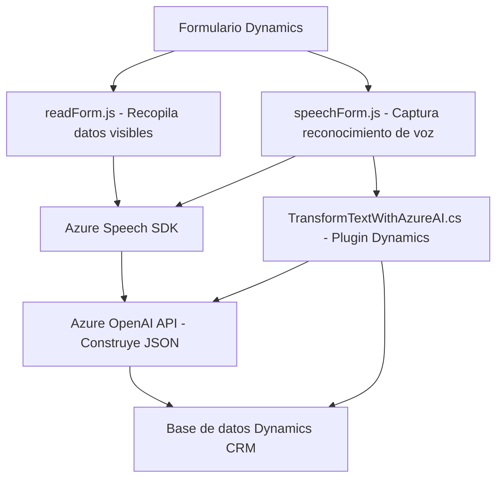

# Resumen técnico

Este repositorio implementa una solución de interacción avanzada entre formularios de **Dynamics CRM** y servicios externos como **Azure Speech SDK** y **Azure OpenAI Service**. La solución está centrada en proporcionar una experiencia de voz integrada con un sistema CRM, transformando entradas habladas en datos estructurados y realizando síntesis de voz dinámica.

# Descripción de arquitectura

La arquitectura presentada es **modular y orientada a servicios**. Su núcleo gira en torno a la integración por medio de APIs para extender la funcionalidad de Dynamics CRM con herramientas de reconocimiento de voz y transformación de datos. La estructura también refleja cierto uso del patrón **n capas** debido a la separación entre capa lógica, integraciones externas (Azure), y capa de presentación en los formularios CRM.

Además, los archivos asociados a Dynamics CRM (`TransformTextWithAzureAI.cs`) implementan el patrón de **Plugin** como extensión estándar para CRM, mientras que los archivos JavaScript (`readForm.js` y `speechForm.js`) manejan la lógica dinámica y la interacción directa con el usuario en frontend.

# Tecnologías utilizadas

### Backend
- **Dynamics CRM SDK**:
  - Gestión de plugins (`IPlugin`).
  - APIs para manipulación de datos (`IOrganizationService`, `Xrm.WebApi`).
- **Azure OpenAI Service**:
  - Uso de prompts avanzados para transformar texto en JSON.
- **HttpClient**:
  - Realización de peticiones REST API.
- **Newtonsoft.Json**:
  - Serialización/deserialización JSON.

### Frontend
- **JavaScript**:
  - Principal lenguaje para lógica cliente.
  - Manejo de formularios y reconocimiento de patrones en textos.
- **Azure Speech SDK**:
  - Reconocimiento de voz (`speech-to-text`) y síntesis de voz (`text-to-speech`).
- **Eventos en Dynamics** (JavaScript API):
  - Manipulación de `formContext` para asignar datos.

### Patrones de programación
- **Modularización** y **Functional Decomposition**:
  - Funciones independientes con responsabilidades claras.
- **Event-driven programming**:
  - Uso de callbacks para cargar SDKs y ejecutar lógica al ocurrir eventos.
- **Service-oriented architecture**:
  - Dependencia de servicios externos como OpenAI y Speech SDK.

# Diagrama Mermaid válido para GitHub

# Conclusión final

Este repositorio implementa una solución de carácter híbrido que extiende Dynamics CRM con capacidades avanzadas de voz e inteligencia artificial, utilizando herramientas clave como el **Azure Speech SDK** y **Azure OpenAI Service**. La arquitectura refleja principios de modularización, patrones de eventos y diseño orientado a servicios con una interacción fluida entre frontend y backend.