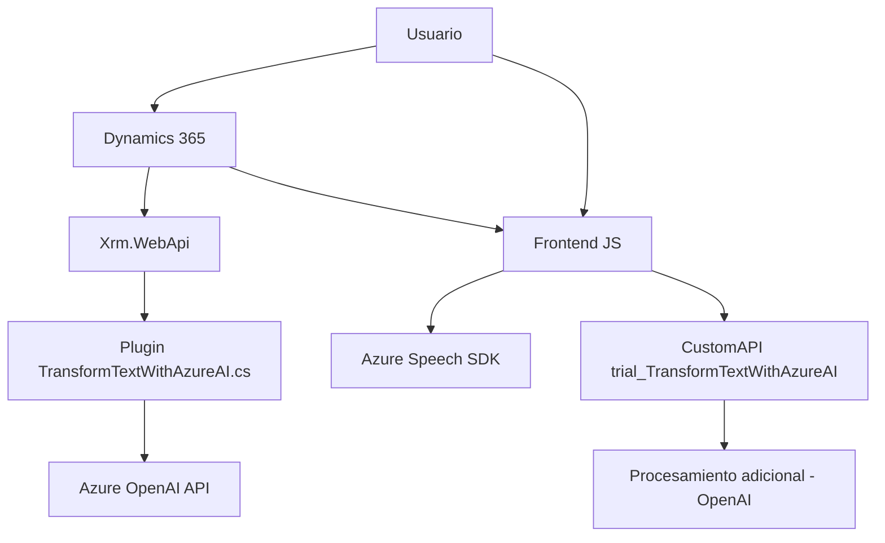

### Análisis Técnico 🔍

#### Breve Resumen Técnico:
El repositorio descrito se enfoca en la integración entre un sistema de gestión de relaciones con clientes (CRM) basado en Microsoft Dynamics 365, el servicio Azure Speech SDK y Azure OpenAI API. Proporciona una solución para capturar entrada de voz, interpretar y procesar datos de formularios y realizar inferencia con inteligencia artificial. Esto implica tanto desarrollo en frontend como en backend.

---

### Descripción de Arquitectura:
1. **Tipo de solución**:  
   Este repositorio implementa una solución híbrida centrada en:
   - Frontend interactivo especializado en la captura y conversión de datos de formularios.
   - Plugins y APIs backend que amplían la funcionalidad de Dynamics 365, integrando text-to-speech (TTS), speech-to-text (STT) y procesamiento de texto con inteligencia artificial.

2. **Tipo de arquitectura**:  
   La arquitectura principal combina:
   - Microservicios (uso de APIs específicas como `trial_TransformTextWithAzureAI`).
   - **N-capas**: La separación entre la capa de presentación (frontend), lógica empresarial (Dynamics CRM) y acceso a datos (APIs).
   - **Integraciones con servicios externos**: Mediante SDK de Azure Speech y Azure OpenAI API, se aplica una arquitectura basada en servicios y eventos asincrónicos.

---

### Tecnologías, Frameworks y Patrones Observados:
1. **Tecnologías Usadas**:
   - **Frontend**:
     - Lenguaje: JavaScript (para manejo de eventos y tareas específicas).
     - SDK adicional: Azure Speech SDK para TTS y STT.
   - **Backend**:
     - Desarrollo en C# para Plugins de Dynamics 365.
     - Microsoft Dynamics SDK (manejo de datos de formularios).
     - Azure OpenAI API para procesamiento de texto inteligente.
   - **APIs complementarias**:
     - API REST personalizada: `trial_TransformTextWithAzureAI`.

2. **Frameworks/Librerías**:
   - **Frontend**:
     - Integración directa del SDK Azure Speech (`https://aka.ms/csspeech/jsbrowserpackageraw`).
   - **Backend**:
     - Librerías .NET Core como `System.Net.Http`, `System.Text.Json`.
     - `Newtonsoft.Json.Linq`.

3. **Patrones Arquitectónicos**:
   - **Callback Pattern**: Utilizado para manejar eventos asincrónicos.
   - **Service-Oriented Architecture (SOA)**: Uso de servicios basados en Azure (Speech y OpenAI) para descentralizar el procesamiento.
   - **Plugin Pattern**: Diseño reutilizable para extender Dynamics CRM.
   - **Modularidad Funcional**: Separación en funciones con responsabilidades claras.

---

### Dependencias o Componentes Externos:
1. **Principal**:
   - SDK de Azure Speech (procesamiento de voz).
   - Azure OpenAI API para transformación y análisis de texto.
2. **Secundarias**:
   - Microsoft Dynamics SDK/WebAPI.
   - APIs personalizadas (`trial_TransformTextWithAzureAI`).

---

### Diagrama **Mermaid**:

---

### Conclusión Final:
Este repositorio implementa una solución integrada avanzada para formularios de Dynamics 365 con capacidades de reconocimiento de voz y procesamiento de texto basadas en servicios de Azure. La arquitectura emplea principios de construcción modular y desarrollo orientado a microservicios, con una combinación de frontend y backend sólido. Las dependencias externas, como Azure Speech SDK y OpenAI API, permiten funcionalidades robustas en términos de STT, TTS e inferencia basada en IA eficiente. Es una solución moderna y escalable que puede adaptarse a diversas necesidades dentro de un entorno empresarial.