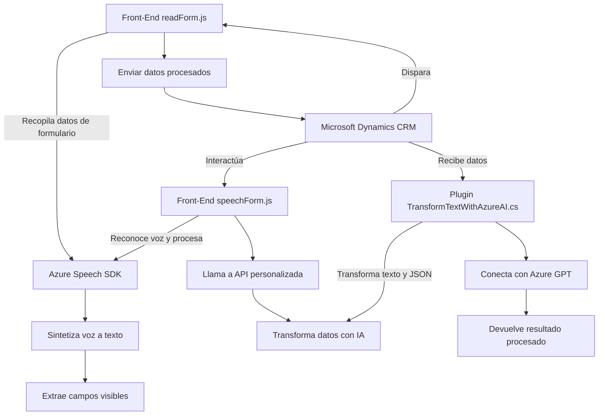

### Análisis técnico y descriptivo del repositorio

#### Breve resumen técnico:
Se trata de una solución orientada a habilitar interacciones con formularios de Microsoft Dynamics CRM mediante entrada de voz, síntesis de texto y procesamiento usando servicios de Azure, incluyendo Azure Speech SDK y Azure OpenAI Service (GPT). La arquitectura parece estar centrada en microservicios, estableciendo una comunicación entre los formularios del front-end, que utilizan SDKs y APIs externas, y plugins de CRM para ejecutar operaciones específicas en la nube.

---

### 1. **Tipo de solución**
   La solución corresponde principalmente a:
   - **Front-End JS**: Para manejar entrada y salida de datos en formularios mediante interacción de voz (Azure Speech SDK).
   - **Integración Back-End mediante Plugins**: Uso de un plugin en .NET para transformar texto con modelos AI (GPT-4) y conectar datos entre Dynamics CRM y el servicio externo.
   
   Por ende, el proyecto es una combinación de un front-end interactivo y servicios back-end mediante extensibilidad del CRM.

---

### 2. **Tecnologías, frameworks y patrones utilizados**
1. **Tecnologías y frameworks**:
   - **Frontend**:
     - JavaScript/ES6.
     - Microsoft Azure Speech SDK.
   - **Back-End/Plugins**:
     - C# con .NET Framework.
     - Microsoft Dynamics CRM SDK.
     - Microsoft Azure OpenAI Service (GPT-4).
     - `Newtonsoft.Json` para manipulación JSON.
     - `HttpClient` en C# para comunicación con APIs REST.

2. **Patrones utilizados**:
   - **Event-Driven Architecture**: Se disparan eventos de voz para leer formularios y actualizar datos.
   - **Integración de servicios externos** (Azure Speech SDK y Azure OpenAI Service).
   - **Plugin Pattern**: Uso de plugins para extender funcionalidad en Dynamics CRM y permitir integraciones con AI.
   - **Modularidad**: Funciones independientes en JavaScript relacionadas pero reutilizables, con separación clara de tareas.
   - **Service-Oriented Architecture (SOA)**: Dependencia de servicios externos y gestión de datos mediante módulos dinámicos.

---

### 3. **Arquitectura**
   La arquitectura puede clasificarse como **combinada**:
   - Para la integración del **front-end**, tiene un enfoque similar al de una arquitectura **modular de componentes**, gestionando distintas tareas mediante múltiples funciones relacionadas con servicios externos.
   - El plugin en C# utiliza el patrón **plugin y extensiones** de Dynamics CRM, lo que posiciona el componente como parte de una **arquitectura orientada a servicios**.
   - La interacción entre el front-end y plugin (dinámico) sugiere un componente de integración **API/microservicios**, con servicios externos (Azure SDK/OpenAI).

En conjunto, la solución parece estar diseñada para integrarse con una arquitectura distribuida o híbrida, que utiliza el CRM como base y los servicios de Azure para capacidades extendidas como síntesis de voz e inteligencia artificial.

---

### 4. **Dependencias y componentes externos**
   - **Dependencias de terceros**:
     - **Azure Speech SDK**: Manejo de entrada por voz y síntesis de texto a voz.
     - **Azure OpenAI Service/Modelo GPT-4**: Transformación de texto basado en inteligencia artificial.
     - **Microsoft Dynamics CRM API/SDK**: Gestión de interfaces y manipulación de datos de formularios.
   - **Dependencias internas**:
     - Métodos declarados en archivos mencionados.
     - Plugins que habilitan conexión entre datos locales y externos.
     - Llamadas a APIs personalizadas en Dynamics CRM.

---

### 5. Diagrama **Mermaid** compatible con Markdown

---

### Conclusión final
La solución presenta una integración bien definida entre componentes de front-end, plugins en el back-end, y servicios externos en la nube (Azure Speech SDK y OpenAI GPT). Utiliza una arquitectura modular en el frontend y extensibilidad mediante plugins en Dynamics CRM, lo que permite interacción entre la entrada de voz, procesamiento con inteligencia artificial, y gestión de datos en formularios.

La propuesta general sigue patrones de diseño estándar (SOA, plugins, modularidad), junto con dependencias clave como Microsoft Azure y Dynamics SDKs, lo que la hace robusta y flexible para aplicaciones específicas.