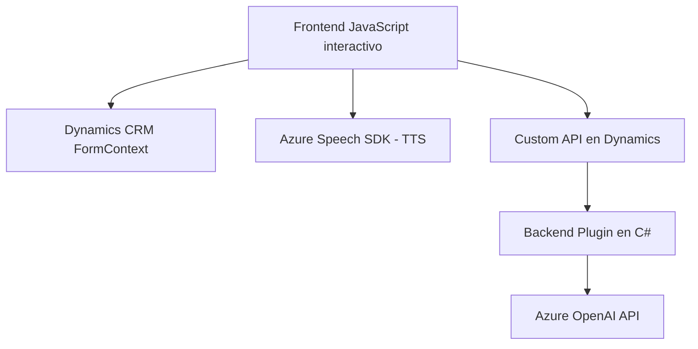

## Análisis y respuesta al repositorio proporcionado

---

### Breve resumen técnico

El repositorio contiene componentes relacionados con la interacción entre Microsoft Dynamics CRM y servicios de Inteligencia Artificial basados en **Azure**. Las funcionalidades principales están divididas entre:

1. **Frontend:** Archivos en JavaScript que gestionan la interacción del usuario con formularios en Dynamics CRM, la conversión de texto a voz (TTS) y la entrada de comandos hablados mediante Azure Speech SDK, además de lógica para conectividad con APIs personalizadas.
2. **Plugin en C#:** Código backend que implementa un plugin en Dynamics CRM para transformar texto utilizando la API de Azure OpenAI en objetos estructurados como JSON.

---

### **Descripción de arquitectura**

#### Tipo de solución:
- El repositorio implementa una solución **integrada para Microsoft Dynamics CRM**, compuesta de:
  - **Frontend interactivo:** Para habilitar entrada y salida de voz con procesamiento de datos del formulario.
  - **Plugin backend:** Para realizar transformaciones avanzadas en texto usando servicios de inteligencia artificial (Azure OpenAI).

#### Tipo de arquitectura:
- **Multi-capas habilitada para integración con microservicios:**
  - La capa **frontend** (javascript) interactúa con las APIs locales de Dynamics CRM y el SDK de Azure Speech.
  - La capa **backend/plugin** implementa un diseño basado en eventos del CRM, integrado con el servicio externo Azure OpenAI para procesamiento avanzado.
  - Las capas están ligadas mediante llamadas programáticas y endpoints REST de Dynamics, con desacoplamiento que permite sustituir servicios externos fácilmente.

#### Patrones observados:
- **Patrón de fábrica (Factory Method):**
  - Utilizado en la creación de configuraciones del SDK de Azure Speech (e.g., `SpeechConfig.fromSubscription`).
- **Patrón de cliente-servidor:**
  - Implementación de comunicaciones HTTP para interactuar con Azure OpenAI en el backend y para cargar el SDK dinámicamente en el frontend.
- **Modularidad y SRP (Single Responsibility Principle):**
  - Cada clase/método está orientado a una sola responsabilidad (e.g., generación de voz, carga dinámica del SDK).

#### Relación entre componentes:
- **Frontend**, mediante archivos JavaScript, interactúa directamente con Dynamics CRM, controla la entrada y salida de datos en formularios y utiliza servicios de reconocimiento de voz (Azure Speech SDK).
- **Backend/plugin**, mediante C# en Dynamics CRM, ejecuta lógica avanzada para procesar comandos y transformarlos mediante Azure OpenAI API.

---

### **Tecnologías y frameworks usados**

1. **Frontend:**
   - **JavaScript**, junto con las APIs web del navegador y los objetos de Dynamics CRM (`formContext`).
   - **Microsoft Azure Speech SDK (JavaScript):** Para entrada y salida de voz (reconocimiento de comandos y síntesis).
   - **Dynamics CRM web API y Custom APIs:** Comunicación entre el frontend y backend, y ejecución de lógica relacionada con formularios.

2. **Backend:**
   - **C#:** Para ensamblar un plugin compatible con Dynamics CRM.
   - **Azure OpenAI API:** Realiza el procesamiento de lenguaje natural (transformación de texto en JSON estructurado).
   - **Dynamics SDK:** Usado para interactuar con el contexto de ejecución de plugins del CRM.

---

### **Componentes externos presentes**

1. **Azure Speech SDK:** En frontend (reconocimiento TTS y comandos hablados).
2. **Azure OpenAI API:** En backend (procesamiento y transformación avanzada de texto).
3. **Dynamics CRM SDKs:**
   - **Xrm.WebApi.online**: Para interacción de frontend con servidor.
   - **Microsoft.Xrm.Sdk:** Para comunicación entre plugin y contexto del CRM.
4. **Bibliotecas JSON (e.g., `Newtonsoft.Json.Linq`, `System.Text.Json`)** para manejo y serialización de datos en formato JSON en backend.
5. **Servicio HTTP interno:** Para comunicación entre frontend, backend y servicios externos.

---

### Diagrama **Mermaid**

El diagrama muestra los componentes del sistema y su interacción.

---

### Conclusión final

El repositorio implementa una solución completa para extender la funcionalidad de Microsoft Dynamics CRM mediante la integración con servicios de IA de Azure (Azure Speech y OpenAI). Esta arquitectura combina una capa de frontend interactiva con un backend orientado al procesamiento avanzado de datos. Las interacciones clave están enfocadas en el uso de SDK especializados y comunicación vía APIs (REST/HTTP). 

El diseño muestra un enfoque modular y extensible que permite adaptarse fácilmente a nuevos servicios externos o cambios en la lógica empresarial. La implementación tiene un buen equilibrio entre desacoplamiento de componentes y uso eficiente de dependencias centralizadas.