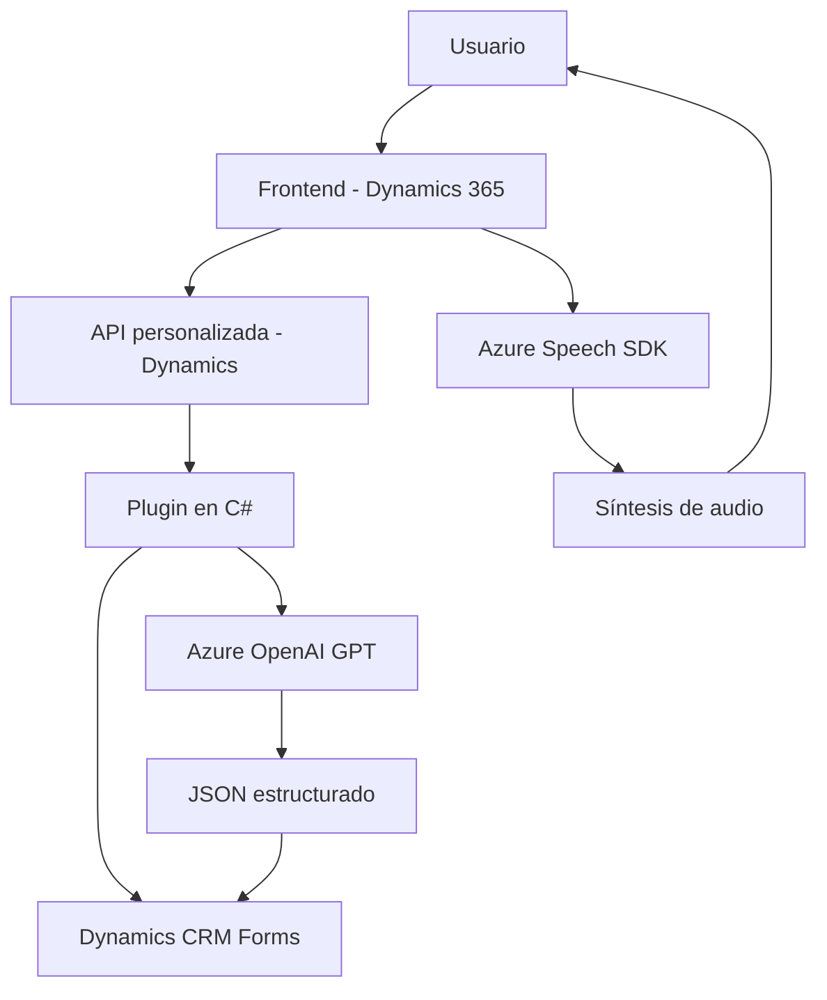

## Breve resumen técnico

El repositorio describe una solución híbrida que integra múltiples capas de un sistema orientado a la gestión de datos mediante formularios en plataformas como **Microsoft Dynamics 365**. Se utiliza reconocimiento de voz, síntesis de voz y procesamiento de texto avanzado con **Azure Speech SDK** y **Azure OpenAI** para mejorar la interacción y la accesibilidad del usuario.

---

## Descripción de arquitectura

La arquitectura del sistema está basada en **n capas** que interactúan entre componentes principales: 
1. **Frontend (JS)**: Manejo de interfaz de usuario, extracción de datos y síntesis/entrada de voz mediante el SDK de Azure.
2. **Backend (Dynamics Plugins)**: Procesamiento avanzado y transformación de datos por medio de plugins en C#.
3. **Servicios externos**: Integración con **Azure Speech SDK** para procesamiento de voz y **Azure OpenAI** para estructuras de texto basadas en IA.

Este diseño modular facilita la implementación de nuevas capacidades dependiendo de los servicios cloud. El flujo de datos y eventos utiliza **patrones de integración** y comunicación asíncrona entre frontend (JavaScript), backend (C#) y servicios externos.

---

## Tecnologías usadas

- **Frontend**:
  - JavaScript.
  - Dynamics 365 API para forma/contexto: `Xrm.Page`, `formContext`.
  - **Azure Speech SDK** para síntesis/reconocimiento de voz.
  
- **Backend (Plugins en C#)**:
  - `Microsoft.Xrm.Sdk` para la conexión y extensión del CRM.
  - Integración con **Azure OpenAI** mediante solicitudes HTTP (`System.Net.Http`).

- **Servicios externos**:
  - Azure Speech SDK y Azure OpenAI (GPT-4).

- **Patrones de diseño**:
  - Modularidad: Funciones especializadas y reusables.
  - Delegación para manejar dependencias asincrónicas.
  - Observer: Carga dinámica del Speech SDK.
  - Proxies: APIs personalizadas que actúan como puente entre frontend/backend y servicios externos.
  - Transformer: Transforma entradas de voz en datos estructurados útiles.

---

## Diagrama Mermaid válido

---

## Conclusión final

La solución descrita está orientada a mejorar la interacción usuario-plataforma mediante **Interfaz natural por voz** y mecanismos avanzados de **procesamiento de lenguaje e inteligencia artificial**. El uso de **Azure Speech SDK** y **Azure OpenAI** en combinación con Dynamics CRM proporciona una capa de integración robusta y escalable.

Además, la arquitectura emplea modularidad y delegación para facilitar su mantenimiento y evolución. Aunque nativamente se organiza como una solución **n capas**, existe una dependencia crítica hacia los servicios externos (Azure) que podrían ser un punto débil si no se gestionan adecuadamente las claves de acceso y las configuraciones.