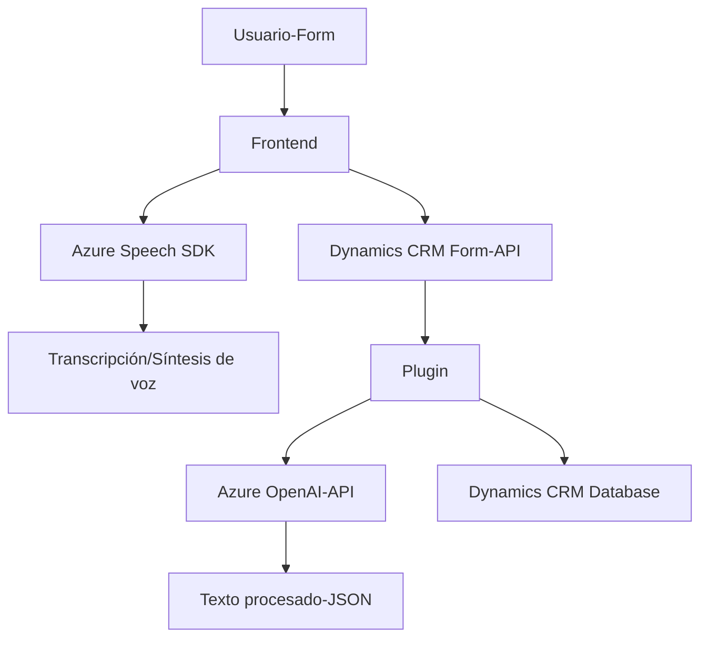

### Breve resumen técnico
El repositorio presentado está claramente enfocado en integrar capacidades avanzadas de análisis de texto y síntesis de voz mediante servicios de Microsoft Azure y aplicación en formularios de Dynamics CRM para mejorar su funcionalidad. Combina frontend JavaScript para la interacción de usuario, junto con un plugin en .NET que utiliza Azure OpenAI para la construcción de contenido procesado. 

---

### Descripción de arquitectura
La solución parece ser una aplicación en capas. Aunque utiliza servicios externos (Azure Speech Services y Azure OpenAI), el núcleo es un sistema centralizado basado en Microsoft Dynamics CRM, que podría considerarse un **monolito ampliado con integraciones externas**. Las capas observadas son:
1. **Frontend interactivo**: Proporciona la interfaz para el usuario, incluyendo grabación y transcripción.
2. **Backend CRM (Plugins)**: Hace el procesamiento de texto mediante la API de Azure OpenAI y maneja datos mediante el SDK de Dynamics CRM.
3. **Integración externa**: Utiliza SDKs y APIs de Azure para extendender la funcionalidad de Dynamics.

Los principales patrones observados son:
- **Facades**: Al simplificar la integración en funciones cumpliendo roles específicos.
- **Modularización**: Lógica segmentada en funciones reusables claramente nombradas con un propósito definido.
- **Plugin-driven architecture**: En el contexto del flujo de trabajo de Dynamics CRM, la arquitectura utiliza eventos para desencadenar el proceso del plugin de TransformTextWithAzureAI.
- **API-centric architecture**: Utilización de servicios REST (Azure Speech y OpenAI), lo cual facilita la extensión sin modificar directamente la funcionalidad de Dynamics CRM.

---

### Tecnologías usadas
1. **Frontend**:
   - Lenguaje: JavaScript.
   - Integración con SDK Azure Speech (síntesis y reconocimiento de voz).
   - Dynamics CRM APIs (`Xrm.WebApi`) para la manipulación de formularios y datos.

2. **Backend**:
   - Lenguaje: C# con integración nativa mediante los SDK de Dynamics CRM.
   - `Microsoft.Xrm.Sdk` para manejo de entidades CRM.
   - `System.Net.Http` para comunicación API.
   - JSON management: Utilización de `System.Text.Json` y `Newtonsoft.Json.Linq` para comunicación estructurada basada en REST.

3. **Servicios externos**:
   - **Azure Speech Services**: Para transcripción y síntesis de texto a voz.
   - **Azure OpenAI API**: Para transformar texto en JSON procesado basado en instrucciones específicas.

---

### Diagrama Mermaid

---

### Conclusión final
Esta solución combina funcionalidad avanzada de frontend interactivo con capacidades de procesamiento en backend mediante un diseño orientado a servicios externos de Azure. La arquitectura es predominantemente en capas con aspecto monolítico, donde el núcleo es Dynamics CRM complementado por integraciones de SDKs y APIs. Es una solución robusta con modularización y patrones implementados correctamente.

Puede beneficiarse de una estrategia para mejorar la seguridad en el manejo de credenciales (Azure OpenAI y Speech Services) mediante mecanismos como **Azure Key Vault**. También podría escalarse hacia un enfoque totalmente basado en **microservicios**, externalizando lógicas específicas en servicios independientes desplegados en contenedores o funciones serverless.