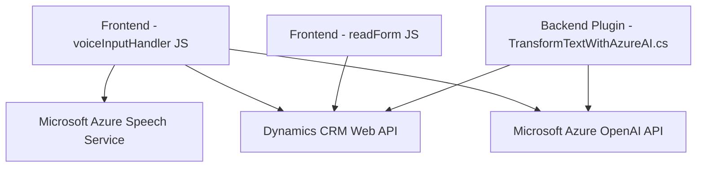

# Análisis Técnico del Repositorio

### Breve resumen técnico
Este repositorio contiene lógica para un sistema que utiliza una integración avanzada de Microsoft Dynamics 365 CRM con tecnologías de Azure (Azure Speech SDK y Azure OpenAI). Está orientado principalmente hacia la interacción de voz y procesamiento de texto, integrando capacidad de síntesis de voz, reconocimiento de voz y análisis estructurado de datos.

---

### Descripción de arquitectura

1. **Tipo de solución**:
   - Sistema híbrido que combina el frontend (interacción por voz) y plugins backend para integrarse con Microsoft Dynamics CRM. Utiliza tecnologías y servicios externos para el reconocimiento de voz y procesamiento avanzado de lenguaje natural.

2. **Arquitectura detectada**:
   - **Patrón de capas** (n capas):
     - **Presentación**: Archivos del frontend (`voiceInputHandler.js`, `readForm.js`) que interactúan directamente con Dynamo CRM y el usuario.
     - **Lógica empresarial**: Plugins de Dynamics (`TransformTextWithAzureAI.cs`) ejecutan transformaciones avanzadas utilizando la API de Azure.
     - **Servicios externos**: Integración con API de Azure Speech y Azure OpenAI.
   - **Microservicios en forma de servicios externos**: La solución delega el reconocimiento y síntesis de voz a servicios externos como Azure Speech SDK y Azure OpenAI.

3. **Patrones asociados**:
   - Interacción con APIs: Uso de servicios para reconocimiento de voz y procesamiento IA.
   - Programación Orientada a Eventos: Configuración de callbacks y llamadas asincrónicas (`ensureSpeechSDKLoaded`).
   - Plugin Architecture: Los archivos de backend siguen el modelo clásico de plugins de Dynamics.
   - Servicio HTTP como punto de integración: Plugins y frontend se comunican directamente con servicios Azure mediante HTTP POST.

---

### **Tecnologías Usadas**

**Frontend (archivos JS)**:
   - *Microsoft Dynamics CRM SDK*: Para interactuar con formularios y datos dentro de Dynamics.
   - *Azure Speech SDK*: Reconocimiento de voz y síntesis para interacción natural.
   - *JavaScript estándar*: Manejo de lógica, eventos y sincronización con servicios externos.

**Backend (archivo .cs)**:
   - *Microsoft.Xrm.Sdk*: Permite integrar lógica personalizada a nivel de CRM.
   - *Azure OpenAI API*: Procesamiento avanzado de lenguaje natural y generación de respuesta estructurada en JSON.
   - *Entorno de ejecución del plugin Dynamics*.

---

### **Dependencias externas posibles**

**Servicios:**
   - Microsoft Azure Speech Service, vinculada con la región y las credenciales de Azure.
   - Azure OpenAI Service para transformar texto y realizar análisis más detallado.

**Librerías externas:**
   - *Newtonsoft.Json*: Para operaciones avanzadas con datos JSON.
   - *System.Net.Http*: Consumir APIs externas con HTTP requests.

---

# Diagrama **Mermaid** para GitHub Markdown 

---

### **Conclusión Final**
El repositorio describe una solución híbrida que utiliza un patrón de **n capas** con integración de servicios externos. Destaca por la combinación de **interacción por voz en el frontend** (habilitada por Azure SDK) y un **backend orientado al procesamiento de texto** mediante Azure OpenAI dentro de Dynamics CRM. La arquitectura es efectiva para escenarios donde una interfaz por voz interactúa con formularios extrayendo y procesando datos dinámicamente.

Sin embargo, debe reforzarse el manejo de credenciales y datos sensibles para mitigar los riesgos de seguridad. Además, sería beneficioso implementar un sistema de configuración externa para claves API y endpoints en lugar de incrustarlos directamente.