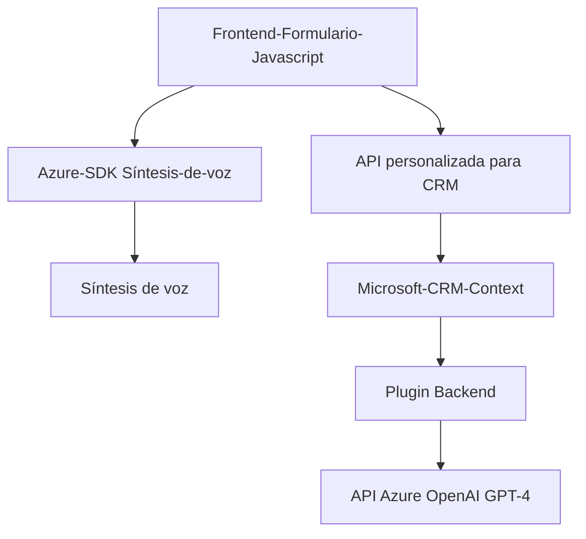

# Análisis Técnico del Repositorio

## Breve resumen técnico
El repositorio contiene archivos estructurados para una solución integrada que combina un **frontend basado en JavaScript** para interacción con formularios, una capa **plugin para Microsoft Dynamics CRM** en C# y una interacción directa con servicios de **Azure Speech SDK** y **Azure OpenAI GPT-4**. Permite el procesamiento, síntesis de voz y transformación avanzada de texto.

---

## Descripción de Arquitectura
La aplicación parece estar orientada a resolver problemas de interacción y procesamiento dinámico entre los usuarios y un sistema CRM. Se utiliza una arquitectura híbrida que integra **Frontend Client-Side Logic** en JavaScript y un **Plugin Backend** para procesamiento mediante Microsoft Dynamics CRM y servicios de Azure. La arquitectura tiene características de:
1. **N Capas:** Separación clara del frontend (procesamiento y síntesis de voz en JS) y el backend del plugin (procesos de transformación de texto).
2. **SOA:** Uso de servicios externos para funciones específicas (Azure Speech y Azure OpenAI).
3. **Integrated Plugins:** Extiende el sistema CRM mediante plugins personalizados.

---

## Tecnologías Usadas
1. **Frontend (JavaScript):**
   - Azure Speech SDK: Para interacción con síntesis y reconocimiento de voz.
   - APIs dinámicas de CRM: Contexto de formulario.
   - Lógica de procesamiento asincrónica con promesas/callbacks.
   
2. **Backend (C# Plugin en CRM):**
   - Microsoft Dynamics CRM SDK: Para integración directa con los objetos y eventos del CRM.
   - Azure OpenAI API: Servicios avanzados de NLP y transformación de texto.
   - HTTP Client para invocar servicios externos (Azure OpenAI).
   - JSON (via System.Text.Json y Newtonsoft.Json).

3. **Servicios de Azure:**
   - **Azure Speech SDK** en JS: Para síntesis y reconocimiento de voz.
   - **Azure OpenAI (GPT-4)** en C#: Procesamiento de texto avanzado.

4. **Patrones Arquitectónicos:**
   - Modular: Cada componente es independiente y enfocado en una tarea específica.
   - Delegación con callbacks/promesas (Speech SDK).
   - Gateway API: Integración profunda con servicios externos mediante HTTP.
   - Plugins CRM: Extensión de funcionalidad por eventos dedicados en CRM.
   - Procesamiento de datos en tiempo real (Frontend).

---

## Dependencias y Componentes Externos
1. **Azure Speech SDK**:
   - Servicio principal para la funcionalidad de voz.
   - Cargado dinámicamente en el frontend.

2. **Azure OpenAI GPT-4**:
   - Usado en el plugin para procesamiento y transformación avanzada de texto mediante un endpoint API.

3. **Microsoft Dynamics CRM**:
   - Sistema base para integrar el plugin.
   - Dependencia en las bibliotecas `Microsoft.Xrm.Sdk`.

4. **Frameworks/Sdk Complementarios**:
   - `System.Text.Json` y `Newtonsoft.Json`: Manejo de datos JSON en el plugin.

---

## Diagrama Mermaid

---

## Conclusión Final
Esta solución está diseñada para interactuar con usuarios mediante voz en la interfaz de un CRM y procesar los datos obtenidos del reconocimiento policial. Se compone de una ejecución distribuida en dos capas principales: un frontend en **JavaScript** que utiliza el **Azure Speech SDK** para la integración de voz, y un backend implementado como plugin para ejecutar transformaciones de texto mediante el **Azure OpenAI GPT-4**. 

Los principales beneficios incluyen:
- Integración potente entre distintos servicios cloud (Azure Speech y Azure OpenAI).
- Modularidad del código que permite la reutilización de funciones y extensibilidad.
- Arquitectura adecuada para un entorno empresarial CRM, escalable con servicios adicionales.
  
Sin embargo, esta arquitectura depende completamente de la infraestructura de Microsoft Azure y Dynamics, lo que puede implicar costos adicionales y mantener una configuración adecuada de estos servicios.