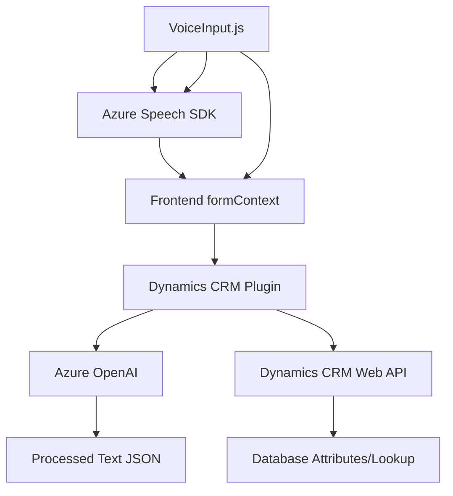

**Breve resumen técnico:**  
El repositorio implementa funcionalidades avanzadas para integrar Microsoft Dynamics CRM con Azure Cognitive Services y Azure OpenAI. Mediante archivos frontend y backend, se manejan entrada/salida de voz y transformación de texto usando APIs y SDKs de Azure.

---

### **Descripción de arquitectura:**  
1. **Tipo de solución**:  
   - Es una solución híbrida que combina:  
     - **Frontend:** Funcionalidades de interacción por voz (lectura y reconocimiento) basadas en el Azure Speech SDK.  
     - **Backend:** Extensiones en forma de plugins que procesan texto mediante el Azure OpenAI Service.  
   - Diseñada para **Microsoft Dynamics CRM**, con un enfoque en mejorar la experiencia de usuario mediante IA y servicios cognitivos.

2. **Tipo de arquitectura utilizada**:
   - Se usa una **arquitectura modular y en capas**:
     - **Capa de Interacción:** Los scripts frontend (VoiceInputHandler.js y VoiceInput.js) manejan interacción de alta frecuencia basada en eventos de usuario (voz, entrada visual).
     - **Capa de Procesamiento:** El plugin (TransformTextWithAzureAI) actúa como middleware avanzado para procesamiento de texto mediante OpenAI.
     - Las capas están estructuradas con separación de responsabilidades para garantizar integración externa mediante APIs mientras aislan las funcionalidades específicas de Dynamics CRM.

---

### **Tecnologías, frameworks y patrones usados:**  
1. **Tecnologías**:
   - **Frontend:**
     - **JavaScript** y **Azure Speech SDK** para entrada/salida de voz.
     - **Dynamics 365 Web API** para gestionar mapeo y valores de formularios.
   - **Backend:**
     - **C# Plugin** para extender Microsoft Dynamics CRM.
     - **Azure OpenAI Service** para transformación avanzada de textos.
     - **Newtonsoft.Json** y **System.Net.Http** para manejar JSON y peticiones HTTP.  
2. **Patrones:**
   - **Event-driven programming:** En los scripts frontend, las interacciones con usuarios están organizadas mediante eventos de voz y clics.
   - **Plugin Architecture:** En el backend, los plugins son módulos integrables en Dynamics CRM.
   - **Dependency Injection:** Dynamics CRM usa inyección de dependencia con el `IServiceProvider`.
   - **Modular design**: Cada función y clase está diseñada para cumplir con una única responsabilidad.

---

### **Dependencias o componentes externos presentes:**  
#### **Dependencias externas:**  
1. **Azure Speech SDK**:  
   Utilizado para síntesis y reconocimiento de voz. Cargado dinámicamente en el entorno frontend.  
   - Ejemplo de URL dinámica: `https://aka.ms/csspeech/jsbrowserpackageraw`.
2. **Azure OpenAI Service**:  
   Usado por el plugin backend para procesamiento avanzado de texto bajo demanda, empleando un modelo como `gpt-4o`.  
3. **Dynamics CRM Web API**:  
   Para integración con formularios y datos, soportando manipulación de atributos y búsquedas.  

#### **Dependencias internas:**  
- **formContext y executionContext**: Usados en frontend y backend para manipular datos y estructura de formularios en Dynamics CRM.
- **Newtonsoft.Json / System.Text.Json**: Para manejo y transformación de datos JSON.

---

### **Diagrama Mermaid**  
La solución tiene **tres componentes principales** que interactúan entre sí:  
1. Frontend (scripting y SDK de Microsoft).  
2. Plugin (extensión en C#).  
3. Azure Services (Speech SDK y OpenAI).  

---

### **Conclusión final:**  
El repositorio implementa una solución dinámica, interactiva y modular enfocada en extender capacidades de Microsoft Dynamics CRM con tecnologías de nube e inteligencia artificial. La arquitectura híbrida asegura compatibilidad tanto para eventos frontend (reconocimiento/voz) como para procesamiento backend (OpenAI). La integración con SDKs de Azure posiciona esta solución como avanzada para entornos empresariales.