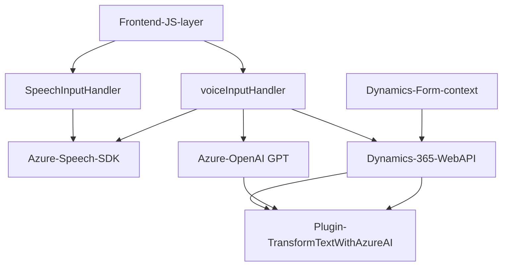

## Breve Resumen Técnico:
El repositorio contiene tres capas principales:
1. **Frontend:** Implementa una interfaz de usuario orientada a la interacción de voz con formularios de Dynamics 365 mediante el **Azure Speech SDK**. Puede sintetizar texto visible en formularios y asignar campos desde comandos de voz transcritos por IA.
2. **Backend (Plugin):** Mediante el archivo `TransformTextWithAzureAI.cs`, el sistema convierte texto ingresado en Dynamics 365 a objetos JSON estructurados usando el servicio **Azure OpenAI**.
3. **Integraciones:** Interacción directa con APIs externas (Azure Speech SDK y Dynamics 365 Web API) para reconocimiento de voz, síntesis de voz y transformación de texto.

---

## Descripción de arquitectura:
La solución combina conceptos de arquitectura basada en servicios (Azure Speech SDK y Azure OpenAI), junto con integraciones con Dynamics 365. Presenta un estilo **n-capas**:
1. **Capa de Presentación:** Funcionalidad en el navegador para capturar y procesar entrada de voz.
2. **Capa de Aplicación:** Lógica de negocio en plugins de Dynamics 365 junto con llamadas a APIs externas.
3. **Capa de Servicios Externos:** Uso de SDKs y servicios como Azure Speech y OpenAI.

Patrones específicos usados:
- **Facade:** Simplifica la interacción entre el código de cliente y las APIs externas mediante una interfaz abstracta (Speech SDK y servicios).
- **Plugin Pattern:** Extensión de funcionalidad de Dynamics 365 mediante un plugin registrado en la plataforma.
- **Callback:** Utilizado ampliamente en la interacción del frontend con el Speech SDK.

---

## Tecnologías Usadas:
1. **Frontend:** JavaScript (vanilla, sin frameworks evidentes) con procesamiento asíncrono (promesas y callbacks).
2. **Backend (Plugin):** C# con **Microsoft.Xrm.Sdk** para interacción con Dynamics, y `System.Net.Http` para comunicación HTTP.
3. **Servicios Externos:**
   - **Azure Speech SDK:** Usado para síntesis y reconocimiento de voz.
   - **Azure OpenAI (GPT):** Procesamiento de texto en formato JSON conforme a normas definidas.

---

## Diagrama Mermaid:

---

## Conclusión Final:
La solución es una **integración orientada a servicios** en un entorno híbrido de Dynamics 365 y Azure. La arquitectura puede considerarse como **n-capas** con módulos desacoplados que usan servicios externos (Azure SDKs y OpenAI). Este enfoque modular facilita el mantenimiento, escalabilidad e integración en sistemas empresariales dinámicos. Añadiendo soporte de entrada, salida de voz y procesamiento IA, la solución potencia la usabilidad en escenarios de formularios. Finalmente, la implementación sigue buenas prácticas, donde cada capa se enfoca en su rol de responsabilidad.