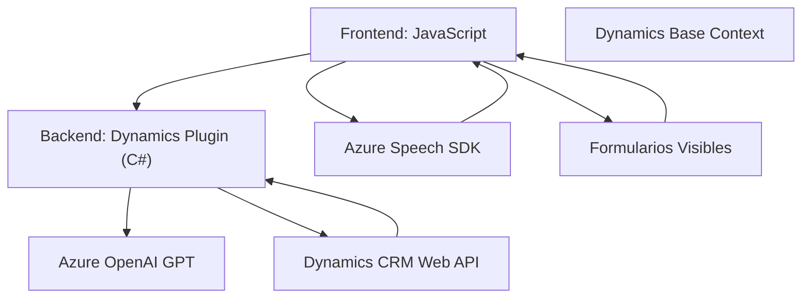

### Breve Resumen Técnico
El repositorio es una solución multifacética orientada a mejorar la funcionalidad de procesamiento de formularios en el **frontend**, haciendo uso de interacción por voz y procesamiento basado en IA. Además, incluye integración directa con **Dynamics 365 CRM** mediante plugins que interactúan con servicios de **Azure OpenAI GPT** y **Azure Speech SDK**.

### Descripción de Arquitectura
La solución tiene características híbridas, con un enfoque en:
- **Frontend con lógica acoplada al SDK**: Realiza funciones de lectura y síntesis de formularios, usando interacciones asincrónicas para aprovechar APIs externas.
- **Integración dinámica de APIs externas**: Incluye procesamiento de transcripciones y síntesis de audio dinamizado con **Azure Speech SDK**.
- **Microservicio de IA**: En el backend, el plugin utiliza servicios de Azure OpenAI GPT para transformar datos.
- **Patrón de n capas** para componentes de Dynamics CRM:
  - Capa de presentación: Formularios renderizados en Dynamics 365.
  - Capa de negocio: Plugin de procesamiento en Dynamics CRM.
  - Capa de datos: Interacciones con Web API del CRM y servicios externos (Azure AI).
  
### Tecnologías Usadas
1. **Frontend:**
   - **JavaScript** para manejo de lógica en los formularios.
   - **Azure Speech SDK** para la interacción de texto a voz y viceversa.
   - **Dynamics 365** para su contexto y soporte frontend.
  
2. **Backend/Plugins:**
   - **C#**, aprovechando el framework de plugins para Dynamics.
   - **Azure OpenAI GPT** para procesamiento avanzado de texto.
   - **Newtonsoft.Json** y biblioteca estándar de .NET para manipulación de JSON.
   - **HTTPClient** del sistema .NET para comunicación con APIs externas.

### Diagrama Mermaid válido para GitHub Markdown

### Conclusión Final
La solución combina tecnologías modernas y patrones bien definidos para lograr un ecosistema enfocado en accesibilidad y automatización. En el frontend, aumenta la interacción con usuarios mediante voz con el uso de **Azure Speech SDK**; mientras que el backend logra transformar datos dinámicos gracias a **Azure OpenAI GPT** en integración con **Dynamics CRM**. Su arquitectura modular y efectiva permite una fácil expansión, soportando tanto funcionalidad local como en la nube.