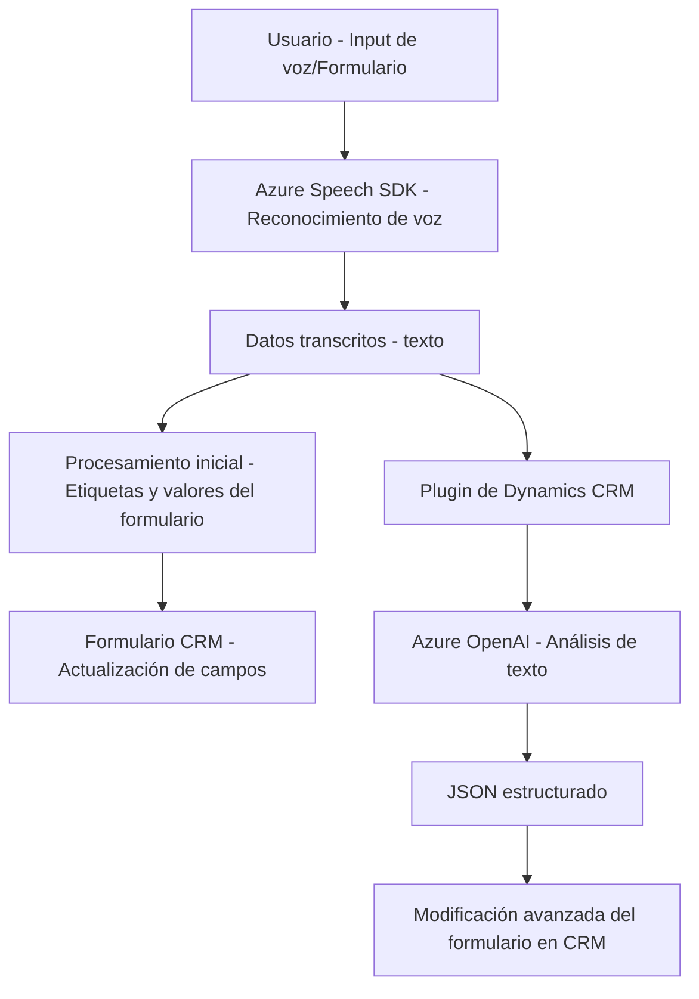

### Breve resumen técnico

Este repositorio parece estar diseñado para integrar capacidades avanzadas de procesamiento de voz y texto en un sistema CRM (posiblemente Microsoft Dynamics 365), combinando un frontend en JavaScript con un backend basado en plugins de C#. Las funcionalidades principales se basan en el reconocimiento y síntesis de voz usando Azure Speech SDK, además de la transformación de texto con inteligencia artificial mediante Azure OpenAI API. El sistema procesa datos de entrada y salida para interactuar con formularios y realizar flujos más dinámicos y personalizados.

***

### Descripción de arquitectura

La solución muestra una arquitectura **multicapa**, donde cada capa cumple una función específica:
1. **Frontend**: Se encarga principalmente de interactuar con el usuario. Incluye la lógica para capturar datos de formularios, sintetizar texto con voz y llenar campos en base a datos procesados.
2. **Backend**: Un plugin basado en C# que actúa como intermediario entre el CRM y el servicio de Azure OpenAI, transformando texto en un formato estructurado JSON.
3. **Servicios externos**:
   - Azure Speech SDK: Maneja la síntesis de voz y el reconocimiento de texto basado en entrada de audio.
   - Azure OpenAI API: Realiza transformaciones avanzadas de texto usando modelos de inteligencia artificial.

Estas capas están acopladas mediante patrones de diseño de servicios, que subdividen la lógica según responsabilidades, para una mayor modularidad. Cada componente del sistema está pensado para ser reutilizable e integrable dentro del ecosistema CRM.

***

### Tecnologías usadas

1. **Frontend**:
   - **Lenguaje**: JavaScript para lógica y frontend en Dynamics CRM.
   - **Azure Speech SDK**: Para servicios de síntesis y reconocimiento de voz.
2. **Backend**:
   - **Lenguaje**: C# para el desarrollo de plugins.
   - Dynamics CRM SDK (`IPlugin`, `IOrganizationService`).
   - **Azure OpenAI API**: Para generación de JSON y análisis de texto inteligente.
   - Frameworks de serialización: `System.Text.Json`, `Newtonsoft.Json.Linq`.
   - Herramientas de manejo de texto: `System.Text.RegularExpressions`.
3. **Dependencias externas**:
   - Integración con APIs: Microsoft Azure, Dynamics CRM services (`Xrm.WebApi.online`).
   - Servicio HTTP para el backend (`System.Net.Http`).

### Patrones de arquitectura aplicados

- **Multicapa**: Separación estricta entre frontend, API externa, y backend.
- **Integration Layer**:
  - Speech SDK y OpenAI funcionan como servicios abstractos que se conectan con el sistema CRM.
- **Event-Driven Programming**: Uso de callbacks en el código para manejar escenarios asincrónicos (carga del SDK desde la URL y llamadas API).
- **Encapsulation**: Funciones individuales con responsabilidades específicas.
- **Command Pattern**: Las llamadas a la API externa (como `callCustomApi`) están encapsuladas en funciones específicas.
- **Helper Functions**: Diseño modular para operaciones recurrentes (formateo y mapeo de campos).

***

### Diagrama **Mermaid**

***

### Conclusión final

Este repositorio implementa una solución **frontend-backend** diseñada para integrarse con sistemas CRM como Dynamics 365. Mediante un enfoque **multicapa** y el uso de **servicios externos (Azure Speech y OpenAI)**, se abordan desafíos clave de reconocimiento y síntesis de voz, así como análisis semántico avanzado de texto. La arquitectura modular y el uso de patrones como encapsulación y comandos aseguran una implementación escalable y mantenible.

Esta solución se ajusta bien a entornos empresariales que necesitan **interacción dinámica** entre usuarios y sistemas con funcionalidades inteligentes como reconocimiento de voz y procesamiento de lenguaje natural (NLP). Sin embargo, la dependencia de los servicios de Azure podría implicar costes significativos de uso del entorno en producción.