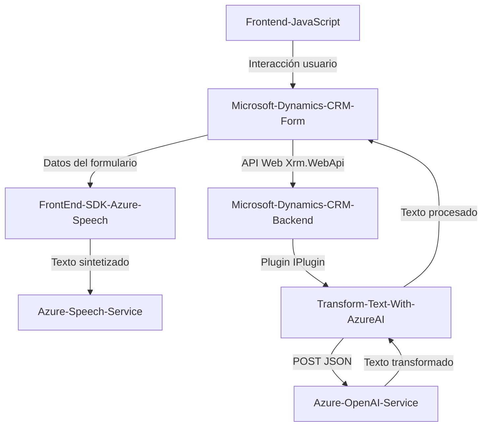

### Breve resumen técnico
El repositorio parece ser parte de una solución empresarial que combina la integración de Microsoft Dynamics CRM con servicios de reconocimiento del lenguaje natural y síntesis de voz proporcionados por Azure. Contiene tres componentes principales:
1. **Frontend JavaScript**: Procesa y sintetiza voz, además de capturar comandos de reconocimiento de voz para completado dinámico de formularios.
2. **Backend Plug-in**: Implementa la lógica para conectarse con Azure OpenAI y transforma texto según normas predefinidas dentro del contexto de Dynamics CRM.
3. **External Dependencies**: El sistema depende de Azure services como Azure Speech SDK y OpenAI API para ofrecer capacidades avanzadas, integrándose con Microsoft Dynamics CRM.

---

### Descripción de la arquitectura
La solución parece seguir modelos arquitectónicos de **n-capas combinados con servicios externos**, con lo siguiente:
1. **Frontend (Capa de Presentación)**: Proporciona interacción directa con el usuario, procesando voz a través del SDK de Azure. También usa patrones modulares y carga dinámica de dependencias (Azure Speech SDK).
2. **Backend de Microsoft Dynamics CRM (Capa de Negocio)**: Implementa plugins que extienden la funcionalidad del CRM con transformación de datos mediante Azure OpenAI.
3. **Servicios Externos (Capa de Datos/Integración)**: Conecta el entorno Dynamics CRM con servicios externos de Azure para reconocimiento, síntesis de voz y análisis de texto.

Es una arquitectura **orientada a servicios**, con uso de servicios REST y SDKs distribuidos.

---

### Tecnologías usadas
1. **Frontend (JavaScript)**:
   - **Azure Speech SDK**: Reconocimiento y síntesis de voz.
   - **Xrm.WebApi**: Integración directa con Dynamics CRM para manipular datos.
2. **Backend (.NET/C#)**:
   - **Microsoft Dynamics CRM SDK**: Manejo del contexto de ejecución, servicios y plugins.
   - **Azure OpenAI API**: Consumo de servicios de inteligencia artificial para transformación de texto.
   - **Librerías .NET**: `System.Net.Http`, `Newtonsoft.Json`, para solicitudes y manejo de datos JSON.
3. **Servicios Externos**:
   - Azure Speech SDK, OpenAI (Azure), con manejo de API keys y regiones.

---

### Diagrama Mermaid válido para GitHub

---

### Conclusión Final
Este repositorio representa una solución empresarial de integración entre Microsoft Dynamics CRM y servicios avanzados de Azure como Speech SDK y OpenAI. La arquitectura es modular y está orientada a servicios (SOA), con un frontend centrado en la interacción del usuario mediante la síntesis y el reconocimiento de voz, mientras que el backend se basa en plugins del CRM para realizar lógica avanzada de transformación y procesamiento de texto vía APIs externas.

La solución es robusta para su propósito, pero algunos puntos de mejora incluyen:
- Estandarización en la etapa de manejo de errores (ej. en llamadas a SDK y API).
- AuOptmización del uso de `HttpClient` en el plugin.
- Uso de un logging centralizado para ambos componentes (front y backend).