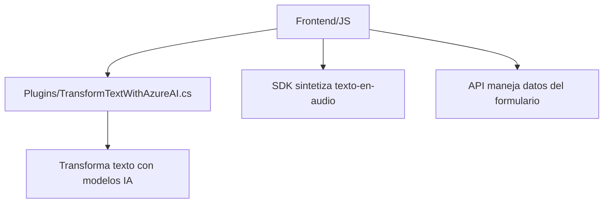

## Análisis técnico del repositorio

### Breve resumen técnico
El repositorio parece implementar una solución integrada que utiliza tecnologías de Microsoft Dynamics CRM (con plugins y APIs) junto con Azure Speech SDK y Azure OpenAI, para proporcionar funcionalidades de reconocimiento de voz, síntesis de voz, procesamiento de formularios y transformación de datos con inteligencia artificial.

---

### Descripción de la arquitectura

1. **Tipo de solución**:  
   La solución es una inteligencia desplegada para mejorar la accesibilidad y automatización en aplicaciones de Microsoft Dynamics CRM. Esto se logra a través de capacidades de reconocimiento de voz, síntesis de voz y transformación avanzada de entrada textual mediante IA.

2. **Tipo de arquitectura**:  
   - **N capas orientadas a servicios externos**: La solución está separada por niveles funcionales: 
     - La capa cliente (Frontend/JS) interactúa con **Azure Speech SDK** para captura de voz y procesamiento dinámico de formularios.
     - La capa de servidor (Plugins) se encarga de consumir servicios externos como **Azure OpenAI** y servir como punto de integración dentro del sistema CRM.
   - **Integración de microservicios**: Aunque no hay microservicios propiamente dicho, el uso de servicios como Azure Speech SDK, Custom API de Dynamics y Azure OpenAI representa una integración de servicios externos, que es una característica común de arquitecturas basadas en microservicios.

---

### Tecnologías, frameworks y patrones utilizados
1. **Frontend**:
   - **Idioma**: JavaScript.
   - **SDK Externo**: Azure Speech SDK (usado dinámicamente para síntesis de voz y reconocimiento).
   - **Integración de APIs**:
     - Custom API de Dynamics para manejar datos del formulario.
     - APIs relacionadas con las entidades de Dynamics (ej. para búsquedas o manipulación de atributos).
   - **Patrones**:
     - Modularidad: Cada función tiene una responsabilidad específica.
     - Event-Driven Programming: Uso de callbacks y eventos del SDK.
     - Data Mapper: Mapeo XML entre los atributos visibles del formulario y su valor interno.

2. **Backend (Plugin)**:
   - **Lenguaje**: C#.
   - **Framework**: Microsoft Dynamics CRM SDK.
   - **Servicio Externo**: Azure OpenAI (GPT-4 utilizado para transformar texto).
   - **Patrones**:
     - Plugin Pattern: Extensión sobre Microsoft Dynamics mediante la implementación de `IPlugin`.
     - Gateway Pattern: La interacción con Azure OpenAI se gestiona mediante HTTP Requests al endpoint externo.
     - Microservicio-like: El plugin actúa como cliente para servicios de IA.

---

### Dependencias o componentes externos presentes
- Azure Speech SDK: Para captura y síntesis de voz.
- Custom API: Llamada dentro del entorno de Dynamics 365.
- Azure OpenAI API: Para transformar texto basado en modelos GPT.
- Microsoft Dynamics SDK: Para la interacción con contextos de formularios, datos y servicios internos del CRM.
- System.Text.Json y Newtonsoft.Json: Manejo y procesamiento de datos JSON en el backend.

---

### Diagrama Mermaid compatible con GitHub Markdown

---

### Conclusión final
El repositorio implementa una solución avanzada para mejorar la accesibilidad y automatización en aplicaciones de Microsoft Dynamics CRM mediante voz y AI. La arquitectura emplea una combinación de integración de servicios externos (Azure Speech SDK y OpenAI API) y un modelo de capas modular. El diseño utiliza patrones probados como el Gateway Pattern en el plugin y la modularidad en el frontend, asegurando escalabilidad y facilidad de mantenimiento.