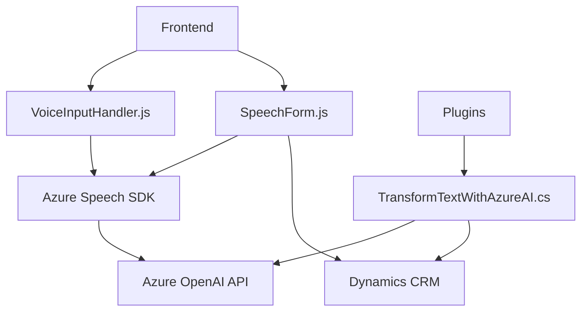

### Breve resumen técnico:
El repositorio contiene implementaciones de una solución híbrida, con funcionalidad en el frontend (JavaScript), backend (C# plugin), y dependencia en servicios externos como Azure Speech SDK y Azure OpenAI API. Su propósito principal es procesar datos de formularios y realizar síntesis y procesamiento de texto mediante servicios de inteligencia artificial en la nube. 

---

### Descripción de arquitectura:
La solución adoptada en el proyecto sigue un esquema híbrido que combina el uso de **movimiento de datos desde el frontend hacia un backend conectándose a servicios externos**. La arquitectura es más próxima a una **arquitectura orientada a servicios (SOA)**, donde el backend y los servicios de Azure administran lógica compleja mientras que el frontend se utiliza como una interfaz interactiva conectada a estos servicios externos.

Elementos clave de la arquitectura:
1. **Modularización del frontend**: Código basado en funciones separadas para cada tarea específica enfocada en transcripciones de voz, manejo del SDK, y sincronización con formularios.
2. **Backend CRM Plugin**: El backend está escrito en C#, ajustado como un plugin en Microsoft Dynamics CRM. Este utiliza la Azure OpenAI API para procesamiento textual avanzado.
3. **Integración de servicios en la nube**: Uso de SDK y APIs de Azure en ambas capas (frontend y backend) para lograr la síntesis de voz, reconocimiento de texto por voz, y manipulación avanzada del contenido.

---

### Tecnologías usadas:
1. **Frontend:**
   - **JavaScript**: Programación en un entorno frontend.
   - **Azure Speech SDK**: Para reconocimiento de voz y síntesis de texto a voz.
   - **Fetch API**: Para realizar solicitudes a servicios API personalizados en Dynamics CRM.

2. **Backend:**
   - **C# .NET**: Con enfoque al desarrollo de plugins para Dynamics CRM.
   - **Microsoft.Xrm.Sdk**: Para conexiones y operaciones dentro del ecosistema Dynamics CRM.
   - **Newtonsoft.Json (JToken)**: Bibliotecas de manejo de JSON.
   - **System.Net.Http**: Para realizar solicitudes HTTP.

3. **Servicios externos:**
   - **Azure Speech SDK**: Procesamiento y síntesis de voz.
   - **Azure OpenAI API**: Genera respuestas y realiza transformaciones avanzadas de texto mediante modelos cognitivos.
   - **Dynamic 365 Web APIs**: Para operaciones con formularios y campos.

---

### Diagrama Mermaid:

---

### Conclusión final:
La solución es una implementación híbrida que se enmarca en una arquitectura **orientada a servicios (SOA)** con módulos bien definidos, integraciones externas (Azure Speech SDK y OpenAI API), e interacciones con Dynamics CRM en el backend. El código sigue principios de diseño como la **modularidad** y el **principio de responsabilidad única**. Aunque no utiliza completamente la arquitectura hexagonal ni estricta separación de capas, presenta un modelo eficiente para cumplir los objetivos de integración de inteligencia artificial en formularios de Dynamics CRM.