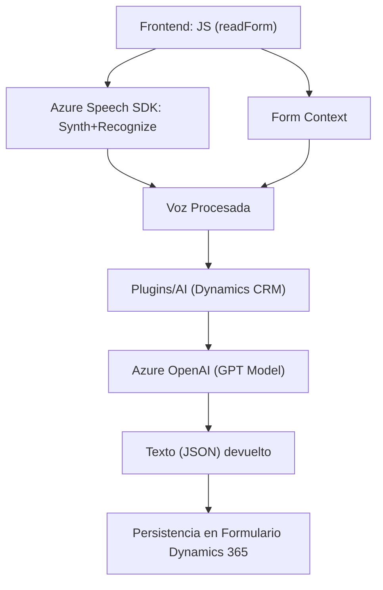

### Breve resumen técnico

La solución en el repositorio integra componentes para la entrada, procesamiento y salida de datos en aplicaciones basadas en **Microsoft Dynamics 365**. Los archivos expuestos están divididos en dos categorías principales: **frontend** (JavaScript en el cliente) y **backend** (C# con plugins para Dynamics CRM). Su propósito principal es integrar con servicios de Azure para habilitar la lectura, síntesis y transcripción de voz, junto con reglas de transformación de texto basadas en IA. La solución es indicativa de una arquitectura orientada a microservicios e integración con las APIs de Azure y Dynamics CRM.

---

### Descripción de arquitectura

La arquitectura es un híbrido entre un **monolito de Dynamics CRM** y una extensión funcional mediante plugins y comunicación con **microservicios externalizados en Azure**. El código del frontend se encuentra distribuido en varios módulos (archivos JS) que se ejecutan exclusivamente en el cliente anclados a formularios y eventos del sistema Dynamics CRM. En el backend, se implementa una **arquitectura orientada a servicios** (SOA) donde los plugins extienden la funcionalidad del servidor de Dynamics CRM y delegan la lógica de transformación a servicios basados en inteligencia artificial alojados en Azure.

### Tecnologías usadas

#### **Frontend**
1. **Vanilla JavaScript**: Utilizado para la lógica implementada en los formularios.
2. **Azure Speech SDK**: Para lectura, síntesis y transcripción de voz, con integración dinámica (carga lazy).
3. **Event-driven programming**: La lógica se basa en eventos dinámicos del contexto de formularios de Dynamics 365.

#### **Backend**
1. **C# y Microsoft Dynamics SDK**: Los plugins del sistema CRM están programados en C# y hacen uso del marco `IPlugin` para la integración.
2. **Azure OpenAI**: Realiza la transformación de texto en JSON utilizando servicios de inteligencia artificial.
3. **HTTP client para API REST**: Emplea `System.Net.Http` para la comunicación con Azure OpenAI.
4. **JSON processing frameworks**: Gestión y manipulación de datos JSON utilizando `Newtonsoft.Json`.

#### **Otros Patrones de diseño**
1. **Facade Pattern** en el frontend, encapsulando funciones para simplificar el proceso desde entrada hasta síntesis de voz o transcripción.
2. **Delegation Pattern** para la carga de dependencias externas (ej. Azure Speech SDK).
3. **Layered Architecture in CRM Plugins**: Separación de responsabilidades mediante métodos en una clase principal que implementan `IPlugin`.

---

### Dependencias o componentes externos presentes

1. **Azure Speech SDK**:
   - Procesamiento de voz, síntesis y lectura.
   - Llamado a través de un `<script>` externo en el frontend que carga dinámicamente la dependencia.

2. **Azure OpenAI**:
   - Utiliza modelos de aprendizaje automático como GPT para transformar texto.
   - Autenticación mediante clave de API y solicitudes REST.

3. **Microsoft Dynamics 365**:
   - Contexto del formulario y el marco `IPlugin` para extensiones mediante plugins.

4. **JSON frameworks**:
   - `Newtonsoft.Json` y `System.Text.Json` para trabajar con datos JSON en C#.

5. **HTTP communication**:
   - `System.Net.Http` en el backend para llamar a servicios web desde el plugin.

---

### Diagrama Mermaid válido para GitHub

---

### Conclusión final

La solución presentada es una integración avanzada entre un formulario de Dynamics CRM y servicios en la nube, diseñada para facilitar la entrada, transformación y síntesis de voz mediante **Azure Cognitive Services (Speech SDK)** y **Azure OpenAI**. 

#### Ventajas:
- **Escalabilidad**: La integración con Azure permite ampliar la capacidad de procesamiento según las necesidades del sistema.
- **Interoperabilidad**: La combinación de frontend dinámico en JavaScript y plugins en C# utiliza comunicación API para crear un ecosistema funcional.

#### Áreas de oportunidad:
- **Seguridad**: Es crucial asegurar la confidencialidad de las claves usadas tanto para Speech SDK como para Azure OpenAI mediante mejores prácticas como Azure Key Vault o configuraciones seguras.
- **Extensibilidad**: La arquitectura puede evolucionar hacia un enfoque más estructurado como la **arquitectura hexagonal** o basada en **microservicios**, lo que permitiría una mejor adaptabilidad para escenarios personalizados más complejos.