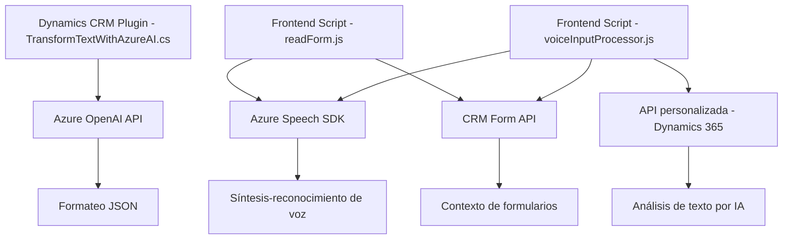

### Breve resumen técnico

El repositorio expone funcionalidades de integración para formularios en Dynamics CRM utilizando servicios como Azure Speech SDK (síntesis/reconocimiento de voz) y Azure OpenAI API (transformación de texto en JSON estructurado). Abarca tanto el frontend (archivos en JavaScript) como el backend (plugins en C# para Dynamics CRM). Se enfoca en una arquitectura orientada a servicios con interacción directa con APIs y SDKs externos.

---

### Descripción de arquitectura

1. **Tipo de solución:** La solución puede categorizarse como un híbrido API + frontend especializado, dirigido a extender funcionalidades interactivas en aplicaciones empresariales basadas en Dynamics CRM.
   
2. **Patrones utilizados:** 
   - Modularización: División lógica entre procesamiento modularizado en los archivos JavaScript.
   - Event-driven: Promesas y callbacks conducen el manejo de eventos y carga dinámica.
   - SOA (Arquitectura Orientada a Servicios): Plugins y servicios consumen APIs externas como Azure OpenAI y Azure Speech SDK para realizar tareas especializadas.
   - SDK Integration: Uso extensivo de SDKs externos y APIs personalizados.

3. **Tipo de arquitectura:**
   - **Frontend:** Estructura basada en n capas, donde las capas principales son lógica de captura y procesamiento de datos.
   - **Backend:** SOA mediante plugins para realizar solicitudes puntuales a servicios externos.

---

### Tecnologías usadas

1. **Frontend:**
   - Azure Speech SDK: Para reconocimiento y síntesis de voz.
   - Dynamics 365 Web API: Manipulación directa del contexto del formulario y sus atributos.
   - JavaScript moderno: Callbacks, promesas y manipulación del DOM para lógicas interactivas.

2. **Backend:**
   - Azure OpenAI API: Transformación avanzada de texto.
   - .NET Framework (C#): Lógica de plugins compatible con Dynamics CRM.
   - Dependencias adicionales: 
     - **Newtonsoft.Json**: Manejo y procesamiento de nodos JSON.
     - **Microsoft.Xrm.Sdk**: Proporciona abstracciones para interactuar con módulos de Dynamics CRM.

---

### Diagrama Mermaid válido para GitHub

---

### Conclusión final

El repositorio implementa una solución moderna altamente integrada en el ecosistema de Dynamics CRM, con una estructura modular y orientada a servicios. En el frontend se facilita la interacción con formularios mediante voz, utilizando SDKs como Azure Speech. En el backend, los plugins C# procesan datos mediante Azure OpenAI para realizar transformaciones avanzadas. La solución adopta patrones como SOA y modularización, promoviendo escalabilidad y adaptabilidad cuando se integre con otros sistemas empresariales.