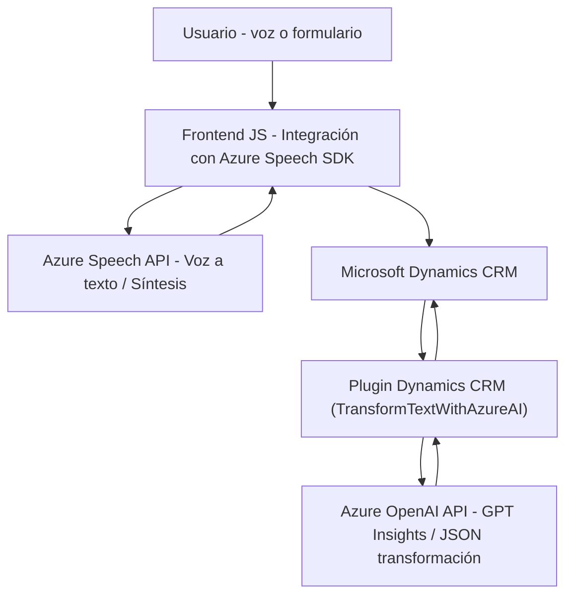

### Breve resumen técnico:
Este repositorio parece ser parte de un sistema que integra capacidades de **Azure Cognitive Services** (Azure Speech y Azure OpenAI) con **Dynamics CRM** para el procesamiento de datos y entrada de voz en formularios dinámicos. La solución incluye un **frontend** basado en JavaScript, complementado con un **backend** en forma de un plugin de Dynamics CRM que utiliza la API de Azure OpenAI.

---

### Descripción de arquitectura:
1. **Solución**: Principalmente, el sistema es una **API y frontend** integrada con un backend de Dynamics CRM. Combina captura y procesamiento de datos con servicios de inteligencia artificial (Azure Speech y OpenAI).
2. **Arquitectura**:
   - **Frontend**: Modular y basado en componentes, gestionando funcionalidades específicas.
   - **Backend**: Comunicación directa con Dynamics CRM mediante un **n-capas** o **plugin-based architecture**. El plugin interactúa con servicios externos como Azure OpenAI y personaliza la lógica de negocio de CRM.
   - El sistema muestra elementos del patrón de arquitectura de **hexagonal port-and-adapter**, ya que el frontend y backend interactúan directamente con servicios externos por separado.

---

### Tecnologías y frameworks usados:
1. **Frontend**:
   - Lenguaje: **JavaScript**.
   - Frameworks/Sistemas:
     - Azure Speech SDK para síntesis y reconocimiento de voz.
     - Modularización del código (funcionalidades separadas como extracción de datos y transcripción).
2. **Backend**:
   - Lenguaje: **C#**.
   - Frameworks/API:
     - Dynamics CRM SDK (`Microsoft.Xrm.Sdk`) para integración con CRM.
     - JSON parsing con **Newtonsoft.Json** y **System.Text.Json**.
     - Comunicación con **Azure OpenAI** mediante **System.Net.Http**.
3. **Servicios externos**:
   - **Azure OpenAI**: Transformación de texto basado en IA.
   - **Azure Speech**: Captura y síntesis de voz.

---

### Dependencias y componentes externos presentes:
1. **Azure Cognitive Services**:
   - Speech SDK (`https://aka.ms/csspeech/jsbrowserpackageraw`).
   - OpenAI API (modelos GPT).
2. **Microsoft Dynamics CRM**:
   - XRM Web API y plugins personalizados.
3. **JSON frameworks**:
   - Newtonsoft.Json para manipulación avanzada de JSON.
   - System.Text.Json para serialización básica de datos.
4. **Frontend interactivo**:
   - Dependiente de una configuración de formularios dinámicos en Dynamics CRM como base para la entrada y procesamiento de datos.
5. **HTTP Requests**:
   - Comunicación directa con un endpoint Azure mediante POST para interacción con OpenAI.

---

### Diagrama **Mermaid**:
El siguiente diagrama representa la interacción entre las tres principales capas de este repositorio: **usuarios**, **frontend**, y **backend**, con servicios externos de Azure. El diagrama asume comunicación unidireccional y flujo de datos dinámico a través de APIs y SDKs.

---

### Conclusión final:
El repositorio está diseñado como una integración de **Azure Cognitive Services** para el reconocimiento de voz, procesamiento de datos y síntesis en una solución modular. El frontend utiliza **Azure Speech SDK** para manejar datos de entrada basados en voz y transformación dinámica de texto en formularios. Este se complementa con un plugin que conecta Dynamics CRM con la API de **Azure OpenAI** para un procesamiento avanzado de texto. Aunque la arquitectura general se aproxima a **hexagonal por capas**, la falta de inyección de dependencias en el backend limita su escalabilidad y flexibilidad.