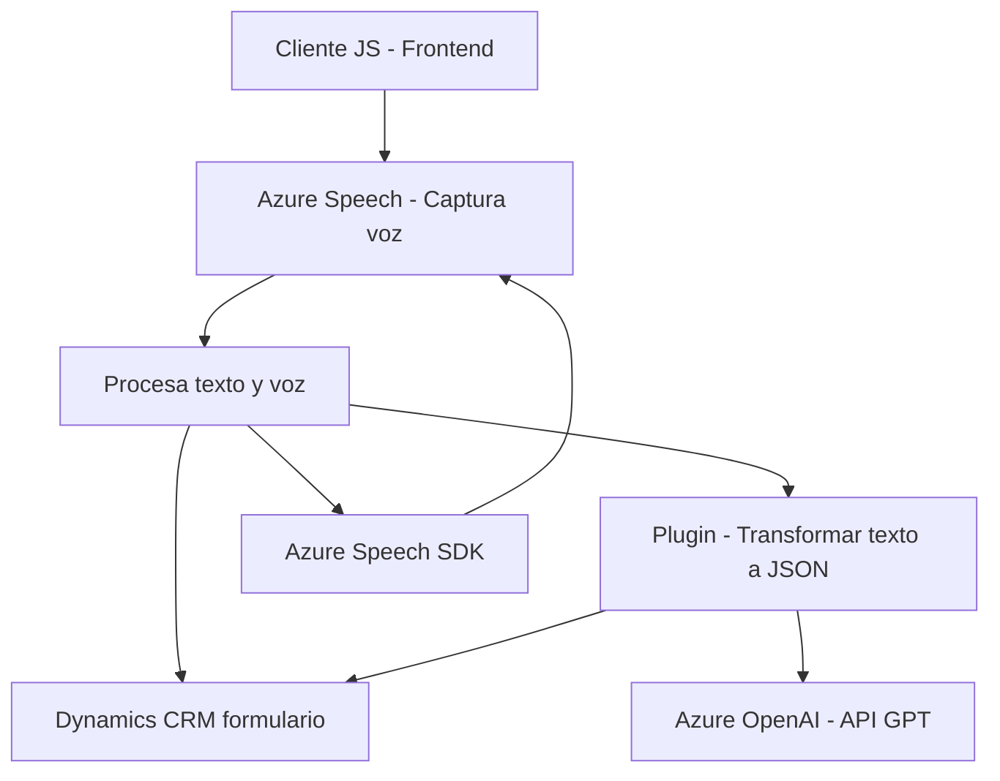

### Breve Resumen Técnico
El repositorio contiene una solución arquitectónica destinada a procesar datos de entrada de voz y texto desde formularios CRM, utilizando servicios avanzados como Azure Speech SDK y Azure OpenAI. La solución está divida en capas representadas por archivos responsables de diferentes tareas: interacción del cliente (frontend), procesamiento y lógica (JavaScript) y un backend orientado por plugins para un sistema Microsoft Dynamics CRM.

---

### Descripción de la Arquitectura
La solución utiliza una arquitectura **n capas** donde cada archivo está focalizado en una responsabilidad específica y el flujo de procesamiento incluye:
1. **Frontend**: Captura de datos y voz, interacción directa con usuarios a través de formas HTML/CRM.
2. **JavaScript intermedio**: Procesamiento de texto de entrada y voz en el cliente (p.ej., parseo, conversión y síntesis de voz).
3. **Backend plugin**: Transformación avanzada utilizando servicios Azure (AI y OpenAI) para estructuración de texto en JSON con normas predefinidas y su asignación en formularios CRM.

Los patrones observados incluyen:
- **Modularización**: Código dividido en funciones y módulos específicos.
- **Cliente/Servidor**: Delegación de lógica compleja al servidor (Azure OpenAI y plugins CRM).
- **Integración de servicios externos**: Uso extensivo de SDKs y APIs externas para manejo de voz y procesamiento inteligente de texto.

---

### Tecnologías Usadas
1. **Frontend JavaScript**:
   - Azure Speech SDK (procesamiento de voz y síntesis).
   - API del navegador.
   - Dinámicas de manipulación del DOM y función callback.

2. **Backend Plugin**:
   - Dynamics CRM SDK (`Microsoft.Xrm.Sdk` para extensiones de CRM).
   - Azure OpenAI Service (GPT vía REST API).
   - .NET Framework (servicios HTTP, serialización JSON).

3. **Patrones de diseño**:
   - Modularización.
   - Observador y callback.
   - Encapsulación lógica.
   - Cliente ligero.

---

### Dependencias o Componentes Externos
Dependencias identificadas:
1. **Frontend**:
   - Azure Speech SDK: Reconocimiento de voz y síntesis.
   - API dinámica para carga de scripts desde Azure.

2. **Backend**:
   - Azure OpenAI Service: Transformación de texto (GPT).
   - Dynamics CRM API (para integración con formularios y campos).

Tecnologías adicionales incluyen bibliotecas específicas del framework .NET y manejo de texto JSON.

---

### Diagramas Mermaid Para Representar la Arquitectura

---

### Conclusión Final
La solución del repositorio está diseñada con gran modularidad y enfoque en la separación de responsabilidades para garantizar flexibilidad y escalabilidad. El uso combinado de Azure Speech SDK y Azure OpenAI permite manejar capacidades avanzadas como la síntesis de voz y transformación de texto en formularios CRM, mientras que la arquitectura en capas asegura un flujo lógico limpio. Adicionalmente, la integración de estándares de seguridad en el backend sería crítica debido al manejo de claves de Azure y datos sensibles.