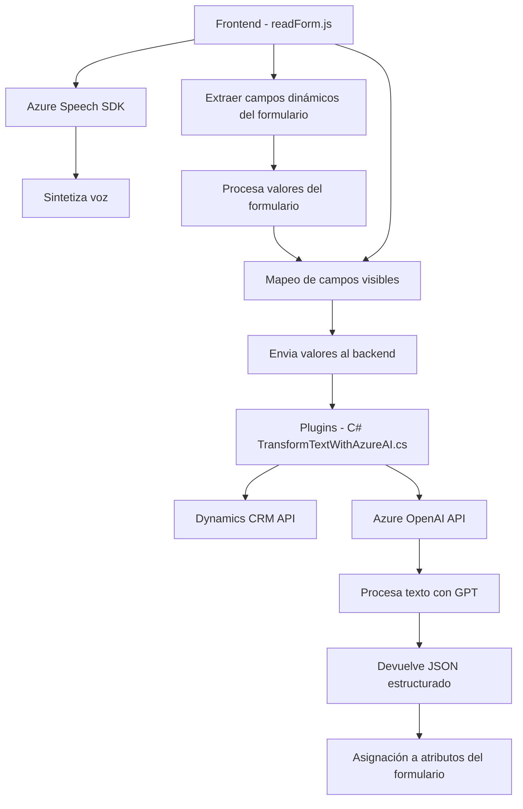

### Breve resumen técnico:
Este repositorio parece estar compuesto por componentes para implementar una solución que integra entrada y salida de voz, procesamiento de texto con inteligencia artificial (IA), y una arquitectura de plugins para integración con Dynamics CRM. Se apalancan herramientas como el **Azure Speech SDK** y **Azure OpenAI API**.

---

### Descripción de arquitectura:
1. **Tipo de solución:**  
   Es una solución híbrida que incluye:
   - Un frontend en JavaScript para gestionar interacción de usuarios en una interfaz de Dynamics 365 mediante entrada y salida por voz.
   - Lógica backend mediante plugins C# para integrar un servicio de transformación de texto usando Azure OpenAI API.
   - La arquitectura parece ser una combinación de **n capas** (frontend y backend) con ciertas funcionalidades moduladas siguiendo principios de **arquitectura dinámica** (API y servicios externos).

2. **Patrones utilizados:**  
   - **Modularidad:** El frontend y los plugins backend están claramente segmentados con funciones definidas.  
   - **Data Mapper:** Utilizado en el frontend para mapear entradas y salidas desde el formulario hacia atributos específicos.  
   - **Plugin Architecture:** Implementado en Dynamics CRM.  
   - **SDK Dependency:** Integración directa con SDK externos para entrada/salida de voz y procesamiento de IA.  
   - **Asynchronous Programming:** Uso de promesas y tareas asíncronas para manejar solicitudes a servicios externos como Azure API.

3. **Dependencias principales:**
   - **Frontend:**
     - `Azure Speech SDK` para entrada/salida de voz.
     - DOM para manipulación de formulario en Dynamics 365.
   - **Backend (C# Plugin):**
     - `.NET Framework` y `Microsoft.Xrm.Sdk` para manejo interno de Dynamics CRM como plugin.
     - `Azure OpenAI API` para procesamiento avanzado de texto basado en GPT.
     - JSON parsing mediante `Newtonsoft.Json` y `System.Text.Json`.

---

### Tecnologías usadas:
- **Frontend:**  
  - **JavaScript**, integrando el SDK de **Azure Speech** para entrada y salida de voz.  
  - Dinámica de DOM para obtener y configurar atributos del formulario en **Dynamics 365**.  

- **Backend:**  
  - **C#** plugin extendiendo capacidades de Dynamics mediante `Microsoft.Xrm.Sdk`.  
  - **Azure OpenAI API** para transformación de texto según normas predefinidas.  
  - **Newtonsoft.Json** y `System.Text.Json` para serialización/deserialización JSON.  

- **Externos:**  
  - `Azure Speech SDK` cargado dinámicamente para uso en navegador.  
  - `Azure OpenAI API`, desplegado en el cliente para procesamiento inteligente del texto.  

---

### Diagrama Mermaid válido para GitHub:

---

### Conclusión final:
Este repositorio implementa una solución modular que extiende funcionalidades de **Dynamics 365** añadiendo elementos de inteligencia artificial y entrada/salida de voz. Utiliza una arquitectura basada en módulos con responsabilidades bien definidas para el frontend y backend, además de apalancar servicios externos como **Azure Speech SDK** y **Azure OpenAI API**. Sin embargo, el diseño presenta algunas áreas de mejora como mejor gestión de claves API y ampliación de validaciones de datos, especialmente en interacciones con APIs externas.