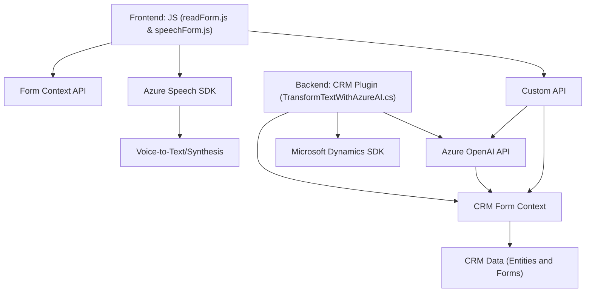

### Breve resumen técnico

La solución propuesta parece ser una aplicación diseñada para la integración con formularios en una plataforma CRM (posiblemente Microsoft Dynamics 365), que utiliza características de reconocimiento de voz y síntesis de texto a voz mediante **Azure Speech SDK** y una **API personalizada** basada en **Azure OpenAI**. Los archivos se dividen en funcionalidad de **frontend** y **backend**, con separación entre lógica de presentación y procesamiento. 

---

### Descripción de arquitectura

La arquitectura del sistema se puede describir como una _arquitectura de n capas_ (al menos tres capas entendidas en sentido abstracto: presentación, lógica y datos). 

1. **Capa de presentación (frontend)**: La carpeta `FRONTEND/JS` contiene JavaScript responsable de las interacciones de usuario en formularios web asociados a CRM. Aquí se manejan:
    - La recopilación de datos visibles del formulario.
    - La síntesis y reconocimiento de voz con **Azure Speech SDK**.
    - La transformación de textos con el uso de APIs externas y actualización de campos en el formulario de la aplicación.

2. **Capa de negocio (backend)**: El archivo `Plugins/TransformTextWithAzureAI.cs` implementa un **plugin de Microsoft Dynamics** que aplica lógica específica para transformar texto utilizando **Azure OpenAI**.

3. **Capa de datos (CRM y API)**: La solución utiliza el **Microsoft Dynamics CRM Form Context API** para interactuar y actualizar formularios. Además, consume datos y funcionalidad mediante la **Azure OpenAI API** y puede realizar consultas hacia APIs personalizadas con formatos RESTful, así como búsquedas en datos asociados al CRM, como entidades o `lookups`.

---

### Tecnologías utilizadas

1. **Frontend**:
  - **JavaScript** (modular structure and asynchronous programming using Promises and callbacks).
  - **Azure Speech SDK**: For voice recognition and text-to-speech synthesis integrated into web forms.
  - **CRM Form Context API**: For manipulating field values and interacting with CRM business forms.
  - Client-side asynchronous typing (`Promises`) for API calls and SDK loading.

2. **Backend**:
  - **Microsoft Dynamics 365 SDK** (`Microsoft.Xrm.Sdk` for CRM Plugins): Managing CRM data retrieval, updates, and custom logic, such as validating user inputs.
  - **Azure OpenAI endpoint**: Handles integration with the API for processing text via the GPT model (API features like `max_tokens`, `temperature`, and `top_p` are configurable).
  - **JSON libraries** (`Newtonsoft.Json`, `System.Text.Json`): Used for serialization and deserialization of data for API interactions.

---

### Diagrama Mermaid válido para **GitHub** Markdown

Se generará un diagrama representando los componentes clave y cómo interactúan entre sí.

---

### Conclusión final

La solución es una integración de varios componentes diseñados para mejorar la interacción usuario-aplicación mediante voz y procesamiento inteligente de datos. Se presenta en una arquitectura de **n capas**: el frontend está orientado al manejo de entrada de voz y interacción con formularios, mientras que el backend maneja la comunicación con el servicio de **Azure OpenAI** y el core del sistema CRM usando **Microsoft Dynamics SDK**.

Los patrones arquitectónicos utilizados incluyen diseños de integración de API mediante un _Cliente HTTP Restful_, el uso del **Azure Speech SDK** y el protocolo de callback/promesas en la capa de presentación, además del patrón proxy en el backend. Aunque la modularidad está presente, podría beneficiarse de una reorganización hacia patrones orientados a objetos para mejorar la mantenibilidad y la prueba unitaria del código.

Por lo tanto, el sistema sería ideal para una plataforma que busque mejorar la productividad de los usuarios mediante técnicas avanzadas como la voz a texto (reconocimiento y síntesis de voz) y automatización de formularios utilizando inteligencia artificial.