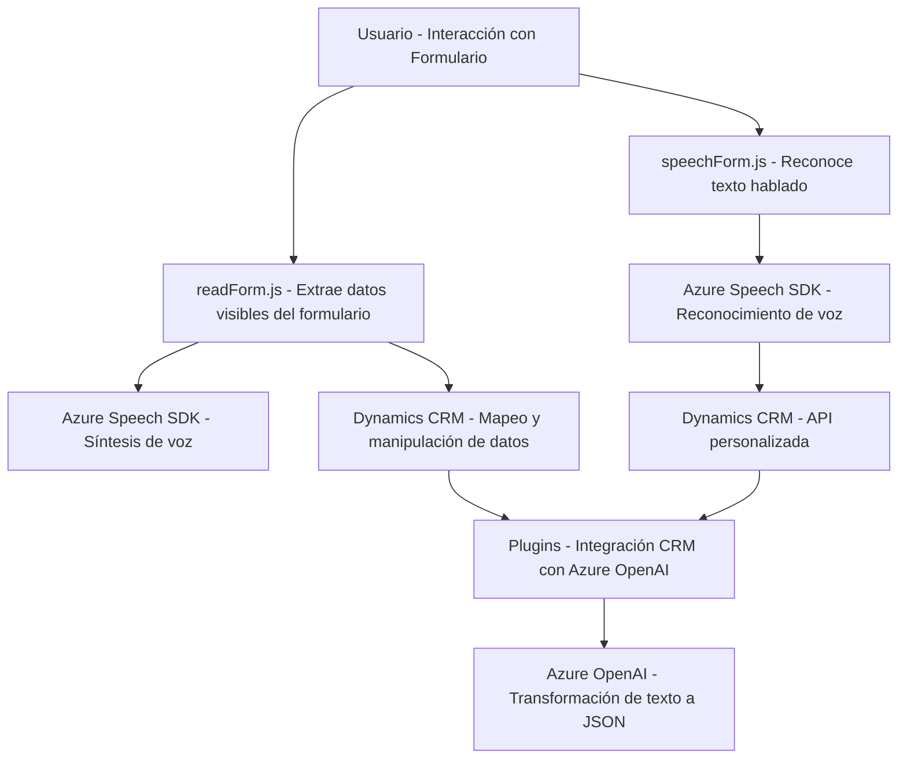

### Breve Resumen Técnico
El repositorio combina funcionalidad de frontend basada en JavaScript y un backend en .NET orientado a Microsoft Dynamics CRM. Se enfoca en la accesibilidad y la automatización mediante voz, inteligencia artificial y la integración de servicios externos (Azure Speech SDK y Azure OpenAI).

---

### Descripción de la Arquitectura
La solución tiene una **arquitectura híbrida orientada a integraciones y n-capas**:
1. **Presentación (Frontend)**: Una capa que interactúa con usuarios mediante formularios y comandos de voz. Usa **Azure Speech SDK** para procesar y sintetizar voz en tiempo real.
2. **Lógica (Backend)**: Un plugin en Dynamics CRM usa patrones de procesamiento remoto (RPC) y de integración de servicios externos (Azure OpenAI), permitiendo la conversión de texto en estructuras JSON basadas en IA.
3. **Data Layer**: La aplicación interactúa en tiempo real con entidades de Dynamics CRM y APIs personalizadas para leer y escribir datos del backend.

---

### Tecnologías Usadas
1. **Frontend**:
   - JavaScript con modularización (funciones separadas).
   - **Azure Speech SDK**: Herramientas para procesamiento de voz y síntesis.
   - Dinámicas basadas en el contexto de formularios de Dynamics CRM (`formContext`).

2. **Backend**:
   - **C#** con .NET Framework para el desarrollo de plugins en Dynamics CRM.
   - **Azure OpenAI API** (GPT-4).
   - Bibliotecas para JSON: `Newtonsoft.Json.Linq`, `System.Text.Json`.

3. **Patrones de arquitectura**:
   - **Programación basada en eventos** (callbacks en frontend).
   - **Modularización funcional**.
   - **Plugin Pattern** para extensibilidad en Dynamics CRM.
   - **Integración de servicios externos** para voz y procesamiento de texto estructurado.

---

### Dependencias o Componentes Externos
1. **Azure Speech SDK**: Para síntesis de voz y reconocimiento de audio.
2. **Dynamics CRM API**: Integración para la operación directa sobre formularios y entidades en la capa de datos.
3. **Azure OpenAI API**: Servicio para clasificación y transformación de texto basado en inteligencia artificial.
4. Herramientas adicionales:
   - `Microsoft.Xrm.Sdk` para contexto de CRM.
   - JSON manipuladores: `Newtonsoft.Json`, `System.Text.Json`.

---

### Diagrama **Mermaid** Válido para GitHub Markdown

---

### Conclusión Final
El sistema está diseñado como una solución modular y extensible, que combina frontend y backend para las necesidades de accesibilidad y procesamiento inteligente en tiempo real. Utiliza tecnologías modernas, como el Azure Speech SDK y Azure OpenAI, que reflejan una integración centrada en servicios de la nube. La arquitectura general se acerca a un esquema híbrido con componentes distribuidos que interactúan mediante APIs. Aunque existen riesgos asociados con el manejo de claves en código fuente, la solución tiene potencial para escalabilidad y eficiencia en entornos empresariales.