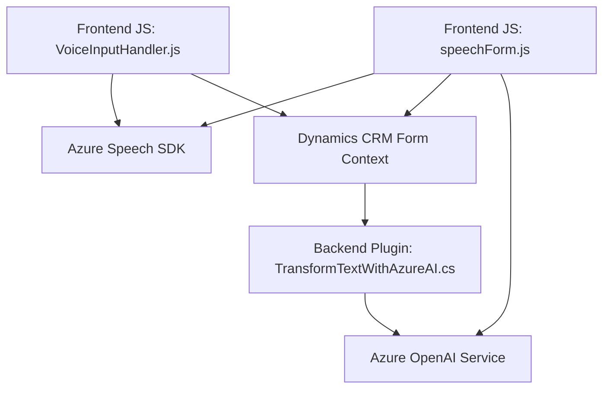

### Breve resumen técnico
El repositorio analizado contiene tres elementos principales: dos archivos JavaScript para el frontend (orientados a interacción por voz y formularios) y un archivo C# que implementa un plugin CRM para procesar texto a través de la integración con **Azure OpenAI**. La solución parece estar diseñada para trabajar en entornos empresariales donde los usuarios interactúan con formularios y aprovechan servicios en la nube (Azure Speech y Azure OpenAI).

---

### Descripción de arquitectura
1. **Tipo de solución**: La solución general corresponde a un **sistema híbrido de integración**. 
   - **Frontend**: Se emplea JavaScript para la funcionalidad de captura y síntesis de voz usando Azure Speech SDK. Esto se alinea con un cliente web orientado a formularios.
   - **Backend/plugin**: Se utiliza el **framework de Dynamics CRM** con una implementación de plugins para integrarse con servicios de Azure y procesar texto.

2. **Arquitectura**:  
   - El sistema general sigue una **arquitectura distribuida con microservicios** por la integración con APIs externas (Azure OpenAI y Speech SDK). 
   - El plugin sigue un **patrón de capas n** típico en aplicaciones basadas en Dynamics CRM, con separación por niveles: presentación (formulario), integraciones y procesamiento lógico.

3. **Patrones utilizados**:
   - **Single Responsibility Principle (SRP)**: Cada función y método tiene un propósito definido, lo que promueve una alta cohesión.
   - **Dependency Injection**: Se aplica en el plugin de Dynamics CRM para desacoplar la lógica del entorno.
   - **Adapter Pattern**: Funciones como `GetOpenAIResponse` (plugin) y `callCustomApi` (frontend) actúan como adaptadores entre los servicios externos y la lógica interna.
   - **Dynamic Data Mapping**: En el frontend, se introducen métodos para mapear datos visibles y dinámicos en formularios.

---

### Tecnologías usadas
1. **Frontend**:
   - **Azure Speech SDK**: Biblioteca destinada al reconocimiento de voz y síntesis de texto a voz.
   - **JavaScript (ES6)**: Lenguaje principal, con uso extensivo de funciones flecha, promesas y asincronía (`async/await`).
   - Frameworks implícitos: Posiblemente **Dynamics 365**, dado el contexto de formularios y manipulación con `Xrm.WebApi`.

2. **Backend/plugin**:
   - **Microsoft Dynamics SDK**: Framework utilizado para la implementación de extensiones en CRM.
   - **Azure OpenAI**: Servicio REST utilizado para procesar texto con IA.
   - **C#**: Lenguaje utilizado para implementar la lógica del plugin, con clases y métodos optimizados.
   - **Sistema de gestión de datos JSON**: Uso de `Newtonsoft.Json.Linq` y `System.Text.Json` para manejo de datos estructurados.

---

### Dependencias y componentes externos
- **Dependencias externas**:  
    - **Azure Speech SDK**: Reconocimiento y síntesis de voz.
    - **Azure OpenAI Service**: Procesamiento de texto basado en IA.
    - **URL externas**: Scripts del SDK de Azure como parte del frontend (`https://aka.ms/csspeech/jsbrowserpackageraw`).

- **Dependencias internas**:  
    - Métodos específicos del contexto de Dynamics (`Xrm.WebApi.online.execute`) para integración de formularios y APIs personalizadas.

---

### Diagrama Mermaid válido para GitHub

---

### Conclusión final
La arquitectura de esta solución está diseñada para permitir una experiencia interactiva, moderna y funcional de usuarios empresariales que trabajan con formularios. El uso de Azure Speech SDK y Azure OpenAI optimiza la entrada por voz y el procesamiento de datos con IA. Mientras el frontend está altamente modular y eficiente, el plugin hace uso de Dynamics CRM para extender la funcionalidad usando servicios en la nube. Sin embargo, el manejo de credenciales expuestas es un punto crítico que debe mejorarse para garantizar la seguridad de la solución.