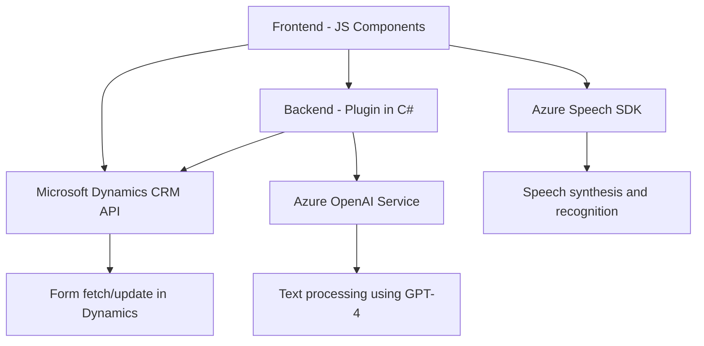

### Breve resumen técnico:

El repositorio contiene tres archivos que implementan funcionalidades de reconocimiento de voz y procesamiento de texto mediante servicios externos, incluyendo **Azure Speech SDK** y **Azure OpenAI Service**. La solución se enfoca en la interacción entre formularios dinámicos y capacidades avanzadas de voz/inteligencia artificial, probablemente como una extensión o aplicación sobre plataformas como **Microsoft Dynamics CRM**.

---

### Descripción de arquitectura:

La arquitectura de la solución combina patrones **modulares** y **orientados a servicios**, lo que la sitúa dentro del paradigma **microservicios funcionales**. Cada módulo o componente tiene una responsabilidad clara y opera sobre servicios externos (Azure Speech y Azure OpenAI). La interacción entre frontend y backend sugiere un modelo de arquitectura **cliente-servidor**, donde el cliente (JavaScript) consume servicios proporcionados por un backend que incluye una implementación .NET para plugins de Dynamics CRM.

El diseño de los archivos refleja una aproximación moderna orientada a funciones con principios destacados:
- **Desacoplamiento:** Cada función tiene una responsabilidad específica (e.g., extracción de datos, síntesis de voz, procesamiento de transcripciones).
- **Event-driven:** Manejo de callbacks y eventos para las operaciones asíncronas (carga de SDK, reconocimiento de voz, integración con servicios).
- **Consumo de servicios externos basado en REST.** (Azure Speech y OpenAI).

---

### Tecnologías usadas:
1. **Frontend:**
   - Lenguaje: JavaScript/ES6.
   - Frameworks/librerías: Azure Speech SDK (JavaScript).
   - APIs externas: Microsoft Dynamics CRM Web API.

2. **Backend (.NET):**
   - Lenguaje: C# (.NET Framework).
   - SDK: Microsoft Dynamics CRM.
   - JSON serialization/deserialization libraries: Newtonsoft.Json, System.Text.Json.
   - Comunicación HTTP: System.Net.Http.
   - Servicios: Azure OpenAI GPT-4.

3. **Servicios externos:**
   - Azure Speech SDK: Para síntesis y reconocimiento de voz.
   - Azure OpenAI GPT-4: Para transformación avanzada de texto mediante inteligencia artificial.

---

### Dependencias o componentes externos:
1. **Azure Speech SDK**: Librería para síntesis y reconocimiento de voz en tiempo real.
2. **Microsoft Dynamics CRM Web API**: Para interactuar con entorno de formularios/entidades y realizar consultas o actualizaciones.
3. **Azure OpenAI Service**: Modelo GPT-4 utilizado para transformación de texto y generación de resultados.
4. **Newtonsoft.Json**: Manejo de JSON en backend.
5. **System.Text.Json**: Serialización y deserialización de objetos JSON en C#.

Opcionalmente, podría incluir:
- Configuración segura para almacenar claves API y detalles de servicios externos (por ejemplo, Azure Key Vault).
- Librerías o frameworks adicionales en el frontend para mejor interacción con APIs.

---

### Diagrama Mermaid válido para GitHub:

---

### Conclusión final:

La solución implementada en este repositorio consiste en un **microservicio funcional** orientado a extender las capacidades de los formularios dinámicos de **Microsoft Dynamics CRM** con funcionalidades avanzadas de síntesis de voz (mediante **Azure Speech SDK**) y procesamiento de texto enriquecido (usando **Azure OpenAI/GPT-4**). Este diseño modular y basado en servicios permite extender fácilmente las capacidades hacia otros módulos de Dynamics o integraciones futuras.

Los archivos reflejan buenas prácticas de modularidad, desacoplamiento y separación de responsabilidades, pero tienen algunas oportunidades de mejora. Por ejemplo:
1. Mejor gestión de claves API para garantizar la seguridad de la aplicación.
2. Uso de control de excepciones más robusto (actualmente presente pero podría extenderse).
3. Un planteamiento más integral y documentado sobre la interfaz del usuario en el frontend para mejorar su interacción con el backend y servicios externos.

La solución demuestra una implementación híbrida ideal para entornos empresariales, aprovechando servicios de nube y un diseño enfocado en interoperabilidad.