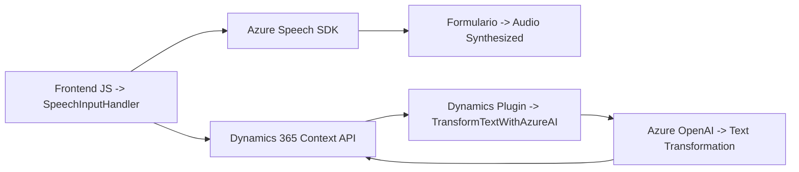

### Resumen Técnico

El repositorio descrito abarca una solución que integra diferentes componentes de software, donde se destacan elementos frontend, plugins de Dynamics 365, y uso de servicios externos como Azure Speech SDK y Azure OpenAI. Esta solución combina tecnologías y técnicas para procesar datos en formularios, transformarlos mediante servicios de voz y procesamiento de lenguaje, y devolver resultados en tiempo real.

---

### Descripción de Arquitectura

La solución refleja una arquitectura de **capas modulares e integración de servicios externos**, que actúa como puente entre un frontend interactivo, APIs de Microsoft Dynamics 365, servicios de Azure Speech SDK para reconocimiento/síntesis de voz, y Azure OpenAI para procesamiento avanzado de lenguaje.

**Componentes clave:**
1. **Frontend (JavaScript):** Maneja la interacción con el usuario y genera la lógica necesaria para capturar voz y procesarla dentro del contexto del formulario.
2. **Backend (Plugins Dynamics 365):** Extiende la funcionalidad de Dynamics 365 mediante plugins que procesan texto con Azure OpenAI, transformándolo en un formato específico (JSON estructurado).
3. **Integración de APIs:** Se emplean dos APIs principales:
   - **Azure Speech SDK:** Para síntesis y reconocimiento de voz.
   - **Azure OpenAI:** Para transformar texto de entrada en formatos específicos.
4. **Contexto de Dynamics 365:** Usa `Xrm.WebApi` para comunicación directa con registros y Custom APIs dentro del ecosistema Dynamics 365.

---

### Tecnologías Usadas

1. **Frontend:**
   - **JavaScript + Servicios Azure:** Para interacciones dinámicas y procesamientos en tiempo real (ej. carga del SDK de Azure Speech).
   - **Microsoft Dynamics Context APIs (`Xrm.WebApi`)**

2. **Backend:**
   - **C# + Plugins de Dynamics 365:** Extensión de eventos del sistema mediante `IPlugin`.
   - **Integración con Azure OpenAI:** Procesa texto dinámico usando solicitudes HTTP y transformación JSON.

3. **Servicios Externos:**
   - **Azure Speech SDK:** Reconocimiento/síntesis de voz.
   - **Azure OpenAI:** Procesamiento avanzado de lenguaje.

---

### Diagrama Mermaid para GitHub

---

### Conclusión Final

La solución presenta una arquitectura extensible y orientada a servicios, ideal para aplicaciones empresariales que integran funcionalidades avanzadas como reconocimiento de voz, síntesis de audio, y procesamiento de texto mediante inteligencia artificial. Las tecnologías utilizadas son coherentes con el ecosistema de Microsoft, combinando integración de APIs, extensiones del CRM Dynamics 365, y servicios en la nube de Azure.

El diagrama refleja esta interacción dinámica entre el frontend, plugins, y servicios de Azure, destacando patrones de diseño como modularidad, delegación, y capas. Esta organización y uso de servicios externos garantizan flexibilidad, escalabilidad, y mantenimiento a largo plazo.