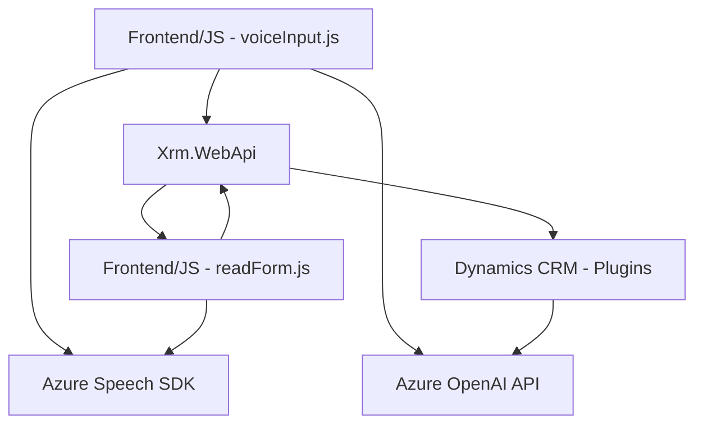

### Breve resumen técnico

El repositorio contiene componentes para una solución orientada al procesamiento de voz y texto. La arquitectura incluye integraciones con Azure Speech SDK para síntesis y transcripción de voz, junto con un plugin desarrollado para un sistema CRM que utiliza Azure OpenAI para texto estructurado. Los archivos son altamente modularizados y diseñados para ser reutilizables en diversas operaciones relacionadas con formularios dinámicos.

---

### Descripción de arquitectura

La solución combina varios paradigmas arquitectónicos:

- **N capas**: El sistema se organiza en niveles específicos, como lógica de presentación (procesamiento en el frontend), lógica de negocio (CRM y plugin), y capa de integración con servicios terceros (Azure SDK y Azure OpenAI).
- **Cliente-Servidor**: Utiliza un frontend que interactúa con servicios API internos y externos.
- **Basado en plugins**: Desarrollado para interacción directa con Dynamics CRM.
- **Orientado a eventos**: Especialmente en el manejo de eventos asincrónicos (por ejemplo, carga del SDK de Azure Speech).
  
El sistema es compatible con arquitecturas orientadas a servicios, gestionando tanto datos dinámicos con el uso de APIs como un sistema CRM robusto.

---

### Tecnologías usadas

1. **Lenguajes de programación y tecnologías**
   - **JavaScript**: Lógica de frontend para interacción con el SDK de Azure Speech y manipulación de formularios.
   - **C# (.NET)**: Desarrollado para plugins de Dynamics CRM.

2. **Frameworks/PL**
   - **Dynamics CRM SDK**: Para interacción con entidades de Dynamics.
   - **Azure Speech SDK**: Integra procesamiento de voz para síntesis y transcripción.
   - **Azure OpenAI (GPT)**: Utilizado dentro del plugin para transformar texto.

3. **Patrones de diseño**
   - **Modularización**: Código dividido en funciones claras y reutilizables.
   - **Gestión por eventos**: Manejo asincrónico de SDK y APIs externas.
   - **Abstracción**: Separación de lógica para transformación de datos antes de procesamiento (ej.: `getReadableValue` y `applyValueToField`).
   - **Cliente-Servidor y REST API Integration**: Manda solicitudes al backend (API personalizada y Azure OpenAI).

---

### Componentes y dependencias externas

- **Principales servicios externos utilizados**:
  - **Azure Speech SDK**: Para síntesis y transcripción de voz.
  - **Azure OpenAI API**: Para transformar texto con IA.
  - **CRM Dynamics SDK**: Para interacción dentro del entorno Dynamics.
  
- **Otras librerías/tecnologías externas**:
  - **Newtonsoft.Json** y **System.Text.Json** (trabajo con JSON en C#).
  - **HttpClient .NET**: Para REST API.

---

### Diagrama Mermaid (compatibilidad GitHub)

---

### Conclusión final

La solución implementada combina capacidades avanzadas relacionadas con síntesis de voz, transcripción, y análisis de datos con apoyo de IA, optimizando la interacción con formularios y CRM como Dynamics. La arquitectura se puede considerar **N capas**, orientada a servicios, y bien modularizada, permitiendo escalabilidad, reutilización, y adaptabilidad en escenarios empresariales. Adicionalmente, el uso de APIs como Azure Speech SDK y OpenAI asegura integración con servicios de última generación mientras se aprovecha la robustez del ecosistema Dynamics.