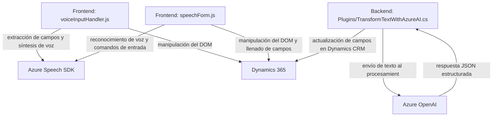

## Breve resumen técnico

La solución contiene archivos que se relacionan con distintos aspectos de una aplicación cliente basada en Dynamics 365 CRM con integración de servicios de Azure para reconocimiento de voz y procesamiento de texto. Es una solución híbrida que combina un cliente web configurado para trabajar sobre la interfaz de Dynamics 365 y un plugin que extiende la funcionalidad del CRM mediante integración con Azure OpenAI.

---

## Descripción de arquitectura

- **Tipo de solución**: Cliente para formularios en Dynamics 365 integrado con servicios de Azure y un plugin para procesamiento extendido (IA y síntesis de voz).
- **Arquitectura**: 
  - En **front-end**, adopta una arquitectura **n-capas** enfocada a integración de servicios (voz y procesamiento) sobre Dynamics 365.
  - En **backend**, el plugin sigue una arquitectura **basada en servicios**, centrada en la implementación de procesos específicos en Dynamics CRM.
- **Componentes principales**: 
  - Manipulación de formularios y datos en el cliente (JavaScript + Dynamics APIs).
  - Síntesis de voz con Azure Speech SDK.
  - Procesamiento de texto con Azure OpenAI mediante un plugin basado en Dynamics CRM.

---

## Tecnologías usadas

1. **Frontend**:
   - **Tecnología:** JavaScript.
   - **Framework:** Dynamics CRM Form APIs y Azure Speech SDK.
   - **Patrones:** Carga Lazy/Dinámica (script SDK), Encapsulación (funciones independientes para reconocimiento y síntesis).

2. **Backend**:
   - **Tecnología:** C# (.NET Framework).
   - **Frameworks:** Microsoft Dynamics SDK, Newtonsoft.Json.
   - **Servicios:** Azure OpenAI, Dynamics 365 WebAPI.
   - **Patrones de plugins:** 
     - Factory para instanciación de servicios organizacionales en Dynamics.
     - External Service Integration para conectar el plugin con Azure.

---

## Dependencias externas o componentes posibles

1. **Azure Speech SDK**:
   - Procesamiento de datos visibles en formularios, para síntesis de voz y comandos de voz.
   - Uso de lazily-loaded script desde `https://aka.ms/csspeech/jsbrowserpackageraw`.

2. **Dynamics 365 Web APIs**:
   - Manipulación de formularios y acceso a campos mediante contexto (`formContext`)
   - Operaciones CRUD y manejo de lookup entities en Dynamics CRM (ejemplo: búsqueda de entidades relacionadas por nombre).

3. **Azure OpenAI**:
   - Servicios de procesamiento de lenguaje y generación de estructuras JSON para el plugin.

4. **Paquetes de NuGet usados en el plugin**:
   - Newtonsoft.Json para manejo de datos JSON.
   - System.Net.Http para solicitudes al servicio Azure OpenAI.

---

## Diagrama Mermaid

---

## Conclusión final

Esta solución combina múltiples enfoques de arquitectura y patrones para integrar servicios externos con Dynamics CRM, permitiendo una experiencia enriquecida para los usuarios de formularios. Destacan:
1. **Frontend**: Modularidad con funciones independientes para manejo de voz y datos.
2. **Backend**: Un plugin robusto que manipula texto usando servicios AI en Azure, respondiendo con un JSON estructurado.

La integración directa con servicios externos (Azure Speech SDK y Azure OpenAI) habilita capacidades avanzadas como reconocimiento y síntesis de voz, así como conversión de voz y texto en data utilizable, siendo una solución adecuada para entornos empresariales que trabajan con procesos basados en formularios.