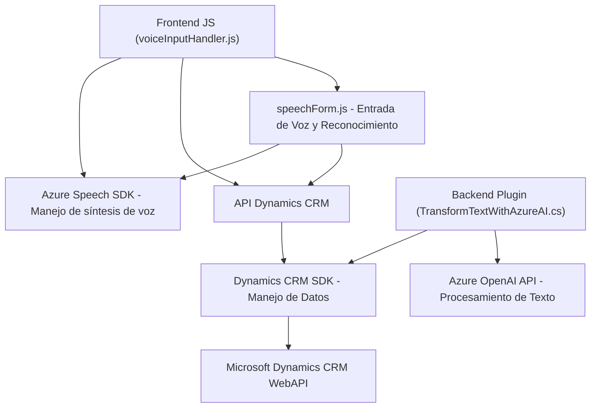

### Breve Resumen Técnico
El repositorio describe una solución compuesta por múltiples componentes que interactúan entre sí, integrando funcionalidades de entrada y salida de voz, manipulación dinámica de formularios, y un plugin para procesamiento de datos con Azure OpenAI. El sistema combina frontend (JavaScript para interacción con el usuario) y backend (C# en Dynamics CRM) con servicios externos de Azure.

---

### Descripción de Arquitectura
La solución tiene una arquitectura **híbrida basada en n capas**:
- **Frontend interactivo** (JavaScript) que ejecuta funcionalidades relacionadas con voz (entrada y síntesis) integradas con formularios. Utiliza el **Azure Speech SDK**.
- **Plugin en Dynamics CRM** (C#) para extender capacidades backend y procesamiento avanzado de texto, integrando el servicio de Azure OpenAI para transformación según reglas específicas.
- **Dependencias Externas**: Azure OpenAI y Azure Speech SDK son esencialmente servicios en la nube que añaden sofisticación y asistencia inteligente al sistema.

---

### Tecnologías Usadas
1. **Frontend**:
   - JavaScript (directamente en navegador).
   - Azure Speech SDK (manejo de síntesis de voz y reconocimiento).
   - Dynamics CRM WebAPI (gestión de formularios y campos).
   
2. **Backend**:
   - C# gestionado en el contexto de Dynamics CRM.
   - Azure OpenAI API (modelo GPT-4 para generación de texto).

3. **Patrones de diseño**:
   - Separación de responsabilidades modular (cada función y clase tiene un propósito específico).
   - Integración con servicios externos mediante API (Azure Speech SDK y OpenAI).
   - Mapeo dinámico de datos mediante pares clave-valor en formularios.
   - Patrón de complemento (Plugin) para la extensión del CRM.

---

### Diagrama Mermaid

---

### Conclusión Final
La solución presentada en el repositorio evidencia un diseño **orientado a servicios** con separación modular de roles:
1. **Frontend** para interacción directa con usuarios, con funcionalidades vocales (entrada y síntesis de voz) integradas en formularios, junto con procesamiento de datos dinámicos.
2. **Backend extensible** a través de un plugin de Dynamics CRM que aprovecha servicios avanzados (Azure OpenAI y Speech SDK) para operaciones de alta complejidad.

Esta arquitectura híbrida combina elementos de integración API, arquitectura **n capas**, y servicios en la nube para crear una solución robusta, flexible y adaptable adecuada para sistemas empresariales extendidos.