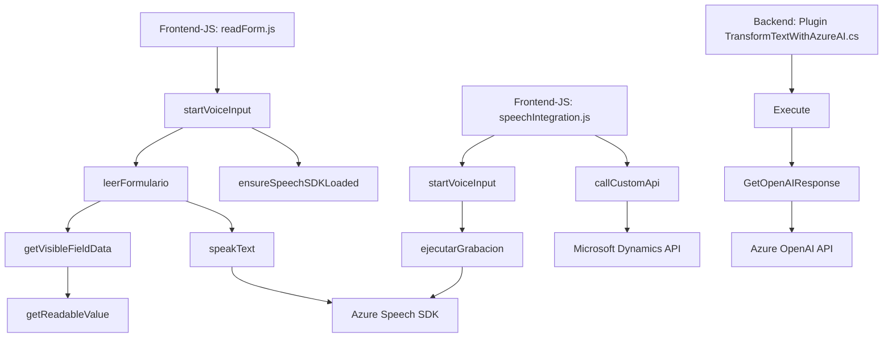

### Breve resumen técnico
El repositorio presenta una solución que integra tecnologías de interfaz de usuario y servicios avanzados en la nube para trabajar con voz y texto en escenarios dentro de Microsoft Dynamics CRM. La solución se basa en un frontend (JavaScript) para interacción del usuario con un formulario, y extensiones backend implementadas como plugins que usan APIs externas (Azure Speech SDK y Azure OpenAI).

---

### Descripción de arquitectura
La arquitectura tiene un enfoque híbrido compuesto por las siguientes capas:
1. **Frontend:** Uso de scripts JavaScript que funcionan como extensiones para formularios de Dynamics CRM, incorporando funcionalidades de síntesis y reconocimiento de voz (Azure Speech SDK).
2. **Backend:** Plugins en .NET que interactúan con Dynamics CRM para procesar texto utilizando Azure OpenAI, manejando la lógica avanzada de transformación y enriquecimiento de datos.

El diseño global se alinea con el patrón **n-capas**, con separación clara entre el frontend, backend y los servicios externos:
- **Frontend:** Para interacción de usuario (formularios y voz).
- **Backend:** Extensiones de lógica comercial (plugins para transformación y procesamiento).
- **Servicios externos:** SDK y APIs de Azure para capacidades avanzadas de IA (Speech y OpenAI).

---

### Tecnologías usadas
1. **Frontend (JavaScript)**:
   - Azure Speech SDK: Para reconocimiento y síntesis de voz.
   - APIs del navegador: Manipulación del DOM/formularios.
   - Microsoft Dynamics CRM scripting (formContext y Xrm.WebApi.online).

2. **Backend (.NET)**:
   - Microsoft Dynamics CRM SDK: Extensiones mediante plugins.
   - Azure OpenAI: Procesamiento avanzado de texto.
   - Framework .NET: Comunicación HTTP y manejo de JSON (System.Text.Json y Newtonsoft.Json).

3. **Patrones de arquitectura/programación**:
   - Modularización funcional: Separación clara de responsabilidades en funciones y métodos.
   - Lazy Loading: Carga dinámica del Azure Speech SDK según necesidad.
   - Callback y asincronía: Manejo de procesos dependientes de SDK/API.
   - SRP y DRY: Código organizado en pequeñas unidades con tareas específicas.

---

### Diagrama Mermaid válido para GitHub

---

### Conclusión final
La solución se presenta como una integración avanzada para extender las capacidades de Microsoft Dynamics CRM mediante tecnología cognitiva (Azure Speech SDK y OpenAI). Su arquitectura basada en capas permite mantener una separación lógica de responsabilidades entre frontend y backend, con interacción fluida hacia servicios externos. Este diseño es escalable para futuras mejoras, como añadir nuevos tipos de procesamiento de datos o soporte para otros idiomas.