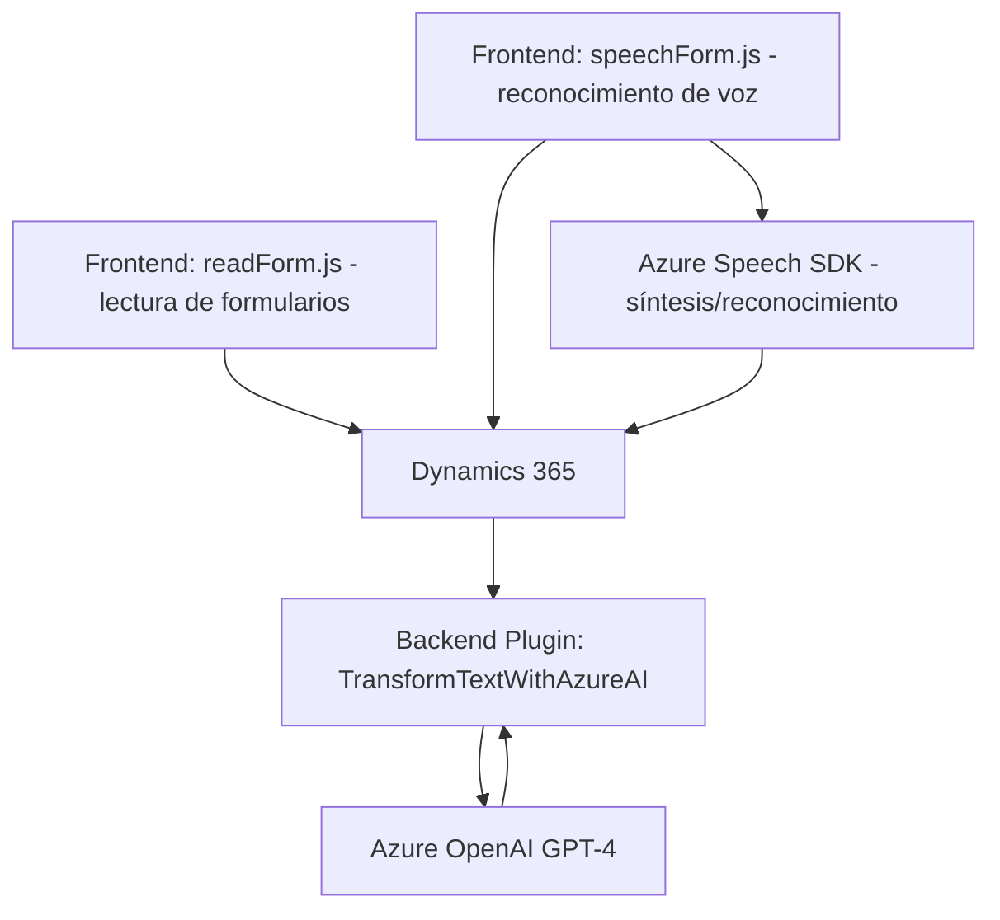

### Breve resumen técnico
El repositorio incluye una solución híbrida compuesta por aplicaciones frontend (basadas en JavaScript) que integran Azure Speech SDK, y un plugin backend desarrollado en C# para Microsoft Dynamics 365, el cual utiliza Azure OpenAI GPT APIs. La funcionalidad principal gira en torno a interacción y procesamiento del lenguaje natural (NLU) para formularios, mejorando la accesibilidad y organización de datos.

---

### Descripción de arquitectura
1. **Tipo de solución**:
    - **Frontend**: Proporciona interfaces dinámicas que utilizan reconocimiento y síntesis de voz para interactuar con los formularios.
    - **Backend**: Plugin personalizado para Dynamics 365 que integra procesamiento avanzado mediante APIs de Azure OpenAI.

2. **Arquitectura**:
    - **Distribuida en capas**:
      - Capa de presentación: JavaScript frontend para el cliente.
      - Capa lógica: Plugin C# en Dynamics 365 que realiza transformaciones a través de una API de IA.
    - **Integración con SaaS**: Uso de servicios Azure como Speech SDK para síntesis/reconocimiento de voz y OpenAI para procesos de texto.

3. **Principales patrones observados**:
    - **Adapter Pattern**: El código adapta atributos del formulario de Dynamics 365 para hacerlos legibles o convertirlos al formato requerido por el usuario.
    - **Fachada**: Funciones frontend como `startVoiceInput(executionContext)` y `startSpeechInput` unifican la lógica integrada.
    - **Carga diferida de dependencias**: La función `ensureSpeechSDKLoaded` gestiona dinámicamente la dependencia del SDK de Azure Speech.
    - **Plugin Architecture**: Desarrollo en C# sigue las reglas del framework de plugins de Dynamics CRM.
    - **Callbacks y asincronía**: Uso intensivo de promesas y funciones `async/await` para manejar APIs externas y dinámicas en ambos entornos (frontend/backend).

---

### Tecnologías usadas
1. **Frontend**:
   - **JavaScript**: Base de los archivos del cliente que interactúan con Azure Speech SDK.
   - **Dynamics 365 Web API**: Utilizada para manipulación de formularios y campos.
   - **Azure Speech SDK**: Reconocimiento y síntesis de voz.
   - **AJAX/HTTP Fetch**: Llamadas asincrónicas a APIs de Azure.

2. **Backend**:
   - **C#**: Lenguaje utilizado para el plugin personalizado en Dynamics 365.
   - **Azure OpenAI (GPT-4)**: Servidor externo que transforma texto en JSON.
   - **Framework de plugins de Dynamics 365**.
   - **Newtonsoft.Json y System.Net.Http**: Para manejar JSON, consultas REST y serialización/deserialización.

---

### Diagrama Mermaid válido para GitHub

---

### Conclusión final
La solución claramente implementa una arquitectura de **integración en capas** con componentes distribuidos entre cliente y servidor. En el cliente, la interacción con usuarios está optimizada mediante reconocimiento de voz y síntesis utilizando **Azure Speech SDK**, mientras que las transformaciones avanzadas en el backend usan **Azure OpenAI GPT APIs** en colaboración con Dynamics 365. Este diseño es modular, extensible y adecuado para despliegues empresariales que integran datos y experiencias del usuario con servicios de inteligencia artificial ofrecidos en la nube.