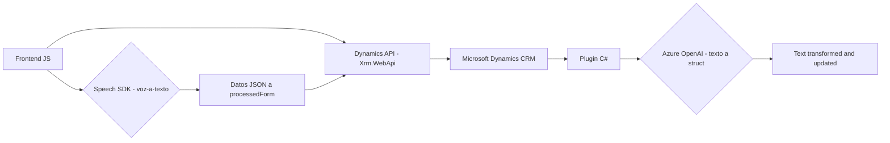

### Breve resumen técnico
La solución es un sistema completo integrado para procesar formularios mediante voz y transformar texto utilizando inteligencia artificial. Combina tecnologías frontend (JavaScript), backend (C# plugins) y servicios cloud (Azure Speech SDK, Azure OpenAI) en un entorno de **Microsoft Dynamics CRM**, extendiendo sus capacidades mediante scripts y plugins personalizados.

### Descripción de la arquitectura
1. **Tipo de solución**:
   - La solución es una **integración de múltiples capas** orientada al procesamiento de datos (texto y voz) y su uso dentro de formularios en el entorno **Microsoft Dynamics CRM**.
   - Incluye un frontend en JavaScript (para manejo de formularios y voz), que interactúa con un plugin backend desarrollado en C# para manejar procesamiento con inteligencia artificial, empleando el servicio **Azure OpenAI**.

2. **Patrones y estilos arquitectónicos utilizados**:
   - **N-capas**: Estructura que separa claramente la capa de presentación (JS para los formularios), la capa lógica (plugin en C#) y la capa de datos (Microsoft Dynamics CRM).  
   - **Service-oriented architecture**: Utiliza servicios de Azure (Speech SDK y OpenAI) por medio de integraciones REST para delegar tareas de síntesis y procesamiento.
   - **Facade pattern**: Implementado en scripts JavaScript para abstraer la complejidad del SDK y proporcionar una interfaz simple para tareas específicas como la extracción de datos del formulario y la síntesis de voz.  
   - **Delegation pattern**: Dinámica de callbacks para cargar librerías externas y delegar tareas de procesamiento.  
   - **Data mapping**: Mapa que asocia las etiquetas visibles del formulario con los campos internos.  
   - **Plugin-based architecture**: C# plugin como extensión de Dynamics CRM para transformar datos.

3. **Tipo de arquitectura**:
   - La arquitectura es **modular** y **híbrida**, con componentes distribuidos que interactúan mediante llamadas asincrónicas (e.g., SDK cargado con JavaScript y solicitudes HTTP al plugin). Cada componente tiene una responsabilidad bien definida:
     - **Frontend**: Interfaz principal con el usuario.
     - **Backend plugin**: Transformación avanzada del texto en Dynamics.
     - **External services**: Azure OpenAI para IA y Azure Speech SDK para el reconocimiento de voz.

### Tecnologías, frameworks y librerías
1. **Frontend (JavaScript)**:
   - **Azure Speech SDK**: Texto a voz y entrada de voz.
   - **Microsoft Dynamics CRM API (Xrm.WebApi.online.execute)**: Manipulación de datos en formularios y backend.
   - **Promises**: Manejador de operaciones asíncronas.

2. **Backend (C# Plugin)**:
   - **Microsoft Dynamics CRM SDK**: Framework para desarrollo de plugins y extensiones.
   - **Azure OpenAI**: Transformación y generación de texto en formato JSON.
   - **System.Net.Http**: Realización de consultas a servicios REST API.
   - **Newtonsoft.Json**: Manejo avanzado de JSON para procesamiento dinámico.

3. **Servicios y API externas**:
   - **Azure Speech Service**: Proporciona reconocimiento de voz y síntesis de audio.  
   - **Azure OpenAI Service**: Conectividad al modelo GPT-4 para tareas de transcripción y transformación avanzada.

### Dependencias o componentes externos
- **Front-end**:
  - Dependencia de **SDK Azure Speech** (`https://aka.ms/csspeech/jsbrowserpackageraw`): Se carga desde el navegador para tareas relacionadas con voz.
  - **Microsoft Dynamics CRM JavaScript APIs** para operaciones en formularios y entidades del CRM.

- **Back-end**:
  - Dependencia del **SDK de Dynamics CRM** para el desarrollo del plugin.
  - Uso de servicios **Azure REST API** (Speech y OpenAI) via **HttpClient**.
  - Uso de **Newtonsoft.Json** para manejar estructuras JSON locales o recopiladas de Azure.

### Diagrama Mermaid

### Conclusión final
La solución está diseñada como una integración modular que utiliza el poder de Microsoft Dynamics CRM junto con las capacidades avanzadas de inteligencia artificial y procesamiento de voz proporcionadas por los servicios en Azure. Su arquitectura se alinea con las mejores prácticas de separación de responsabilidades y modularidad gracias a los patrones utilizados. Las tecnologías empleadas permiten escalabilidad y extensibilidad, lo que junto con un diseño asincrónico basado en REST garantiza una operación fluida en entornos empresariales dinámicos.