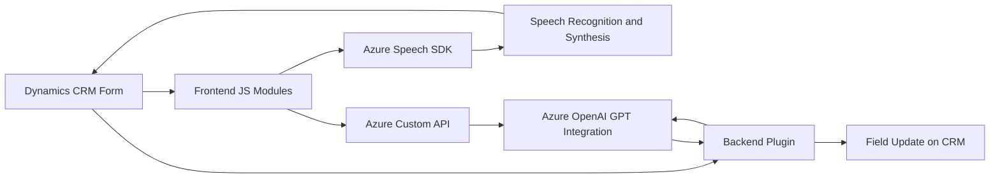

### Breve resumen técnico
La solución proporcionada tiene como finalidad implementar una integración avanzada entre Dynamics CRM y servicios externos de inteligencia artificial, como Azure Speech SDK y Azure AI. Se busca habilitar funciones de reconocimiento de voz, síntesis de audio y procesamiento avanzado de texto transcrito mediante IA para manipular formularios en Dynamics CRM de manera interactiva.

---

### Descripción de arquitectura
La solución representa una **arquitectura modular multicapa**, en la que cada componente tiene roles y responsabilidades específicas:
1. **Frontend (JavaScript):**
   - Manipulación de datos del formulario en Dynamics CRM y visualización en los campos interactivos.
   - Integración directa con el SDK de Azure Speech para manejar eventos de voz y síntesis de audio.

2. **Backend (Plugin C#):**
   - Plugin registrado en Dynamics CRM para transformar texto con Azure AI mediante solicitudes HTTP.
   - Responde a eventos del sistema utilizando el patrón de plugins nativo de CRM.

El enfoque arquitectónico combina patrones de *event-driven architecture* (reaccionar a eventos como grabación de voz, transcripción y carga de SDK) con *service-oriented architecture* (consumo de APIs externas, como Azure Speech y Azure OpenAI).

---

### Tecnologías usadas
1. **Frontend:**
   - **Azure Speech SDK:** Reconocimiento y síntesis de voz.
   - **Dynamics CRM SDK:** Manipulación de campos de formularios en Dynamics CRM.
   - **JavaScript ES6:** Promesas y asincronismo para carga dinámica de librerías.
   
2. **Backend:**
   - **C# .NET Framework:** Desarrollo del plugin utilizando clases como `HttpClient` y el framework REST.
   - **Newtonsoft.Json:** Procesamiento y serialización de datos JSON.
   - **Azure OpenAI (GPT-4):** Procesamiento de texto avanzado con IA.

---

### Diagrama Mermaid
El siguiente diagrama explica el flujo general y las interacciones entre los componentes de la arquitectura.

---

### Conclusión final
La solución integra **Azure Speech SDK** para interactuar con datos del formulario mediante reconocimiento y síntesis de voz en tiempo real, además de **Azure OpenAI** para procesar texto utilizando inteligencia artificial avanzada. Este diseño representa una arquitectura **multicapa modular** que se conecta dinámicamente con APIs externas y utiliza patrones orientados a eventos y servicios. Es especialmente útil para enriquecer la experiencia del usuario en aplicaciones empresariales como Dynamics CRM, facilitando la automatización de tareas mediante IA y procesamiento de voz.