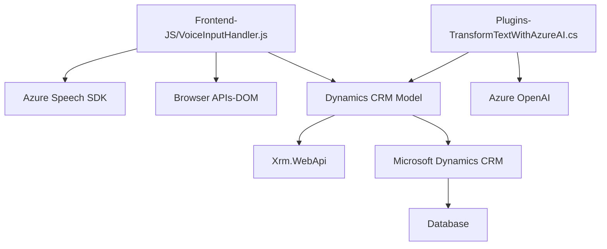

### **Análisis detallado del repositorio**

#### **Breve Resumen Técnico**
Este repositorio parece ser una solución compuesta que incluye una capa frontend en JavaScript y un backend .NET para Microsoft Dynamics CRM integrado con servicios externos como Azure Speech SDK y Azure OpenAI. La funcionalidad principal gira en torno a capturar texto, convertirlo en audio o voz, usar reconocimiento de voz, y procesarlo dentro del contexto de aplicaciones empresariales basadas en Dynamics CRM.

---

#### **Descripción de la Arquitectura**
La arquitectura es híbrida y muestra características de patrones orientados al servicio (SOA). Las capas observadas incluyen la interacción cliente-servidor:
1. Frontend con lógica para formularios y funcionalidad de voz.
2. Middleware en forma de plugins y clases que integran con el backend de Dynamics CRM.
3. Componentes externos como Azure Speech SDK y Azure OpenAI Service para procesamiento avanzado.

Podemos inferir una arquitectura **orientada al servicio** en la que partes modulares (frontend, backend con plugins, y servicios de terceros) están bien desacopladas a través de APIs. Es un diseño multi-capa orientado a servicios.

---

#### **Tecnologías, Frameworks y Patrones usados**
1. **Frontend**:
   - Lenguaje: JavaScript.
   - Frameworks/Librerías: 
     - Azure Speech SDK.
     - Manipulación con DOM API.
   - Patrones: Modularidad (funciones específicas) y carga dinámica de dependencias.

2. **Backend**:
   - Lenguaje: C# (Microsoft .NET).
   - Frameworks/Librerías:
     - Microsoft Dynamics CRM SDK para capacidades del modelo de datos y computación en plugins.
     - Json.NET (Newtonsoft.Json) para manipulación JSON.
     - System.Text.Json para optimización de serialización y deserialización.
   - Patrones: Plugin-Based Architecture para extensibilidad del sistema.

3. **Integraciones Externas**:
   - **Microsoft Azure Speech SDK**: Para sintetizar voz y reconocer audio.
   - **Azure OpenAI Service**: Procesamiento de texto mediante inteligencia artificial.

---

#### **Dependencias o componentes externos**
1. **Microsoft Azure Speech SDK**: Se carga dinámicamente en el lado del cliente para sintetizar texto en audio y gestionar reconocimiento de voz.
2. **Azure OpenAI Service**: Componente REST usado por el backend para procesar transformaciones en texto.
3. **Plugins de Dynamics CRM**: Los archivos implementan funcionalidades específicas en el modelo de datos Dynamics CRM.
4. **APIs del Navegador y Xrm.WebApi**: Manejo de formularios y comunicación con CRM desde el navegador y la capa web.

---

### **Diagrama Mermaid válido para GitHub**

---

#### **Conclusión Final**
La solución presentada en este repositorio es una **mezcla de frontend y backend**, donde cada capa tiene responsabilidades específicas. La arquitectura general permite modularidad y extensibilidad mediante un diseño orientado al servicio (SOA). Las dependencias externas (Azure Speech y OpenAI) están bien integradas, y el backend utiliza los recursos de Dynamics CRM para operar sobre datos empresariales y procesos específicos. El código parece estar pensado para aplicaciones de negocio avanzadas y procesos automatizados mediante reconocimiento de voz y procesamiento de lenguaje natural.