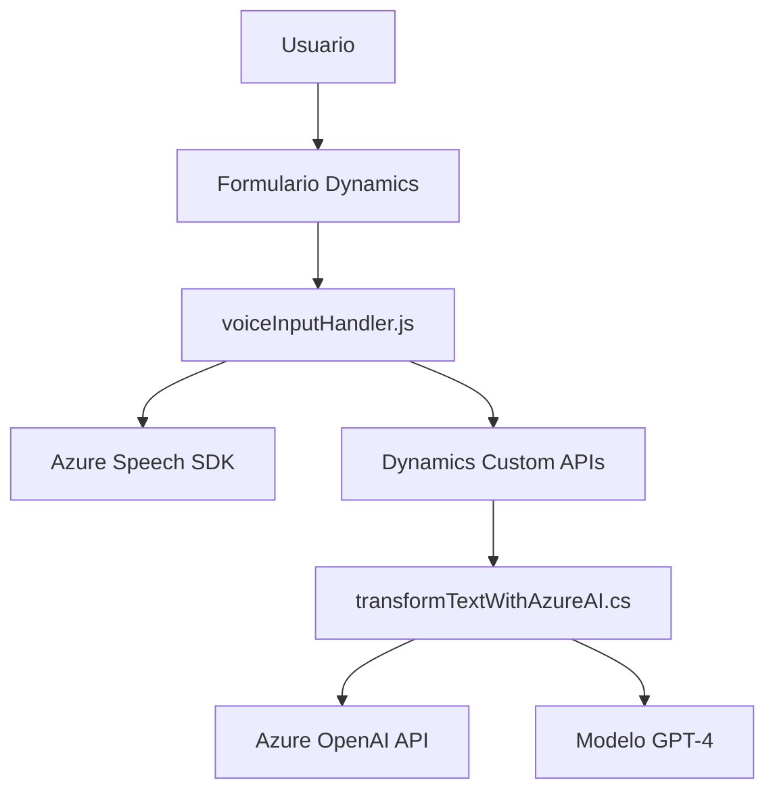

### Análisis y explicación técnica

#### **Breve resumen técnico**
Este repositorio es parte de una solución que implementa una integración entre Microsoft Dynamics 365 y varios servicios de Azure. Los archivos analizados detallan funcionalidades para la captura, procesamiento y transformación de texto mediante voz (via Azure Speech SDK) y un plugin de Dynamics que conecta con Azure OpenAI para la interpretación de texto en formato JSON. La solución está orientada a procesar datos de formularios en Dynamics CRM y agregar capacidades avanzadas de reconocimiento e interpretación de voz.

---

#### **Descripción de arquitectura**
La solución se basa en una arquitectura híbrida que combina conceptos de **n capas** (separación de presentación, lógica y datos) y **microservicios** (orientación a servicios externos) dentro del ecosistema Dynamics 365. A nivel de código:
1. **Frontend (JavaScript):** Ofrece un módulo para capturar datos de formularios y procesamiento de voz. Incluye la interacción directa con el navegador y la realización de llamadas a APIs externas (Azure Speech SDK).
2. **Backend (C# Plugin):** Implementa la lógica empresarial más compleja, como la transformación del texto capturado mediante Azure OpenAI al formato deseado. Este backend es integrado mediante la arquitectura de plugins de Dynamics CRM.

La solución se alinea parcialmente con los principios de **arquitectura hexagonal**, ya que interactúa con servicios y plataformas externas (Speech SDK, OpenAI API) manteniendo una separación entre la lógica de negocio y las dependencias externas.

---

#### **Tecnologías usadas**
1. **Frontend:**
   - **JavaScript:** El procesamiento local de datos y su integración directa con formularios basados en Dynamics.
   - **Azure Speech SDK:** Para la síntesis de texto en voz y reconocimiento de voz en el navegador.
   - **Client-side web API interactions:** Uso de Promesas y callbacks para manejar flujos asíncronos.

2. **Backend:**
   - **C# Plugin (Dynamics CRM):** Utilización de `IPlugin` para integrar la lógica empresarial con Dynamics CRM.
   - **Azure OpenAI API:** Comunicación con el modelo de lenguaje GPT-4 para interpretar el texto obtenido.
   - **REST API (HttpClient en C#):** Para consumir recursos externos y enviar solicitudes a Azure.
   - **System.Text.Json:** Serialización y deserialización de datos JSON.

3. **Servicios externos:** Dependencias de Azure como:
   - Azure Speech SDK para síntesis y reconocimiento de voz.
   - Azure OpenAI API para transformar texto mediante inteligencia artificial.
   - Dynamics SDK para la manipulación de datos dentro de los formularios.

---

#### **Dependencias y componentes externos**
1. **Azure Speech SDK:** Integrado dinámicamente en el cliente (Web). Permite reconocer y sintetizar voz directamente en el navegador.
2. **Azure OpenAI API:** Utilizado en el backend para transformar texto capturado en un formato deseado.
3. **Microsoft Dynamics SDK:** Dependencias tanto en los scripts como en el plugin para acceder y manipular datos relacionados con formularios.
4. **Custom APIs de Dynamics:** Para completar la arquitectura mediante endpoints específicos (ej. `trial_TransformTextWithAzureAI`).
5. **HTTP Client en C#:** Para las llamadas REST al servicio Azure OpenAI.
6. **Externally-hosted SDKs:** Como el CDN del Azure Speech SDK.

---

#### **Diagrama Mermaid**

---

### **Conclusión final**
Este repositorio implementa una solución híbrida basada en la plataforma Microsoft Dynamics CRM junto con los servicios de Azure. La solución utiliza una arquitectura modular con la interacción entre frontend (manipulación de formularios y voz) y backend (transformación avanzada con IA). Combina conceptos de **n capas** y **microservicios**, aprovechando la potencia de servicios de Azure como Speech SDK y OpenAI. 

**Puntos fuertes:**
- Modularidad: El sistema utiliza funciones y servicios desacoplados para facilitar la escalabilidad.
- Integración de servicios externos: Aprovecha Azure Speech y Azure OpenAI para añadir capacidades avanzadas.
- Arquitectura orientada a componentes: Separación clara entre frontend y backend.

**Áreas de mejora:**
- Las funciones de actualización de campos podrían ser centralizadas para mejorar su manejo y reutilización futura.
- Complementar el backend con mejores mecanismos para manejo de excepciones en casos de fallas en servicios externos.

En general, el diseño es moderno y extensible, reflejando buenas prácticas de integración con servicios cloud y módulos de negocio.