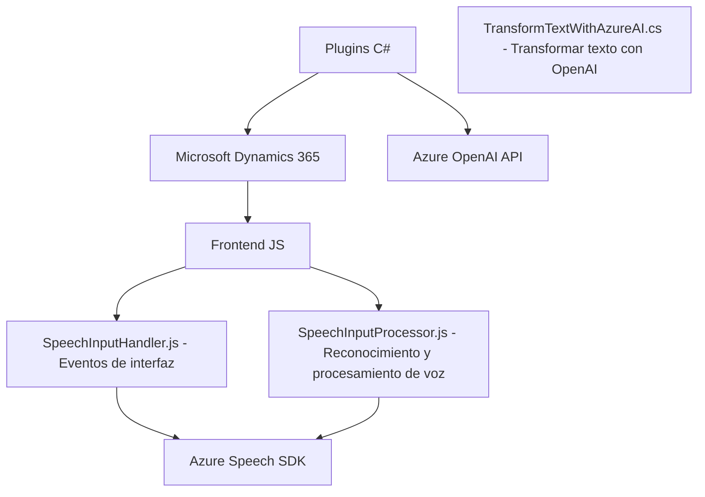

### Breve resumen técnico
El repositorio parece ser parte de un sistema mayor para integrar funcionalidades avanzadas como reconocimiento y síntesis de voz y procesamiento con IA en la plataforma **Microsoft Dynamics 365**. Tiene varias componentes:
1. **Frontend:** JavaScript para el manejo de entrada/salida de voz y sincronización con formularios.
2. **Plugin en C#:** Implementación de un plugin para extender la funcionalidad en Dynamics CRM con integración de Azure OpenAI.
3. **Dependencias externas:** Servicios como Azure Speech SDK y Azure OpenAI, integrados para realizar tareas avanzadas.

---

### Descripción de arquitectura
La arquitectura del sistema es **n capas** con integración de servicios externos. Tiene tres capas principales:
1. **Capa de presentación/frontend:** Implementada en **JavaScript** que interactúa con el usuario mediante formularios en Dynamics 365 y utiliza el **Azure Speech SDK** para entrada y salida de voz. La lógica aquí se divide en funcionalidades como lectura y escritura de datos del formulario y entrada por reconocimiento de voz.
2. **Capa de negocio:** Extensión mediante un **plugin C#** en Dynamics CRM que interactúa con Azure OpenAI para procesamiento avanzado de texto y generación de estructuras JSON.
3. **Capa de datos** (implícita): El sistema interactúa con datos del CRM sobre los objetos y formularios.

---

### Tecnologías usadas
1. **Microsoft Dynamics 365:** Es la plataforma principal sobre la que operan tanto los scripts de JavaScript como el plugin en C#.
2. **Azure Speech SDK:** Para reconocimiento y síntesis de voz en tiempo real.
3. **Azure OpenAI GPT:** Para procesamiento de texto y generación de JSON estructurado según normas definidas.
4. **JavaScript:** Usado en los archivos del frontend, principalmente para manipulación de formularios, integración de voz y lógica procesal.
5. **C#:** Implementación de un plugin utilizando la interfaz `IPlugin` del SDK de Dynamics CRM.
6. **System.Net.Http:** En el plugin para hacer peticiones HTTP hacia Azure OpenAI.
7. **JSON Lib:** Serialización y deserialización (por ejemplo, `JsonSerializer` en `System.Text.Json` o `Newtonsoft.Json` para estructuras complejas).

**Patrones implementados:**
- **Integración con APIs:** Uso de Azure Speech SDK y Azure OpenAI mediante llamadas a APIs para capacidades avanzadas.
- **Plugin extensible:** Uso de `IPlugin` para crear puntos de extensión en Dynamics CRM.
- **Orientación modular:** Separación clara en funciones con principios de responsabilidad única.
- **Uso de callbacks y procesos asíncronos:** Especialmente para la carga de librerías externas y gestión de SDK.

---

### Diagrama Mermaid válido para GitHub

---

### Conclusión final
El repositorio integra funcionalidades de voz e IA en una arquitectura **n capas**, orientada a extender y enriquecer la experiencia de usuario en **Microsoft Dynamics 365**. Combina un frontend modular en JavaScript para interacción con los formularios y el entorno de trabajo, junto con plugins en C# para procesamiento avanzado en la capa de negocio. Las dependencias externas, como **Azure Speech SDK** y **Azure OpenAI**, destacan el foco en tecnologías de reconocimiento, síntesis de voz e IA. La arquitectura es escalable y adaptable para futuras extensiones, siendo una solución ideal para plataformas CRM avanzadas.