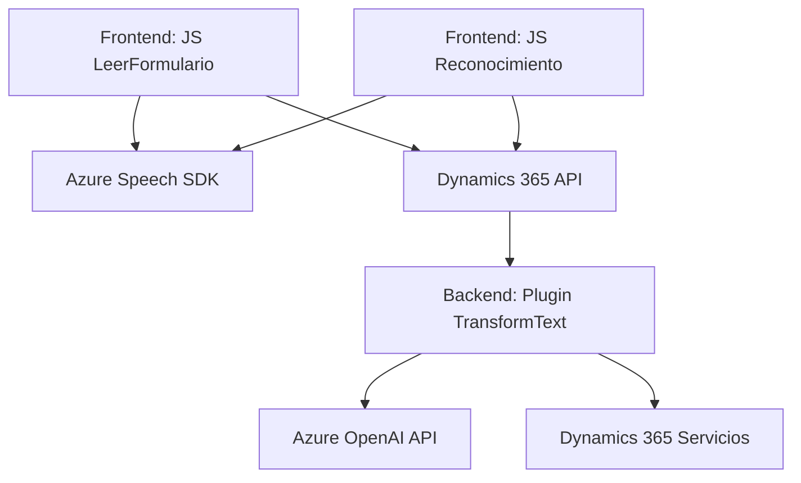

# Breve resumen técnico

El repositorio incluye códigos que interactúan con Microsoft Dynamics 365, Azure Speech SDK y OpenAI para mejorar la interacción entre usuarios y formularios mediante accesibilidad y procesamiento inteligente de datos de voz y texto. Podemos identificar soluciones específicas tanto en frontend como en plugins de backend que trabajan en conjunto para realizar transcripciones de voz, síntesis de texto en audio, y transformación de texto con inteligencia artificial.

---

# Descripción de arquitectura

La arquitectura observada es de tipo **n-capas**, con un claro diseño dividido en tres capas principales:
1. **Frontend (Cliente)**: Scripts en JavaScript interactúan con el navegador y SDKs para obtener datos del usuario mediante voz y generar audio mediante síntesis de texto.
2. **Backend (API + Servicios)**: Plugins en C# que interactúan con Dynamics 365 y servicios de OpenAI para procesar texto en tiempo real.
3. **Servicios externos**: Integración directa con Azure Speech SDK y OpenAI GPT para síntesis de voz, reconocimiento de voz, y transformación de texto.

---

# Tecnologías usadas

1. **Frontend**
   - **JavaScript**: Base del desarrollo para scripts interactivos.
   - **Azure Speech SDK**: Utilizado para reconocimiento de voz y síntesis de texto a voz.
   - **Dynamics 365 Web Resources**: Gestión de formularios dinámicos y atributos usando `executionContext` y `Xrm.WebApi`.

2. **Backend**
   - **Dynamics 365 Plugins API**: Se sigue el estándar de desarrollo de procesos en Dynamics, con clases que implementan la interfaz `IPlugin`.
   - **Azure OpenAI Service (GPT)**: Consumo de API para el procesamiento de texto basado en inteligencia artificial.
   - **Librerías de manejo HTTP y JSON**: `System.Net.Http`, `System.Text.Json`, `Newtonsoft.Json.Linq`.

3. **Patrones usados**:
   - Modularización de funciones.
   - Patrón fachada (`startVoiceInput` y plugins).
   - Delegación hacia servicios externos (SDKs y API).

---

# Tecnologías externas y dependencias

1. **Microsoft Azure Speech SDK**: Usado para interacción con reconocimiento y síntesis de voz.
2. **Azure OpenAI GPT**: Procesamiento de datos para transformación inteligente de texto.
3. **Dynamics 365 API (`Xrm.WebApi`)**: Gestión de datos y manipulación de atributos en formularios.
4. **Librerías estándar (.NET Framework, Newtonsoft JSON)**: Facilitación del manejo de datos y servicios.

---

# Diagrama Mermaid (válido para GitHub Markdown)

---

# Conclusión final

La solución presentada es un sistema integral diseñado para mejorar la experiencia de usuario en formularios dinámicos, habilitando accesibilidad mediante voz y transformación inteligente de texto. Con una arquitectura **n-capas** y el uso de servicios externos (Azure Speech y OpenAI), se logra un flujo eficiente y modular desde el frontend hasta el backend, asegurando flexibilidad y escalabilidad.