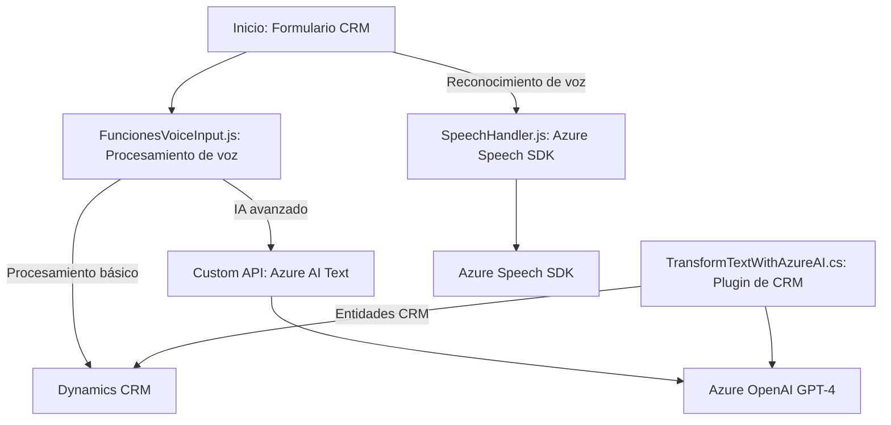

### Breve resumen técnico:
El repositorio describe diferentes archivos con funcionalidades distribuidas para integrar Azure Speech SDK, Dynamics 365 CRM y Azure OpenAI Service. Principalmente aborda tareas relacionadas con la recopilación de datos de formularios, síntesis y reconocimiento de voz, y transformación de texto mediante inteligencia artificial. Se observa una integración entre aplicaciones cliente (frontend JavaScript para formularios) y un plugin de servidor (C# para Dynamics CRM).

---

### Descripción de arquitectura:
El diseño general del sistema es **n-capas** con elementos de integración entre frontend y contratistas externos, así como comunicación directa con servicios Cloud de Azure a través de su API SDK. La arquitectura distribuye responsabilidades entre las capas:

1. **Frontend (JavaScript)**: Implementa la lógica de interacción con los usuarios mediante formularios y reconocimiento/síntesis de voz con Azure Speech SDK.
2. **Backend (Dynamics 365 Plugin)**: Procesa las solicitudes del cliente, interactúa con entidades de CRM y servicios de Azure AI para realizar transformaciones avanzadas de texto.

Se observa cierto grado de modularidad, aunque existen responsabilidades combinadas en algunos métodos que podrían beneficiarse de una separación más estricta.

---

### Tecnologías y conceptos usados:
1. **Frontend:**
   - **JavaScript**, en archivos organizados por módulos funcionales.
   - **Azure Speech SDK**, para reconocimiento y síntesis de voz.
   - Uso del contexto del formulario CRM para manipular campos visibles (`executionContext`, `formContext`).
   - Programación asíncrona con promesas (`callCustomApi`).

2. **Backend Plugin:**
   - **C# .NET Framework**, con APIs de Dynamics CRM (`Microsoft.Xrm.Sdk`).
   - **Azure OpenAI Service (GPT-4)**, mediante solicitudes HTTP (`System.Net.Http`).
   - **JSON manipulation libraries**, tanto `System.Text.Json` como `Newtonsoft.Json.Linq`.

3. **Patrones arquitectónicos**:
   - Modularidad funcional: Desglosado por funcionalidades específicas, cada archivo intenta encapsular tareas principales.
   - Orientación a servicios: Llamadas a APIs externas y uso de servicios SDK.
   - Modelo n-capas: Separación entre frontend que interactúa directamente con usuarios y backend encargado de lógica central y comunicación con Azure.
   - Callback y asincronía en carga dinámica (ejemplo: `ensureSpeechSDKLoaded`).

---

### Diagrama **Mermaid**:

---

### Conclusión final:
El repositorio describe una solución integrada orientada a servicios que combina interacción usuario-frontend y procesamiento backend basado en funcionalidades Cloud. Permite capturar datos de formularios y transformarlos mediante voz y análisis textual, conectado principalmente con Azure Speech SDK y OpenAI GPT-4. La arquitectura es híbrida, con un diseño de **n-capas** enriquecido por dependencias externas. 

Puntos fuertes:
- Modularidad funcional en el frontend.
- Uso de APIs modernas para procesamiento de voz y texto.
- Diseño adaptable, soporte para CRM Dynamics.

Áreas de mejora:
- Refactorización del método `Execute` del plugin para reducir responsabilidades combinadas.
- Documentación de configuraciones externas como claves API y endpoints para facilitar la escalabilidad.
- Evaluar una arquitectura **hexagonal** para mayor desacoplamiento entre servicios integrados y lógica interna.