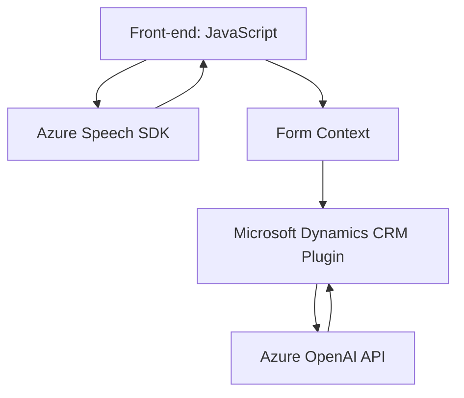

### Breve Resumen Técnico
El repositorio contiene una solución para la integración entre Microsoft Dynamics CRM, Azure Speech SDK, y Azure OpenAI. Esta solución se centra en dos áreas principales: el manejo de entrada y salida de voz en formularios dinámicos del front-end (JavaScript) y la transformación avanzada del texto con inteligencia artificial en el back-end a través de un plugin en C#.

---

### Descripción de la Arquitectura
La solución sigue una **arquitectura de n capas** con separación entre la capa de presentación (JavaScript en el front-end), una capa de lógica de negocio (plugins en Dynamics CRM en C#) y la capa de integración con servicios externos (Azure Speech SDK y Azure OpenAI). Las componentes están diseñadas de manera modular y reutilizan patrones como servicios externos, composición funcional y patrones de plugins de Dynamics CRM.

---

### Tecnologías, Frameworks y Patrones Usados
#### Tecnologías:
1. **Azure Speech SDK:**
   - Usado para síntesis y reconocimiento de voz en el front-end (JavaScript).
2. **Microsoft Dynamics CRM SDK:**
   - Estructura y servicios para integración de plugins que interactúan directamente con el entorno CRM.
3. **Azure OpenAI API:**
   - Proporciona servicios de inteligencia artificial para el procesamiento de lenguaje natural (NLP).
4. **JavaScript**: 
   - Estructura del front-end usando funciones para interacción de datos con campos de los formularios a tiempo real.

#### Frameworks:
1. **Dynamics CRM Framework:** Permite el desarrollo de plugins personalizados para automatizar tareas y realizar integraciones.
2. **Newtonsoft.Json:** Para manipular JSON en el plugin C#.
3. **System.Net.Http:** Facilita la comunicación HTTP con Azure OpenAI desde el entorno del plugin.

#### Patrones de diseño utilizados:
1. **Patrón de Carga Dinámica de SDK:** Asegura que las dependencias externas como Azure Speech SDK sean cargadas en tiempo de ejecución solo cuando se necesitan (`ensureSpeechSDKLoaded`).
2. **Patrón Servicio:** Comunicación directa con APIs externas como Azure OpenAI mediante solicitudes HTTP encapsuladas en métodos específicos (e.g., `GetOpenAIResponse`).
3. **Modularidad:** Separación de lógica en unidades funcionales.
4. **Interacción basado en Contexto:** Uso de `executionContext` para simplificar el manejo y transferencia de datos entre el front-end y el entorno CRM.

---

### Diagrama Mermaid Válido para GitHub Markdown

---

### Conclusión Final
El repositorio analiza una solución que conecta Dynamics CRM con servicios de voz y procesamiento de texto basados en la nube. Utiliza una arquitectura **n capas** con un front-end para la interacción de usuarios y un back-end que incorpora procesamiento avanzado de voz y texto con Azure AI. La solución es modular, escalable e integrada perfectamente con Microsoft Dataverse y servicios de Azure. Este enfoque combina tecnologías modernas como el Azure Speech SDK y OpenAI, junto con patrones robustos como carga dinámica, modularidad, y desacoplamiento para lograr un sistema flexible y orientado a propósito.