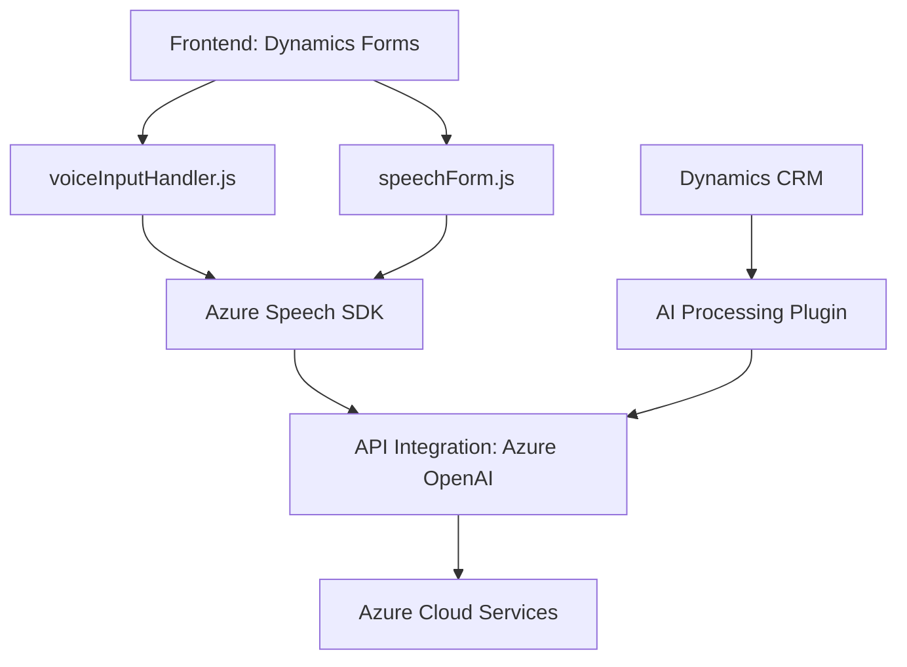

### Breve resumen técnico:
El repositorio tiene archivos distribuidos en tres áreas principales: **frontend**, **backend** (plugins), y dependencias externas relacionadas con servicios de Azure. La solución facilita la interacción entre formularios de Dynamics 365 y servicios cloud para reconocer voz, sintetizar texto a voz y transformar datos con capacidades de AI de Azure.

---

### Descripción de arquitectura:
1. **Tipo de solución:**  
   La solución tiene múltiples facetas:  
   - **Frontend:** Lógica de cliente en JavaScript que habilita integración con formularios y Azure Speech SDK para lectura y síntesis de datos.  
   - **Backend:** Plugins en C# diseñados para la manipulación de datos contextualizada dentro de Dynamics CRM y comunicación con Azure OpenAI.  
   - **Servicios externos:** APIs de Azure Speech y OpenAI.  
   
   **Nota:** Esto sugiere una arquitectura híbrida con capas en el frontend y extensibilidad de Dynamics CRM en el backend.

2. **Arquitectura general:**  
   - **N-capas:** La solución separa la lógica entre el frontend, usado para la interacción y presentación (incluyendo Dynamics forms), y el backend, que contiene lógica de transformación con plugins de Dynamics CRM.  
   - **SaaS/Cloud Integration:** Hay una fuerte dependencia de servicios SaaS externos como Azure Speech y OpenAI.  
   - **Desacoplamiento:** Entre el cliente (frontend) y las capacidades avanzadas del backend, creando una integración modular.

---

### Tecnologías usadas:
1. **Frontend:**  
   - **Azure Speech SDK:** Reconocimiento de voz, síntesis de texto a voz.  
   - **Dynamics 365 Web API:** Manipulación de atributos dentro del contexto de formularios interactivos.  
   - **JavaScript:** Procedural y modular.  

2. **Backend:**  
   - **C# (Plugins):** Implementación en Dynamics CRM, utilizando el SDK de Microsoft.  
   - **Newtonsoft.Json:** Procesamiento de datos JSON en el backend.  
   - **Azure OpenAI API:** Transformación semántica y generación de respuesta con IA.
   - **.NET Framework Libraries.**

3. **Patrones de diseño:**  
   - Callback Initialization: Gestión del SDK de Azure en el frontend con inicialización dinámica.  
   - MVC-like: En el frontend, la lógica maneja atributos (modelo), campos (vista) y conecta datos/acciones (controlador).  
   - Plugin-based: Backend implementa lógica según patrones convencionales de plugins en Dynamics CRM.

---

### Dependencias externas y componentes:
- **Azure Speech SDK:** Para reconocimiento de voz y síntesis de texto.  
- **Azure OpenAI API:** Para transformación avanzada de texto con IA.  
- **Microsoft Dynamics CRM Web API:** Para manipulación de datos del lado del cliente y backend.  
- **Third-party Libraries:**  
  - **Newtonsoft.Json**: Manejo de JSON en C#.  
  - **System.Net.Http:** Envío de solicitudes al servicio de Azure.  
- **CDN Dependencies for SDKs:**  
  - `https://aka.ms/csspeech/jsbrowserpackageraw` para cargas dinámicas en la configuración cliente.  

---

### Diagrama Mermaid (100 % compatible con GitHub Markdown):

---

### Conclusión final:
La solución es un sistema híbrido que integra múltiples technologies, ofreciendo funcionalidades avanzadas como reconocimiento y síntesis de voz, así como transformación semántica de datos con IA. Su arquitectura constituye un modelo de **n capas**, que mantiene separada la lógica de negocio entre frontend (cliente) y backend (plugins). La integración con servicios externos es fundamental (Azure Speech SDK y OpenAI), destacando un enfoque moderno de desarrollo escalable y preparado para el entorno cloud.