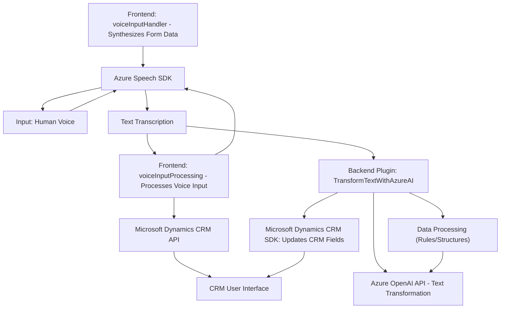

### Breve resumen técnico
Este repositorio contiene diferentes módulos dirigidos a la implementación de servicios y funcionalidades basadas en Azure Speech SDK y Azure OpenAI en un contexto de integración con Microsoft Dynamics 365 CRM. Los principales objetivos incluyen la entrada y salida de datos por voz, la transformación de textos mediante inteligencia artificial y la actualización programática de campos en formularios dinámicos dentro de un ecosistema basado en Microsoft Dynamics.

---

### Descripción de arquitectura
La arquitectura de la solución parece estar basada en un diseño **n-capas** combinado con **componentes específicos y servicios externos**. Se incluye un ecosistema modular de frontend con JavaScript para manejar la interface del usuario y la interacción con Azure Speech SDK, además de un componente de backend en forma de un **plugin** para procesamiento avanzado por medio de la API de Azure OpenAI.

Esta arquitectura distribuye la lógica entre el frontend (gestión de voz y formularios), el backend (proceso de transformación de datos mediante inteligencia artificial) y los servicios externos integrados (Azure Speech/AI).

---

### Tecnologías usadas
#### En el frontend:
1. **JavaScript** para el desarrollo de módulos.
2. **Azure Speech SDK** para procesamiento de voz (síntesis/entrada).
3. **Promises y manejo de async/await** para la lógica asíncrona.
4. **Microsoft Dynamics CRM JavaScript SDK (`Xrm.WebApi.online`)** para interacción con formularios CRM.
5. **Gestión dinámica de SDKs** mediante carga de scripts en tiempo de ejecución (callbacks).

#### En el backend:
1. **Microsoft Dynamics CRM SDK (`Microsoft.Xrm.Sdk`)** para implementación de plugins.
2. **Azure OpenAI API** para procesamiento de lenguaje natural.
3. **HttpClient (System.Net.Http)** para realizar solicitudes HTTP.
4. **JSON Handling frameworks**: `System.Text.Json` y posible uso de `Newtonsoft.Json`.

---

### Diagrama Mermaid

---

### Conclusión final
Este repositorio presenta una solución que emplea tecnologías modernas para integrar servicios de voz y AI en funciones diseñadas para mejorar la interacción con Microsoft Dynamics CRM. La arquitectura sigue un modelo de **n-capas** al dividir lógicamente el frontend y backend, apoyándose fuertemente en SDKs y servicios externos (Azure Speech y OpenAI) para proporcionar capacidades como entrada y salida por voz, y transformación inteligente de datos. 

Aunque el diseño modular y la integración son sólidos, existen oportunidades de mejora en términos de seguridad y manejo de dependencias, especialmente para las credenciales y la robustez de las operaciones asíncronas en caso de fallos. El diagrama Mermaid ilustra la interacción entre componentes de manera clara, alineándose perfectamente con las reglas de sintaxis establecidas.