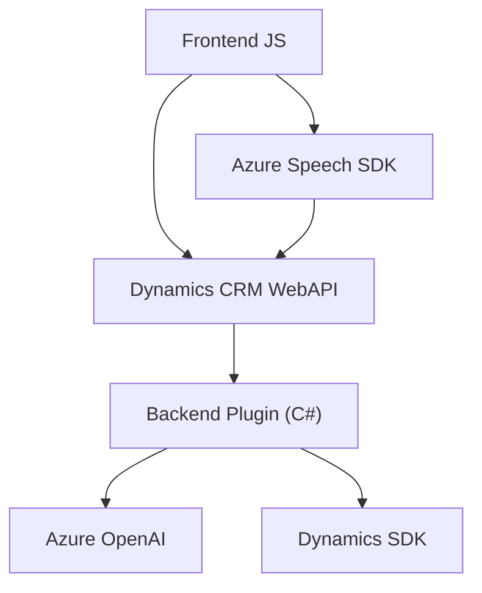

### Breve resumen técnico
Este repositorio parece ser parte de un sistema que integra procesamiento de voz, formularios dinámicos y servicios de inteligencia artificial para facilitar interacciones en entornos CRM, específicamente Microsoft Dynamics 365. Utiliza tecnología de Azure Speech SDK y Azure OpenAI para el reconocimiento, síntesis de voz y conversión de texto a datos estructurados.

### Descripción de arquitectura
La arquitectura tiene elementos de **n capas** con integración de servicios externos:
1. **Frontend**: JavaScript para manejar interacción de voz/síntesis y manipulación dinámica de formularios.
2. **Backend Plugins**: C# plugins para procesamiento avanzado mediante Azure OpenAI y actualización de datos de forma estructurada.
3. **Servicios externos**: Azure Speech SDK y Azure OpenAI para síntesis de voz y procesamiento de lenguaje natural.

Aunque parece haber separación entre las capas (frontend, backend y APIs), el enfoque basado en servicios integrados del CRM con lógica empresarial puede acercarse a un diseño monolítico dependiente del ecosistema CRM.

### Tecnologías usadas
1. **Frontend**:
   - **JavaScript**: Para la manipulación dinámica de formularios.
   - **Azure Speech SDK (JavaScript)**: Para síntesis y reconocimiento de voz.
   - **Dynamics CRM WebAPI (Xrm.WebApi)**: Para manipulación de datos del CRM.

2. **Backend**:
   - **C# (Plugins)**: Para extender la funcionalidad del CRM con procesamiento avanzado.
   - **Azure OpenAI (HTTP API)**: Para transformar texto en datos JSON estructurados.
   - **Dynamics CRM SDK (Microsoft.Xrm.Sdk)**: Para implementar lógica de negocios personalizada.

### Dependencias externas
1. **Azure Speech SDK**: Reconocimiento y síntesis de voz.
2. **Dynamics CRM WebAPI**: Acceso y manipulación de datos del CRM.
3. **Azure OpenAI**: Procesamiento de lenguaje natural.
4. **System Libraries**: `HttpClient`, `Newtonsoft.Json` y similares para manejo de datos y solicitudes HTTP.

### Diagrama Mermaid

### Conclusión final
Este repositorio implementa una solución orientada a funciones avanzadas en Dynamics CRM, integrando reconocimiento de voz y procesamiento de texto con servicios inteligentes de Azure. Está diseñado en capas, con una dependencia fuerte de servicios externos (Azure Speech SDK y OpenAI). Aunque el sistema no es del todo independiente como microservicio, su arquitectura modular permite escalabilidad y integración con otros componentes del ecosistema Microsoft Dynamics.