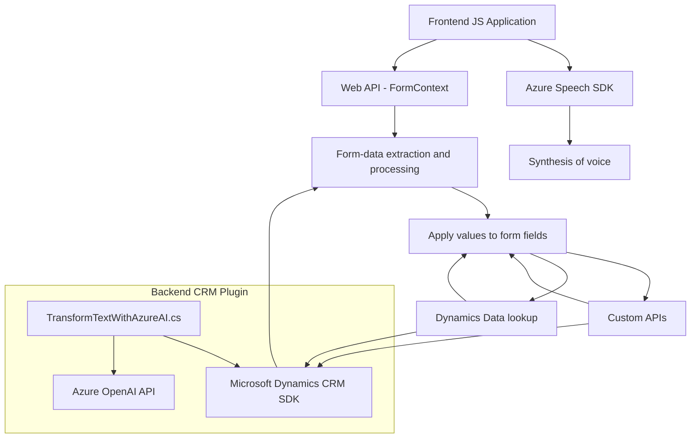

### Breve Resumen Técnico
El repositorio incluye código para integrar funcionalidades de entrada, síntesis y procesamiento de voz, así como transformación de texto con IA en un entorno web y Dynamics CRM. Se utiliza el SDK de Azure Speech para reconocimiento/síntesis de voz y Azure OpenAI para procesamiento de lenguaje natural. Los archivos están destinados tanto a mejorar la accesibilidad como a automatizar procesos en formularios dinámicos.

---

### Descripción de la Arquitectura
La solución adopta una **arquitectura modular orientada a servicios**. Los diferentes componentes están diseñados para ser independientes pero cooperan para interactuar con formularios dinámicos y APIs externas. Se utiliza un enfoque **service-oriented** (SOA) para realizar integraciones con servicios de terceros (Azure Speech SDK y Azure OpenAI API). Además, en el archivo C#, se implementa el patrón **Plugin de Dynamics CRM** para extender las capacidades del sistema CRM mediante la integración con servicios de IA.

Las aplicaciones web funcionan como clientes de la lógica alojada en los servicios de Azure y CRM. La arquitectura general parece más alineada con un modelo **n-capas**, con una separación entre el frontend (funcionalidad de entrada y síntesis de voz), capa de negocio (procesamiento de texto y mapeo en los formularios), y servicios externos (Azure Speech y OpenAI).

---

### Tecnologías Usadas
1. **Frontend**:
   - **JavaScript** para módulos frontend.
   - **Azure Speech SDK** para entrada/síntesis de voz.
   - **Web APIs** para manipulación del DOM y gestión de formularios dinámicos.

2. **Backend**:
   - **Microsoft Dynamics CRM SDK** para integración con Dataverse.
   - **C#** como lenguaje principal en el plugin de Dynamics CRM.
   - **Azure OpenAI API (GPT)** para procesamiento de texto.

3. **Comunes**:
   - **JSON** como formato de intercambio de datos.
   - HTTP para comunicar con APIs externas.
   - **Event-driven programming** en el frontend para manejar entrada de voz y síntesis en tiempo real.

---

### Posibles dependencias o componentes externos
1. **Azure Speech SDK**: SDK basado en la nube para reconocimiento y síntesis de voz.
2. **Azure OpenAI API**: Conexión con modelos avanzados de GPT vía endpoint HTTP.
3. **Microsoft Dynamics CRM (Dataverse)**: Integración directa como un plugin para extender funcionalidades base.
4. **Newtonsoft.Json** y **System.Text.Json**: Manejo de objetos JSON en C#.
5. **APIs personalizadas**: Lógicas avanzadas podrían estar ejecutándose mediante backend propio o servicios externos adicionales.

---

### Diagrama Mermaid

---

### Conclusión
Este sistema conforma una solución híbrida con una arquitectura de **n-capas (frontend - backend - servicios API)**, que integra mecanismos de procesamiento de voz, interacción con formularios dinámicos, y capacidades avanzadas de NLP (procesamiento de lenguaje natural) usando la API de Azure OpenAI. El enfoque modular y orientado a servicios proporciona facilidad para la extensión y adecuación del sistema a futuras necesidades. Sin embargo, dependencias críticas como el SDK de Azure Speech y el plugin Dynamics CRM limitan su portabilidad fuera de estos ecosistemas, lo que podría ser una consideración para su futura evolución.