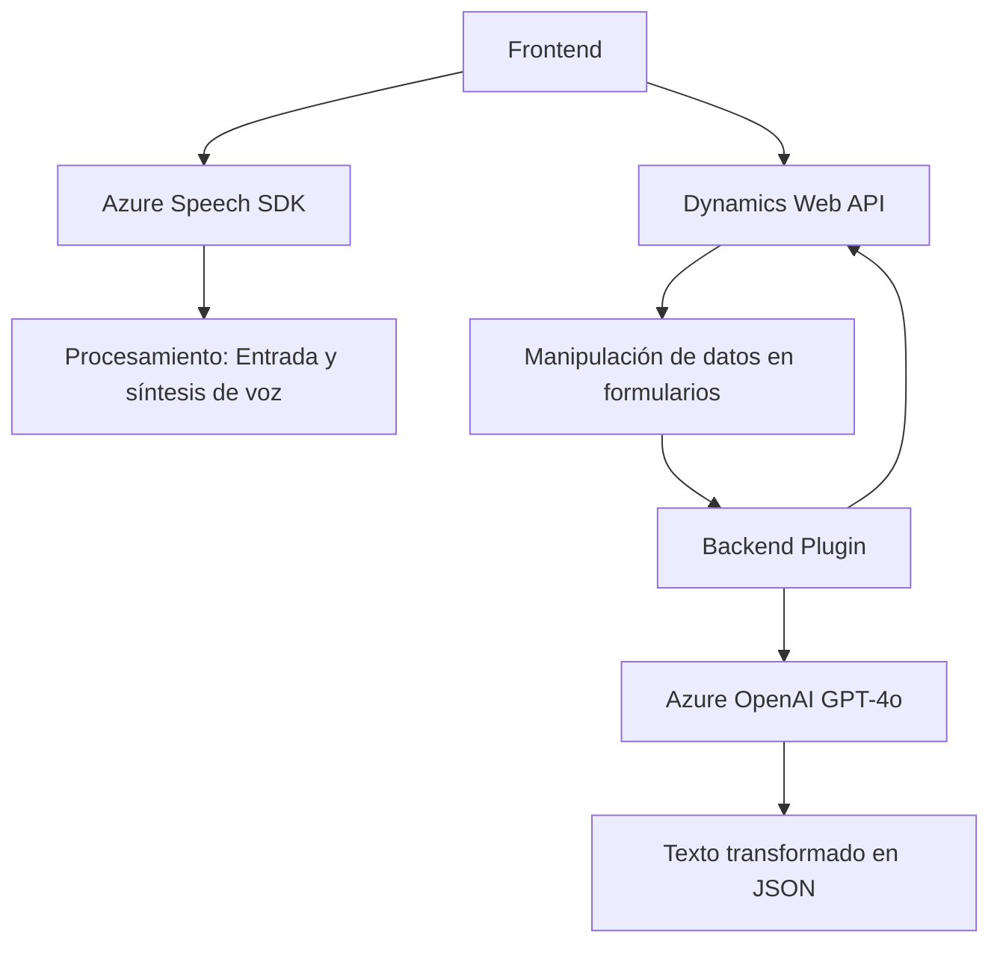

### Breve Resumen Técnico  
El repositorio proporciona una solución que incorpora procesamiento de formularios, entrada y síntesis de voz, integración con Azure Speech SDK y Azure OpenAI, además de manipulación de datos en Microsoft Dynamics 365. La solución está compuesta por un frontend en JavaScript y un backend plugin en C#. Su integración demuestra una arquitectura destinada a enriquecer la interacción entre usuarios y formularios en sistemas empresariales.  

---

### Descripción de Arquitectura  
La arquitectura indicada utiliza un enfoque modular en el frontend y plugins en el backend. En el frontend, JavaScript ofrece funciones que encapsulan la lógica de captura de datos desde formularios, conversión a texto y salida a voz mediante Azure Speech SDK. Además, hay una integración con APIs personalizadas de Dynamics 365. El backend implementa un plugin en C# que consume el servicio Azure OpenAI para transformar texto con una lógica determinada y estructurarlo en JSON. La comunicación entre frontend, APIs y servicios externos está diseñada bajo principios de integración web y microservicios.  

El sistema global utiliza:
- **Microservicios** para conexiones a Azure Speech SDK y Azure OpenAI.
- **Integración API** para interactuar con Dynamics 365 y otros microservicios externos.
- **Patrón de Plugin** en el backend para extender la funcionalidad de Dynamics CRM.  
 
Por lo tanto, la solución combina arquitectura de microservicios con elementos de arquitectura de capas, donde servicios externos cumplen roles específicos de procesamiento y síntesis.  

---

### Tecnologías Usadas  
#### Frontend:  
- **JavaScript**: Para la captura y procesamiento de datos (lectura de formularios, síntesis de voz).  
- **Azure Speech SDK**: Integración directa para entrada de voz y síntesis de texto.  
- **Dynamics 365 API**: Para manipular atributos de formularios y entidades.  

#### Backend:  
- **Microsoft Dynamics SDK**: Extensiones al sistema CRM.  
- **Azure OpenAI GPT-4o**: Para transformar texto mediante IA.  
- **C#**: Implementación del plugin en Dynamics CRM.  
- **Newtonsoft.Json**, **System.Net.Http**: Manejo de comunicación HTTP y datos JSON.  

---

### Dependencias o Componentes Externos  
1. **Azure Speech SDK**: Para entrada y salida de voz.  
2. **Azure OpenAI GPT-4o**: Transformación avanzada de texto.  
3. **Dynamics 365 Web API**: Para manipulación de datos del sistema CRM.  
4. **Contexto del formulario de Dynamics 365**: Acceso interno a descripciones y atributos de formularios.  
5. **Newtonsoft.Json**, **System.Text.Json**: Librerías para procesamiento de datos estructurados.  

---

### Diagrama Mermaid  

---

### Conclusión Final  
La solución exhibe una arquitectura híbrida que combina elementos de **microservicios** y **capas**. El frontend actúa como punto de entrada, procesando datos y delegando tareas específicas a servicios externos como Azure Speech SDK y las APIs de Dynamics 365. En el backend, un plugin en C# amplía las capacidades del sistema CRM, integrándolo con Azure OpenAI para transformar texto mediante IA.  

La solución está bien estructurada y utiliza patrones como delegación, encapsulación funcional y modularidad para ofrecer una experiencia enriquecida y fácilmente adaptable en entornos de negocios basados en Dynamics 365. Las dependencias externas están alineadas con los propósitos tecnológicos planteados: procesamiento de voz/texto y manipulación de datos del sistema CRM.