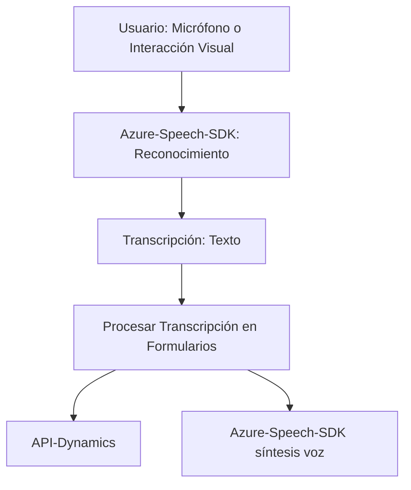
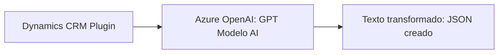
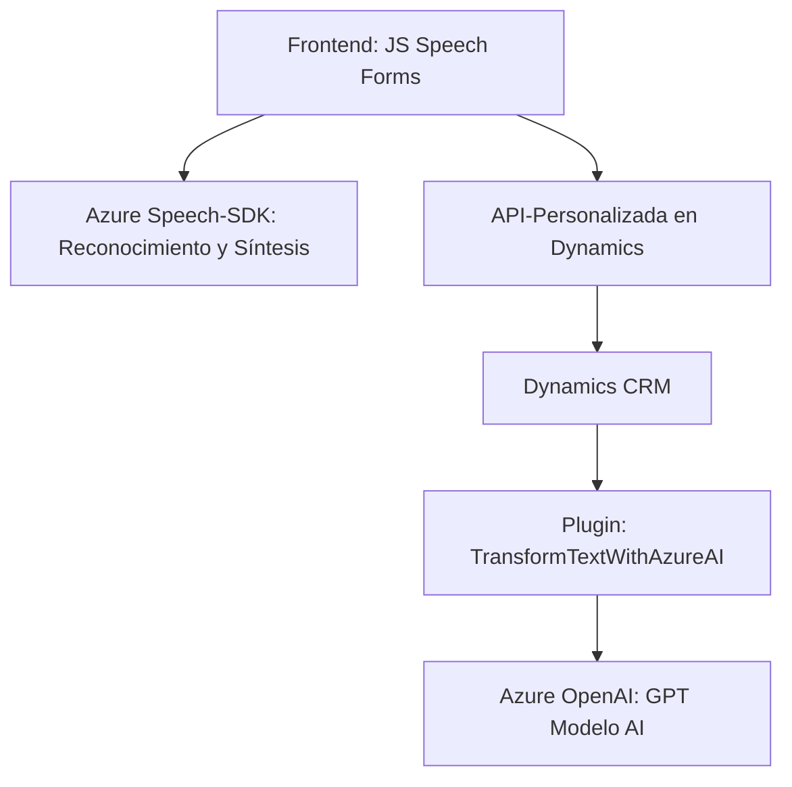

### Resumen técnico
El repositorio presenta una solución con componentes distribuidos para procesar contenido de formularios utilizando entrada y salida de voz. Hace uso intensivo de servicios en la nube, como **Azure Speech SDK** y **Azure OpenAI**, para la transformación de datos. El sistema está compuesto por tres niveles principales: un frontend basado en JavaScript que interactúa con el usuario (voz y visual), integración con APIs de Dynamics 365, y un plugin en C# para procesamiento avanzado de texto con inteligencia artificial.

---

### Descripción de arquitectura
La arquitectura combina un diseño de **cliente ligero en el frontend**, un componente **plugin** para Dynamics CRM basado en .NET, y una interacción fluida con **servicios de terceros** (Azure Speech SDK, OpenAI). Aunque no está segmentado como microservicios, utiliza **n capas** con integraciones hacia recursos en la nube. Tiene características de una arquitectura de **puerta de enlace** hacia APIs externas, fortalecida por la modularidad tanto en el frontend como en el backend.

---

### Tecnologías usadas
1. **Frontend**:
   - JavaScript (APIs propias del navegador).
   - Azure Speech SDK (Integración para síntesis y reconocimiento de voz).
   - DOM API.

2. **Backend/CRM**:
   - C# (.NET Framework):
     - Microsoft Dynamics SDK (para plugins CRUD y eventos).
     - REST API con `HttpClient` para interactuar con Azure OpenAI.

3. **Servicios externos**:
   - Azure Speech SDK.
   - Azure OpenAI (GPT-4).
   - Dynamics 365 API.

---

### Diagramas

#### Diagrama de flujo (Mermaid) para flujos del frontend

---

#### Diagrama de flujo (Mermaid) para sistema externo conectado al plugin de Dynamics

---

#### Diagrama general (integración de componentes)

---

### Conclusión final
El repositorio implementa una solución orientada a servicios que combina un frontend modular con capacidades avanzadas de interacción por voz, un backend basado en Dynamics CRM, y una integración profunda con tecnologías de Azure. La arquitectura válida se clasifica como **n capas** con alto aprovechamiento de servicios externos, pero carece de características completas de un diseño microservicial. Ideal para proyectos de automatización y mejora de formularios interactivos mediante inteligencia artificial basada en texto y voz.