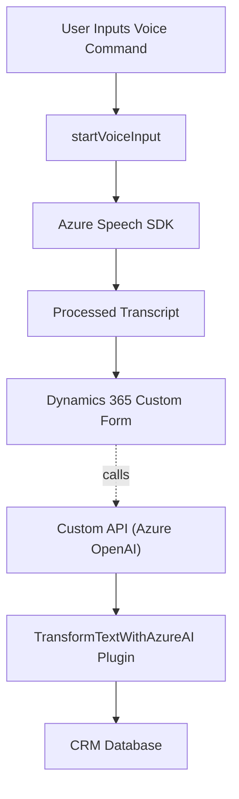

### Análisis del Repositorio

#### **Breve Resumen Técnico**
El repositorio cuenta con archivos divididos principalmente en dos carpetas: **FRONTEND/JS** y **PLUGINS/**, lo que apunta a una solución combinada de aplicación web y lógica empresarial en Dynamics CRM. 

La carpeta **FRONTEND/JS** contiene módulos implementados en JavaScript que interactúan principalmente con Microsoft Azure Speech SDK para reconocimiento y síntesis de voz, así como con APIs de Dynamics 365. Mientras que la carpeta **PLUGINS/**, con el plugin `TransformTextWithAzureAI.cs`, integra lógica empresarial interactuando con Dynamics CRM y la API de Azure OpenAI para transformar texto ingresado en datos estructurados.

#### **Descripción de arquitectura**
La arquitectura se puede describir como un **monolito en capas**, con comunicación hacia servicios externos (Azure Speech SDK, Azure OpenAI) para extender la funcionalidad. Las capas principales incluyen:
1. **UI/Frontend:** Implementa flujos de interacción con el usuario en el frontend para reconocimiento, síntesis de voz y entrada de datos en formularios de Dynamics 365.
2. **Business Logic:** Plugin con lógica de negocio implementada en Dynamics CRM para procesar texto a través de Azure OpenAI y múltiples servicios del SDK.
3. **API and Service Layer:** Integra comunicación con APIs externas (Azure Speech SDK y Azure OpenAI) para funcionalidades relacionadas.

#### **Tecnologías Usadas**
1. **Frontend:**
   - **JavaScript/ES6+:** Código para procesamiento y manipulación del DOM del formulario.
   - **Azure Speech SDK:** Reconocimiento y síntesis de voz.
   - **Dynamics 365 SDK (`Xrm.WebApi`)** para operaciones específicas con CRM.
2. **Backend:**
   - **C#:** Lenguaje de programación utilizado en el plugin `TransformTextWithAzureAI.cs`.
   - **Azure OpenAI API:** Para texto transformado con IA.
   - **Microsoft.Xrm.Sdk:** Lógica empresarial y conexión con Dynamics CRM.
   - **HttpClient:** Llamadas a API.
3. **Librerías auxiliares:**
   - **Newtonsoft.Json:** Manipulación JSON.
   - **System.Text.Json:** Serialización.
   - **System.Text.RegularExpressions:** Operaciones con expresiones regulares.

#### **Patrones y Arquitectura**
1. **Arquitectura en N Capas:**
   - Frontend en JavaScript (UI Layer).
   - Comunicación de API externa (Client Layer).
   - Lógica de negocio y plugin en C# para Dynamics CRM (Business Logic Layer).
2. **Orientación a servicios:**
   - Integración con APIs externas como Azure Speech SDK y Azure OpenAI permite procesar texto en servicios específicos.
3. **Patrones observados:**
   - **Modularización:** Cada función está orientada al cumplimiento de una responsabilidad única.
   - **Lazy Loading:** Carga dinámica del Speech SDK en el frontend.
   - **Encapsulación:** Métodos y lógica aislados por función en cada archivo.
   - **Invocación de Microservicios:** Uso de la Azure OpenAI API como un servicio externo.

#### **Componentes y Dependencias Externas**
1. **Microsoft Azure Speech SDK:** Funcionalidad de reconocimiento y síntesis de voz.
2. **Microsoft Dynamics 365 Web API (`Xrm.WebApi`)**: Manipulación de datos de los formularios y campos del CRM.
3. **Azure OpenAI API:** Lógica de transformación de texto con inteligencia artificial.
4. **HTTP Client para conexiones externas.**
5. **JSON Manipulation:** `Newtonsoft.Json` y `System.Text.Json`.
6. **Base de datos SQL Server:** Comunicación con datos del CRM.

---

### **Diagrama Mermaid**

---

### **Conclusión Final**
La solución implementada en el repositorio apunta a una **monolítica en capas**, diseñada principalmente para interactuar con formularios en Dynamics 365 y procesos de entrada por voz. Incorporando SDKs y APIs con funcionalidad avanzada de reconocimiento y síntesis de voz, así como procesamiento IA, el sistema está orientado hacia simplificar la interacción del usuario con formularios del CRM.

El código muestra buena organización y manejo modular, especialmente en el frontend, con funciones claras para la extracción de datos del formulario. Sin embargo, es esencial mejorar prácticas de seguridad al gestionar claves de API y considerar la implementación de capacidades adicionales de manejo de errores para aumentar la solidez del sistema.