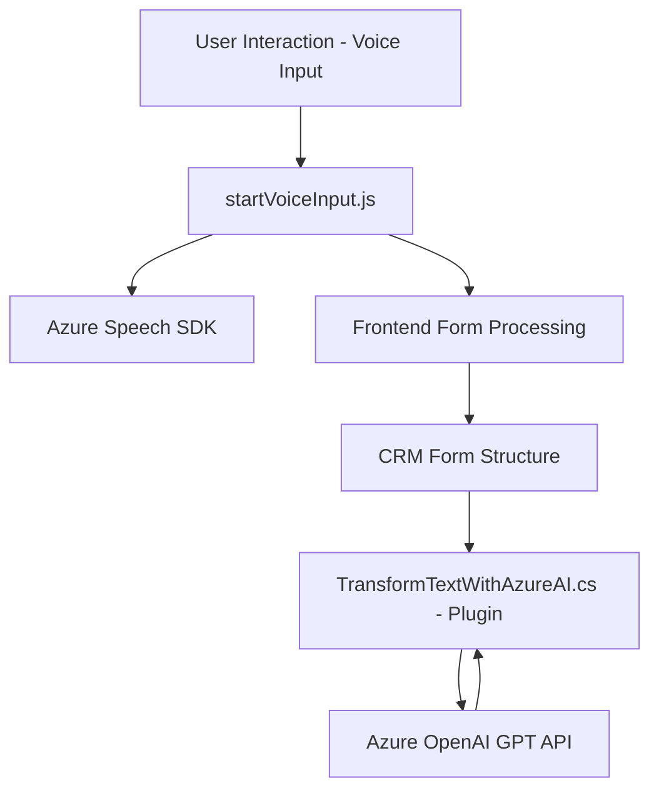

### Breve resumen técnico:
El repositorio representa una solución integral que utiliza tecnologías como **Azure Speech SDK**, **Microsoft OpenAI GPT** y **Microsoft Dynamics CRM APIs** para proporcionar funcionalidades avanzadas de interacción con voz, sintética y manipulación de datos. Está orientado a la integración directa en plataformas CRM, enfocándose en el uso de voz como entrada para manipular formularios dinámicos y procesar datos con inteligencia artificial.

---

### Descripción de arquitectura:
La arquitectura puede clasificarse como **n capas** o **microservicio-híbrido**, basado en la independencia modular de componentes. Aunque los archivos de frontend manejan funciones específicas como generación de voz y manipulación de formularios, la capa del plugin en **C#** actúa como una extensión directa del CRM mediante llamadas asíncronas a servicios de Azure. Esta separación sugiere una arquitectura basada en un diseño distribuido, pero centralizado en la integración.

1. **Frontend**:
   - Scripts modulares que interactúan con servicios de Azure Speech SDK y APIs de CRM.
   - Cada script descompone tareas en funciones especializadas (relacionadas con síntesis de voz, entradas transcritas y API personalizadas).
   - Dinámico con carga condicional del SDK de Azure basado en el estado del entorno.

2. **Backend (Plugin en C#)**:
   - Extensión directa dentro del CRM (Dynamics) implementando `IPlugin`.
   - Llama y consume servicios externos mediante solicitudes REST a Azure OpenAI para procesamiento avanzado de texto.
   - Genera JSON como resultado de la interacción con Azure AI.

---

### Tecnologías usadas:
1. **Frontend**:  
   - **Azure Speech SDK**: Para generación y reconocimiento de voz.
   - **JavaScript ES6**: Desarrollo modular basado en funciones.
   - **Browser dynamic import**: Para carga dinámica de librerías como el SDK.
   - **Xrm.WebApi**: API de Dynamics CRM para manipulación de datos.

2. **Backend**:  
   - **Microsoft Dynamics CRM SDK**: Manejador de datos y extensiones del sistema.
   - **Azure OpenAI GPT**: Para el procesamiento de texto avanzado.
   - **System.Net.Http** y **Json**: Envío y procesamiento de solicitudes HTTP hacia servicios externos (Azure APIs).
   - **Newtonsoft.Json.Linq**: Manipulación avanzada de JSON.

3. **Patrones utilizados**:
   - Modularización de funciones por responsabilidad.
   - Lógica asincrónica para interacción y carga dinámica de SDK.
   - Comunicación basada en servicios: integración de APIs REST externas desde Azure Speech y OpenAI.

---

### Diagrama Mermaid válido para GitHub:

---

### Conclusión final:
El análisis describe un sistema que se puede clasificar como una solución **híbrida**, con características de patrones de arquitectura de **n capas** y dependencias externas que difieren entre frontend y backend. Utiliza tecnologías modernas para generación de voz (Azure Speech SDK), procesamiento avanzado con inteligencia artificial (OpenAI), y extensiones específicas para CRM, apuntando a la creación de una solución integral para manipulación dinámica de datos desde interacción directa con voz.

La arquitectura ofrece:
1. **Flexibilidad** (modularización de responsabilidades).  
2. Referencias **asimétricas** entre runtime de cliente y servicios en Azure.  

Esta solución puede escalar fácilmente, pero requiere un control estricto de dependencias externas para mantener la estabilidad frente a cambios en los servicios disponibles en Azure.