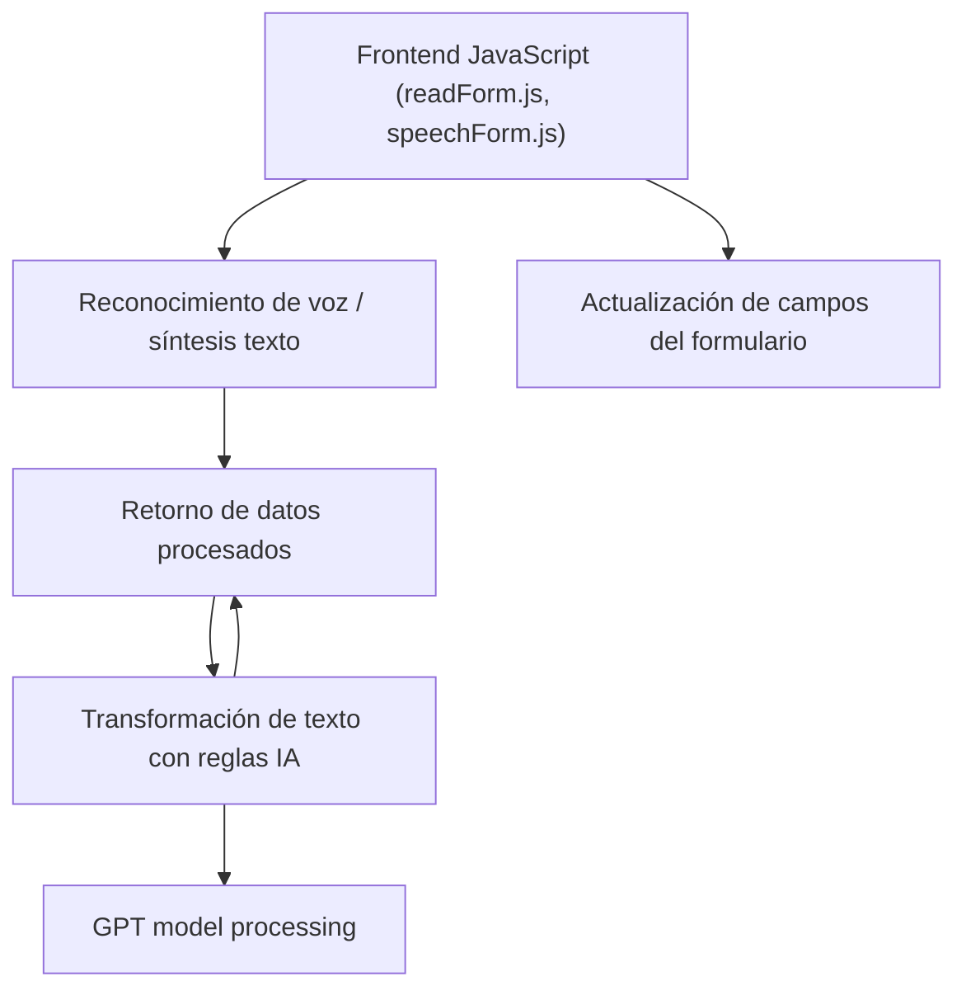

### Breve Resumen Técnico

Este repositorio implementa un sistema que permite interactuar con formularios web utilizando voz, integrando reconocimiento de voz y síntesis de texto a voz mediante el **Azure Speech SDK**. Se complementa con un plugin personalizado (`TransformTextWithAzureAI.cs`) que transforma texto basado en inteligencia artificial de Azure GPT y permite mejorar el procesamiento dinámico de datos en formularios integrados en Dynamics CRM.

---

### Descripción de la Arquitectura

1. **Tipo de solución:** La estructura del repositorio sugiere un software híbrido que combina un **frontend web** basado en JavaScript y un **backend plugin** desarrollado para Dynamics CRM que trabaja con Azure OpenAI.  
   - El frontend es responsable de capturar la voz del usuario, procesarla y sintetizar texto a voz.  
   - El backend extiende funcionalidades del CRM mediante un plugin personalizado para transformar texto usando Azure GPT.

2. **Arquitectura general:**  
   - **Frontend:**
     - Organizado usando una arquitectura modular con separación de responsabilidades (SoC). Cada archivo JS cumple una tarea específica: lectura de formularios, reconocimiento de voz y mapeo dinámico de datos.  
     - Uso dinámico de SDK externos como `Azure Speech SDK`.  
   - **Backend plugin:**
     - Implementa una arquitectura de micro-extensión orientada a servicios. Se basa en el **Plugin Pattern** para integrar lógica de procesamiento dinámico con datos del CRM.
   - **Componentes externos:**  
     - **Azure Speech SDK**: Usado en el frontend para servicios de voz.  
     - **Azure OpenAI GPT**: Usado en el plugin para modificar y estructurar texto dinámicamente.
   - **Integración:** Es una solución basada en servicios utilizando interfaces como `IPluginExecution`.

---

### Tecnologías, Frameworks y Patrones Utilizados

#### **Frontend**
1. **Tecnologías:**
   - **JavaScript**: Funcionalidades como manipulación del DOM y carga dinámica de recursos (Speech SDK).
   - **Azure Speech SDK**: Reconocimiento de voz, transcripción y síntesis de audio.
   - **Dynamics API (Xrm.WebApi)**: Interacción con datos formularios/entidades del CRM.

2. **Patrones:**
   - **Loader dinámico:** Comprobación y carga dinámica del SDK de Azure (`ensureSpeechSDKLoaded`).  
   - **Callback Pattern:** Métodos basados en callbacks para controlar flujos asincrónicos del SDK.  
   - **Separation of Concerns (SoC):** Funciones destinadas a roles específicos como procesamiento de datos (`applyValueToField`) y transcripciones (`processTranscript`).  

#### **Backend Plugin**
1. **Tecnologías:**
   - **C#**: Lógica orientada a objetos para el plugin de Dynamics CRM.
   - **Microsoft.Xrm.Sdk**: Extensión a Dynamics CRM mediante el framework SDK.
   - **Azure OpenAI GPT API**: Usado para transformar texto basado en reglas definidas.

2. **Patrones:**
   - **Plugin Pattern:** Extendiendo Dynamics CRM con lógica personalizada invocada como servicio.  
   - **Facade Pattern:** Abstracción de lógica para procesar llamadas externas hacia el servicio OpenAI (`GetOpenAIResponse`).
   - **API Integration:** Búsqueda, transformación y validación de datos mediante operaciones HTTP hacia Azure OpenAI.

---

### Diagrama Mermaid Compatible con GitHub Markdown

---

### Conclusión Final

Esta solución está diseñada para proporcionar una experiencia inclusiva y moderna para la interacción con formularios dinámicos en un ambiente CRM, utilizando tecnologías de voz, texto y servicios basados en inteligencia artificial. Lo más notable es la integración armoniosa de **Azure Speech SDK** y **Azure OpenAI GPT**, lo que facilita:
1. La captura y síntesis de interacción vocal.
2. La transformación avanzada de datos a través de inteligencia artificial.
3. Extendiendo funcionalidades en **Dynamics CRM** con un enfoque modular.

Es una arquitectura híbrida basada en **n capas**, con clara separación entre frontend y backend, y fuertes dependencias con servicios externos de Azure.