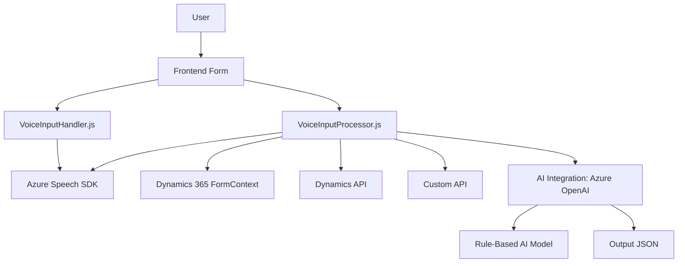

### Breve Resumen Técnico

El repositorio analiza funcionalidad y código relacionado con un sistema que permite la interacción por voz y procesamiento de texto en un entorno de formularios web (posiblemente integrado con Microsoft Dynamics 365). Las principales características y archivos sugieren una solución que utiliza un frontend para recogida de datos desde formularios y conexión con servicios como Azure Speech SDK para la síntesis y reconocimiento de voz, junto con un backend que incluye plugins enfocados en la transformación de datos con Azure OpenAI.

---

### Descripción de arquitectura

La arquitectura general parece representar una combinación entre **Arquitectura de capas (n capas)** y una **Service-Oriented Architecture (SOA)**:  

1. **Frontend Layer**:
   - Abstrae la lógica de procesamiento de voz y asignación de valores al formulario.
   - Modularidad elevada con funciones específicas para cada responsabilidad (separación por archivo).  
   - Acceso directo a APIs del entorno de Dynamics 365 y Azure Speech SDK para la interacción cliente-servidor.

2. **Backend Layer**:
   - Plugins desarrollados con alto acoplamiento hacia Microsoft Dynamics 365 y Azure OpenAI.
   - Procesamiento basado en eventos de Dynamics 365.

---

### Tecnologías usadas

1. **Frontend (JavaScript)**:
   - **Azure Speech SDK**: Para reconocimiento y síntesis de voz.
   - **Dynamics 365 JavaScript APIs**:
     - `Xrm.WebApi`: Para consultar y modificar datos del CRM desde scripts frontend.
   - **Programming Paradigms**:
     - Modularidad (funciones desacopladas por responsabilidad).
     - Patrones como Callback y Observador mediante funciones como `ensureSpeechSDKLoaded`.

2. **Backend (C#)**:
   - **.NET Framework**: Infraestructura base, probablemente usada con Dynamics CRM SDK.
   - **Microsoft Dynamics 365 SDK**: Para desarrollar plugins en la capa del servidor.
   - **Azure OpenAI GPT-4**: Automatización de la transformación de texto según normas predefinidas.
   - **Librerías para acceso y manipulación de datos**:
     - `Newtonsoft.Json` / `System.Text.Json`: Manejo de datos JSON.
     - `System.Net.Http`: Para realizar solicitudes HTTP.
   - **Software Patterns**:
     - Plugin architecture: Ejecución de la lógica en el contexto del servicio Dynamics 365.
     - SOA: Desarrollo enfocado en la interacción con APIs externas (Azure OpenAI).
     - Singleton-like HTTP Client design: Uso estático o semipersistente de `HttpClient`.

---

### Dependencias o Componentes externos

1. **Azure Speech SDK**: Reconocimiento y síntesis de voz para interacciones habladas en el frontend.
2. **Azure OpenAI Service**: Interfaz de procesamiento de texto en el backend utilizando GPT-4.
3. **Dynamics 365 Workflow API** (event-driven): Para la interacción con el sistema CRM de Microsoft y ejecución de workflows mediante plugins.
4. **External Scripts**: Carga dinámica de librerías (`https://aka.ms/csspeech/jsbrowserpackageraw`) para habilitar Azure Speech SDK en tiempo de ejecución.
5. **HTTP communication**: Para interacción con servicios externos como Azure Speech y OpenAI.

---

### Diagrama **Mermaid**

---

### Conclusión Final

La solución está diseñada para mejorar la experiencia de usuario mediante la interacción por voz en formularios web integrados con Microsoft Dynamics 365. Aprovecha tanto el servicio de reconocimiento de voz de Azure como el sistema de plugins para el backend, haciendo uso de Azure OpenAI Service para transformar y clasificar datos.

#### **Fortalezas**:
- Modularidad del código en el frontend.
- Potente integración con herramientas de Microsoft (Dynamics 365, OpenAI, Azure SDK).
- Escalable y compatible con nuevas funcionalidades dictadas por los servicios conectados.

#### **Limitaciones**:
- Alta dependencia de servicios específicos de Microsoft y Azure, lo que limita flexibilidad con otras plataformas.
- Uso extendido de callbacks puede complicar el mantenimiento del código (puede evaluarse una migración a Promises o async/await).

En general, esta solución sigue prácticas modernas de desarrollo, optimizadas para automatización y experiencia de usuario profesional.