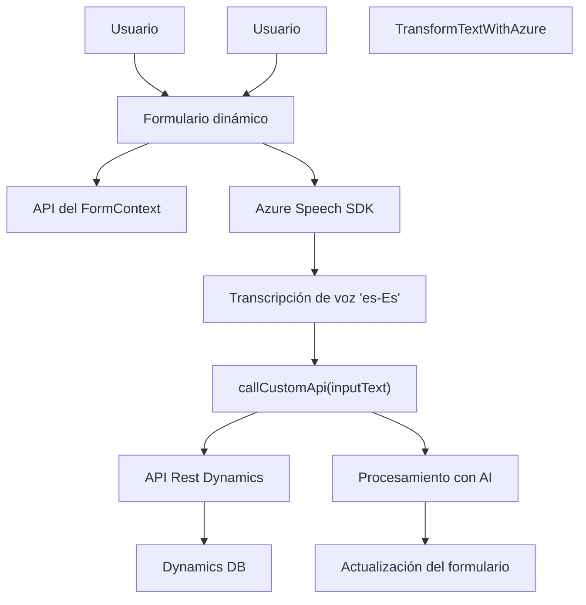

### Breve resumen técnico:
El repositorio presenta una solución orientada a la integración de interfaces de usuario (frontend) y procesamiento de datos con servicios externos, específicamente Azure Speech SDK y Azure OpenAI API. Cubre funcionalidad para la extracción, síntesis y transcripción de datos desde formularios, aplicaciones CRM (Dynamics 365), y experimenta aplicaciones de patrones de diseño efectivos (fachada, modularización, delegación). La estructura implica una fuerte interacción con APIs externas, además de lógica personalizada. Es una solución compuesta usualmente categorizada como un *modulo frontend/backend híbrido* de integración para sistemas empresariales.

---

### Descripción de arquitectura:
La solución tiene las siguientes características arquitectónicas:
1. **Front-End**: Manipulación de formularios basados en JavaScript con integración del SDK de voz. Patrones prevalentes incluyen *modularización* y carga condicional (*lazy loading*).
2. **Plugin Back-End**: Implementación en C# adherida a la interfaz IPlugin de Dynamics CRM, que opera como un proceso extensible del servidor y realiza operaciones con Azure OpenAI API.
3. **Integración con APIs Externas**: Lógica bien definida para comunicación con servicios de Azure, incluyendo Azure Speech y Azure OpenAI.
4. **Patrón de **n capas**: Separación entre datos del frontend (procesamiento en tiempo real de formularios) y backend (persistencia y lógica de negocio avanzada mediante plugins de Dynamics).

---

### Tecnologías usadas:
1. **Frontend**:
   - **JavaScript**.
   - **Azure Speech SDK** para síntesis y transcripción de voz.
   - Dynamics 365 FormContext API.
2. **Backend**:
   - **C#** implementado como un plugin para Dynamics CRM.
   - **Azure OpenAI API** para operaciones de transformación de texto.
   - **Newtonsoft.Json** y `System.Net.Http` para manejo de datos estructurados y comunicación HTTP.

---

### Diagrama Mermaid válido para GitHub:

---

### Conclusión final:
La solución presentada es una arquitectura modular y extensible para integrar aplicaciones CRM (Dynamics 365) con servicios de Azure, incluyendo reconocimiento de voz y procesamiento de AI. Utiliza JavaScript en frontend y C# en backend para gestionar operaciones especializadas. Integra patrones arquitectónicos clave como *fachada* y *n capas* para mantener modularidad y separación de lógica. Adicionalmente, tiene dependencias externas bien definidas que aseguran alta funcionalidad, pero también requieren configuración optimizada para locales seguros y claves API.