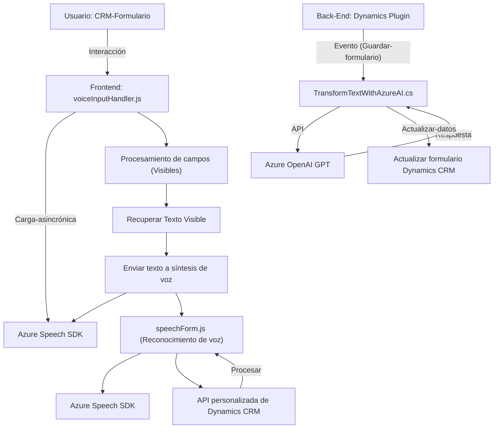

### Breve Resumen Técnico

Los archivos proporcionados indican que el repositorio es parte de una solución que integra funcionalidad avanzada de reconocimiento y síntesis de voz, procesamiento de texto con IA y manipulación de formularios en Microsoft Dynamics CRM, usando Azure Speech y OpenAI SDKs. Este sistema aporta una capa de interacción mediante voz y procesamiento de lenguaje natural.

---

### Descripción de Arquitectura

La arquitectura parece ser de tipo **modular y basada en n-capas**, con la siguiente división:
1. **Frontend (JS)**: Gestiona la interacción directa con el usuario en formularios (integración UI del CRM) y se encarga de la síntesis y reconocimiento de voz. Utiliza y carga dinámicamente servicios de Azure.
2. **Backend (Plugins)**: Implementa lógica de negocios avanzada en forma de plugins para transformaciones textuales mediante Azure OpenAI. Responde a eventos del sistema en Dynamics CRM.
3. **Externo**:
   - **Azure Speech SDK**: Funcionalidad de síntesis y procesamiento de voz.
   - **Azure OpenAI**: Manejo de transformaciones de texto a través de modelos GPT.

El diseño se orienta a una **arquitectura en capas** con integración de servicios externos y lógica distribuida entre frontend y backend. No es estrictamente microservicios, pero sí aprovecha patrones de interacción asincrónica y modularidad con servicios externos.

---

### Tecnologías Usadas

1. **Frontend**:
   - JavaScript
   - Azure Speech SDK
   - Navegador (DOM) y APIs relacionadas
   - Patrones: modularidad, gestión de dependencias dinámicas, adaptadores de datos.

2. **Backend**:
   - C# (.NET Framework)
   - Microsoft Dynamics CRM Plugins
   - Azure OpenAI (vía REST API)
   - Librerías comunes de .NET para JSON y HTTP.

3. **Servicios Externos**:
   - Azure Speech SDK (`https://aka.ms/csspeech/jsbrowserpackageraw`)
   - Azure OpenAI (`https://openai-netcore.openai.azure.com/`)

---

### Diagrama Mermaid

---

### Conclusión Final

La solución presentada es una **integración completa entre Microsoft Dynamics CRM y servicios de Azure**, permitiendo el uso avanzado de reconocimiento y síntesis de voz, así como el procesamiento de texto con inteligencia artificial. La arquitectura modular y en capas asegura la mantenibilidad y soporte de servicios externos como **Azure Speech SDK** y **Azure OpenAI**. El diseño empleado es eficaz para escenarios donde se requiera convertir voz en datos procesados y enriquecer formularios dinámicos en sistemas empresariales. Es un ejemplo robusto de cómo potenciar plataformas CRM con capacidades modernas de AI y voz.